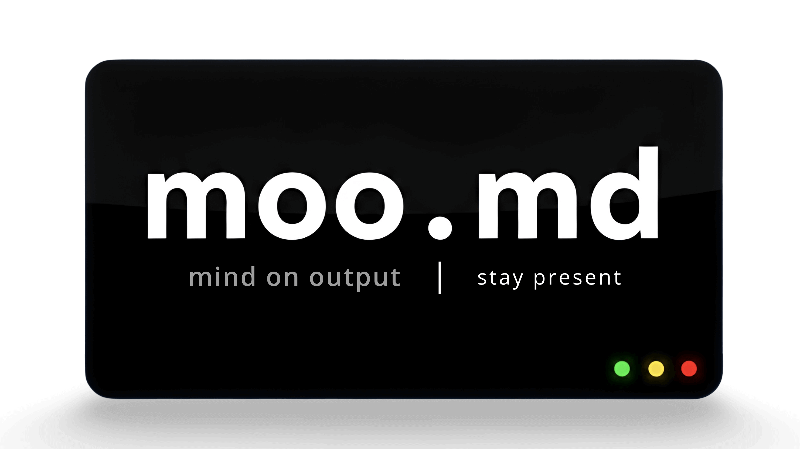

<p align="center">
  
  <br/>
  Plugins that make claude state confidence, list failures, and present structured reasoning before acting.
</p>

<br/>

| Before moo.md                | After moo.md                           |
| ---------------------------- | -------------------------------------- |
| "This should work"           | "85% confident because [evidence]"     |
| Builds first, searches later | Searches libraries before writing code |
| Hopes nothing breaks         | Lists failure modes before starting    |
| Forgets what worked          | Recalls insights from past sessions    |

## See It In Action

Every response ends with a verdict box:

<p>
  
</p>

## What Runs Quietly

Before responding, Claude checks:

- Intent clear?
- Libraries searched?
- Failure modes listed?
- Confidence stated?
- Reversibility assessed?

30+ thinking tools run automatically: Inversion, Pre-Mortem, Ishikawa, Five Whys, Decision Matrix.

## Install

```bash
/plugin marketplace add saadshahd/moo.md
/plugin install hope@moo.md
```

## Plugins

| Plugin                                 | What It Does                                                     |
| -------------------------------------- | ---------------------------------------------------------------- |
| [hope](docs/plugins/hope.md)           | Core thinking system — confidence gates, silent audit, workflows |
| [product](docs/plugins/product.md)     | PRDs, competitive analysis, metrics                              |
| [wordsmith](docs/plugins/wordsmith.md) | Editing, voice extraction, narrative                             |
| [founder](docs/plugins/founder.md)     | Idea validation, pitch decks, financials                         |
| [career](docs/plugins/career.md)       | Interview prep, skill gaps, stakeholder navigation               |
| [counsel](docs/plugins/counsel.md)     | Expert simulation for code guidance and style                    |

## Documentation

- [5-Minute Start](docs/getting-started.md) — Install and see value immediately
- [Learnings System](docs/learnings-system.md) — Insights persist across sessions

## Issues

Something broken? Onboarding unclear? Feature request?

→ [Open an issue](https://github.com/saadshahd/moo.md/issues)

## Gratitude

**[Nate B. Jones](https://www.natebjones.com/)** — grounded thinking, advanced prompting

**[Superpowers](https://github.com/obra/superpowers)** — prior art

**[Farnam Street](https://fs.blog/blog/)** - For the excellent writings
