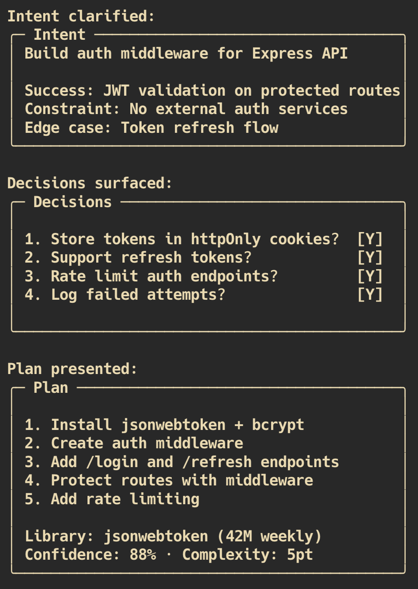
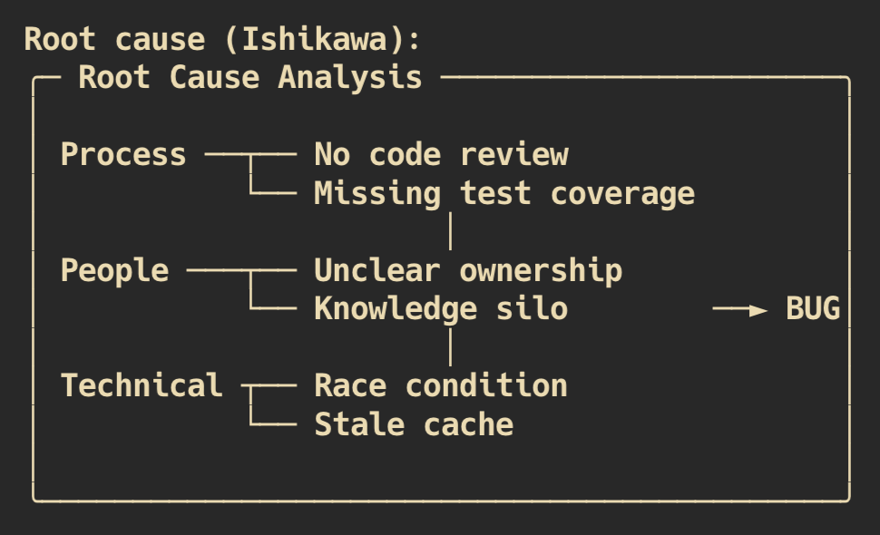
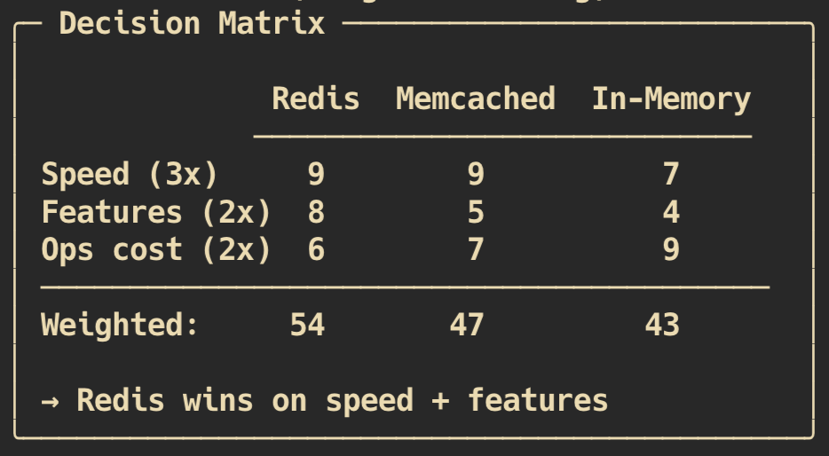
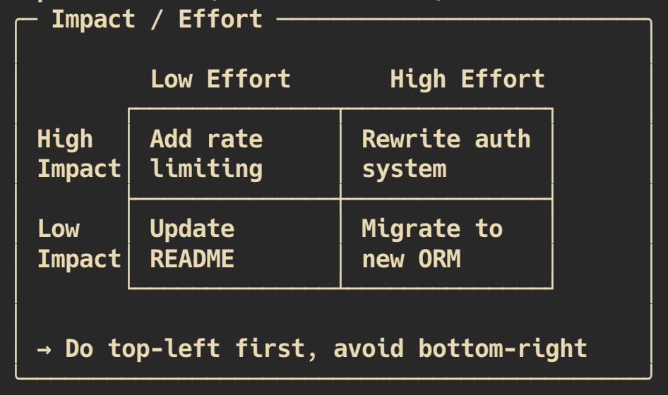
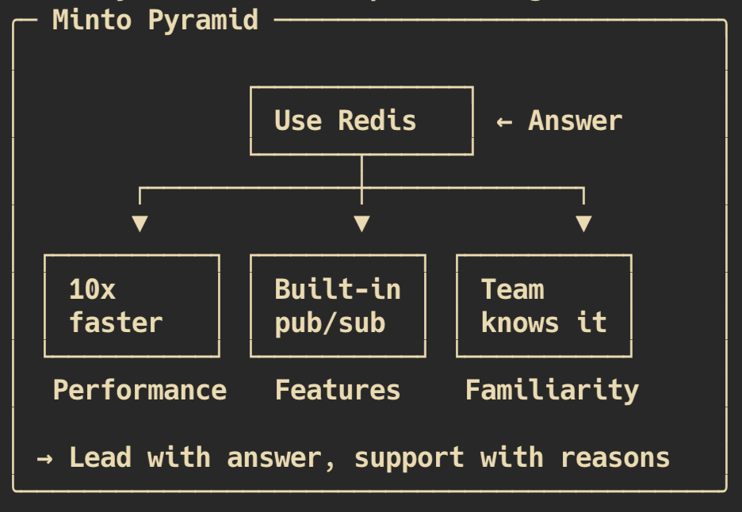
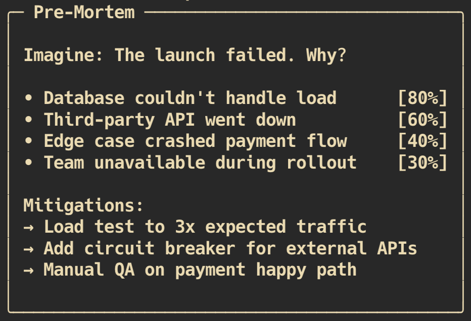

# moo — mind on output

Claude says "this should work" and builds first.
moo makes Claude think first.

## Before vs After

| Without moo | With moo |
|-------------|----------|
| "This should work" | "85% confident because [evidence]" |
| Builds first, searches later | Searches libraries before writing code |
| Hopes nothing breaks | Lists failure modes before starting |
| Forgets what worked | Recalls insights from past sessions |

## What moo Does

Before every response, Claude checks:

- Intent clear?
- Libraries searched?
- Failure modes listed?
- Confidence stated?
- Reversibility assessed?

## See It In Action

<table>
  <tr>
    <td align="center" valign="top" width="50%">
      <p><sub>Planning phase</sub></p>
      
    </td>
    <td align="center" valign="top" width="50%">
      <p><sub>Verdict box</sub></p>
      
    </td>
  </tr>
  <tr>
    <td align="center" valign="top" width="50%">
      <p><sub>Root Cause Analysis</sub></p>
      
    </td>
    <td align="center" valign="top" width="50%">
      <p><sub>Five Whys</sub></p>
      
    </td>
  </tr>
  <tr>
    <td align="center" valign="top">
      <p><sub>Decision Matrix</sub></p>
      
    </td>
    <td align="center" valign="top">
      <p><sub>Impact-Effort</sub></p>
      
    </td>
  </tr>
  <tr>
    <td align="center" valign="top">
      <p><sub>Minto Pyramid</sub></p>
      
    </td>
    <td align="center" valign="top">
      <p><sub>Pre-Mortem</sub></p>
      
    </td>
  </tr>
</table>

## Install

```bash
/plugin marketplace add saadshahd/moo.md
/plugin install hope@moo.md
```

## Plugins

| Plugin | What It Does |
|--------|--------------|
| [hope](docs/plugins/hope.md) | Think before building — confidence gates, failure modes, library search |
| [product](docs/plugins/product.md) | Validate before building — PRDs, competitive analysis, metrics |
| [wordsmith](docs/plugins/wordsmith.md) | Write clearly — editing, voice matching, structure |
| [founder](docs/plugins/founder.md) | Test your idea — validation, pitch structure, unit economics |
| [career](docs/plugins/career.md) | Navigate your career — interview prep, skill gaps, stakeholders |
| [counsel](docs/plugins/counsel.md) | Get expert perspective — simulate Hickey, Graham, Fowler, etc. |

## Documentation

- [5-Minute Start](docs/getting-started.md) — Install and see value immediately
- [Learnings System](docs/learnings-system.md) — Insights persist across sessions

## Issues

Something broken? Feature request?
→ [Open an issue](https://github.com/saadshahd/moo.md/issues)

## Gratitude

**[Nate B. Jones](https://www.natebjones.com/)** — grounded thinking, advanced prompting

**[Superpowers](https://github.com/obra/superpowers)** — prior art

**[Farnam Street](https://fs.blog/blog/)** — excellent writings on mental models
