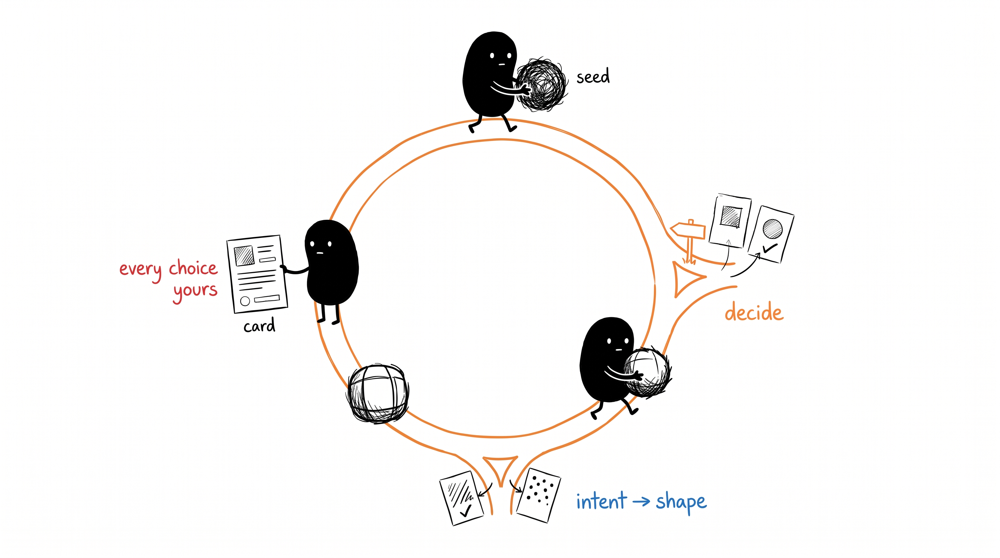
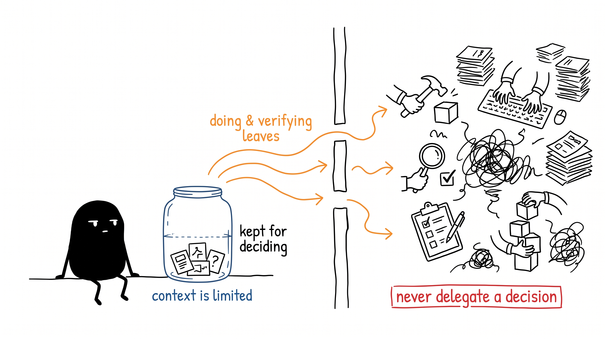

# hope @ moo.md

> "Ownership without comprehension is just a signature."
> from [The Engineer's Anxiety at the Penalty Kick](https://saadshahd.github.io/blog/the-engineers-anxiety-at-the-penalty-kick/)

Why introduce friction? Because **YOU** the human end up being the world model. The LLM powered agentic coder is just your hands with tiny muscle memory.

moo does not build and does not author your code, rules, or taste. It is orthogonal to build tooling like superpowers and tdd. You hand-write your `taste.md`, your `CLAUDE.md`, your taste. moo keeps you owning what matters and gets out of the way.

One idea runs through all three layers: **never delegate a decision.**

## The loop

The loop is pure decision work. You drive it slowly, in your own context. Nothing here is delegated.

Every piece of work starts as a raw **seed**, the rough thing you typed. The seed is the honest origin: rough in form, purest in intent. It is the one artifact that is fully yours.

**intent** and **shape** do not make the seed more honest. They make it explicit and specified. Each surfaces a decision as a prompt with concrete options, a few at a time, and you answer. Every added detail stays yours because you chose it. intent turns the seed into a confirmed statement of what you want. shape turns that into a chosen approach before any code exists.

A raw seed, an echoed sentence, a tradeoff you chose on the record. The result is a card that hands off outside your context window.



## The mode

**delegate** is the line between deciding and doing.

You keep every decision. Each one is surfaced to you so you stay engaged and keep caring about it. Only tactical, observable work fans out to agents: implement, test, verify, audit, explore.

This is also what stops compaction from silently rewriting your context. The verbose doing never enters your main thread, so it can never quietly mutate what you decided.

The guard: keeps the doing out so the deciding stays in.



## The practice

**own** is retrieval practice. It runs on Monday, spaced, so questions arrive around the time you would forget.

Agents grow the codebase faster than they grow your understanding of it. That gap is the part you are accountable for. own closes it. It probes you on the concepts you shipped. A short conversation, four questions, no score.

The agent hands you artifacts and walks away. What it never carries between sessions is what own trains. The problem is named in [One Flew Over the Context Window](https://saadshahd.github.io/blog/one-flew-over-the-context-window/).


## What each layer guards

| Force that silently erodes your ownership | The guard |
| --- | --- |
| The model could fill in decisions for you | intent and shape surface them as prompts you answer |
| Compaction mutates your context | delegate keeps the doing out so the deciding stays in |
| Agents grow code faster than your understanding | own closes the gap on Monday, spaced |

## Try it

```bash
/plugin marketplace add saadshahd/moo.md
/plugin install hope@moo.md
```

Run the whole loop with `/hope:full <your seed>`, or stage by stage with `/hope:intent` and `/hope:shape`. On Monday, `/hope:own`.
