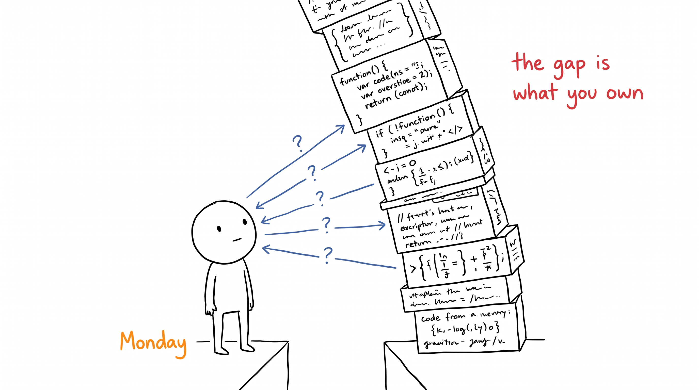

Why introduce friction? Because **YOU** the human end up being the world model. The agent is just your hands.

**moo/hope** doesn't build, and doesn't author your code, rules, or taste. It works alongside build tooling like [superpowers](https://github.com/obra/superpowers).

One idea runs through all three layers: **never delegate a decision.**

## Try it

```bash
/plugin marketplace add saadshahd/moo.md
/plugin install hope@moo.md
```

- Run the whole loop with `/hope:full <your seed>`, or run the stages directly: `/hope:intent <your seed>` then `/hope:shape <your intent>`, each handing you a lean card.
- For work you used to do by hand, `/hope:delegate` routes it to agents while you keep every decision.
- When work depends on live external state, `/hope:freeze` snapshots it as fact (never memory) before a stage builds on it.
- At session wind-down, `/hope:over` hands the load-bearing decisions back so you keep owning what shipped.

## A loop

The loop is pure decision work. You drive it slowly, in your own context.

Every piece of work starts as a raw `<seed>`, the rough thing you fully typed. It is the one artifact that is fully yours.

**/intent** and **/shape** do not make the seed more honest. They make it explicit and specified. Each surfaces a decision as an interactive question, every choice previewed, a few at a time, and you answer. Every added detail stays yours because you chose it. `/intent` turns the `<seed>` into a confirmed statement of what you want. `/shape` turns the `<intent card>` into a chosen approach before any code exists.

The outcome is a card you carry comfortably outside the context window.


## A mode

**delegate** is the line between deciding and doing.

You keep every decision. Each one is surfaced to you so you stay engaged. Only tactical, observable work fans out to agents: implement, test, verify, audit, explore.

This is also what stops compaction from silently rewriting your context. The verbose doing never enters your main thread, so it can never quietly mutate what you decided.


## A routine

**over** is the session-end handover. You run it as a session winds down, so the decisions you made leave with you and not with the agent.

Agents grow the codebase faster than they grow your understanding of it. That gap is the part you are accountable for. over closes it. It reads the session, finds what was load-bearing, and hands each decision back as one forward question — you rebuild the reasoning, it confirms once. A short conversation, no score.

What the agent never carries between sessions is what over hands back. The problem is named in [One Flew Over the Context Window](https://saadshahd.github.io/blog/one-flew-over-the-context-window/).



## Overview

| The trap                                 | Layer                          | Guard                                        |
| ---------------------------------------- | ------------------------------ | -------------------------------------------- |
| AI fills in your decisions               | `/hope:intent` & `/hope:shape` | interactive questions, each choice previewed |
| compaction mutates & drifts your context | `/hope:delegate`               | doing stays out, deciding stays in           |
| stale or remembered external state       | `/hope:freeze`                 | snapshot facts, never infer                  |
| code grows faster than understanding     | `/hope:over`                   | session-end handover keeps you owning it     |

## Reading

- [The Engineer's Anxiety at the Penalty Kick](https://saadshahd.github.io/blog/the-engineers-anxiety-at-the-penalty-kick/) — "Ownership without comprehension is just a signature."
- [One Flew Over the Context Window](https://saadshahd.github.io/blog/one-flew-over-the-context-window/) — what the agent never carries between sessions.
