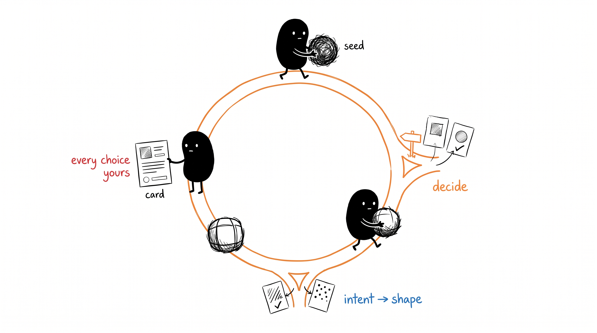
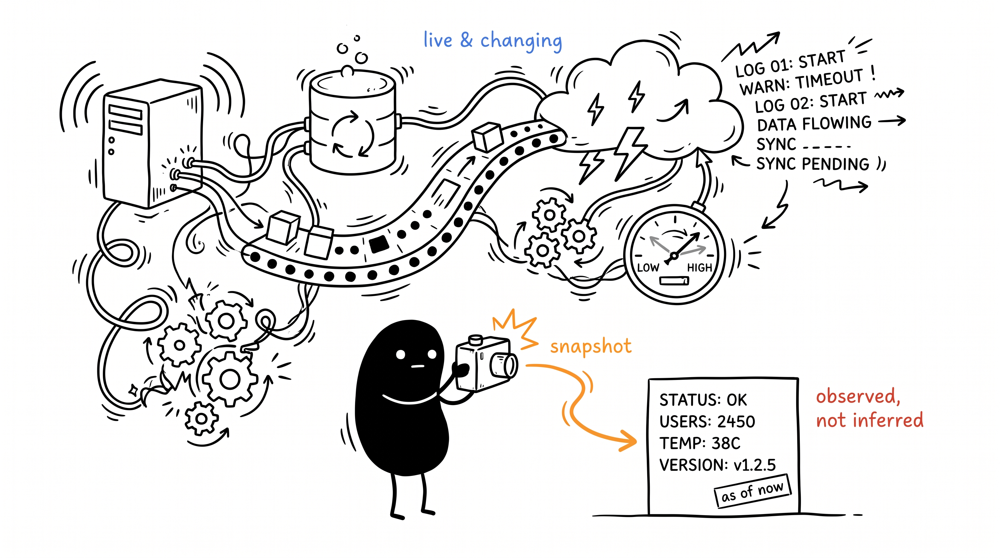
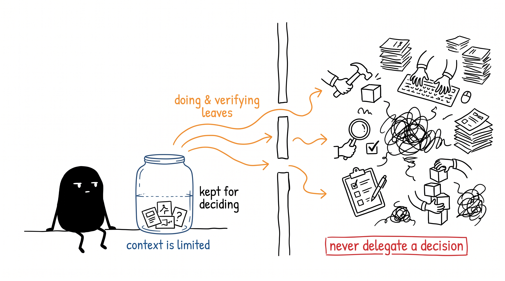

[](https://skills.sh/saadshahd/moo.md)

Why introduce friction? Because **YOU** the human end up being the world model. The agent is just your hands.

**moo/hope** doesn't build, and doesn't author your code, rules, or taste. It works alongside build tooling like [superpowers](https://github.com/obra/superpowers).

One idea runs through all three layers: **never delegate a decision.**

## Installation (30-second setup)

Two ways in, two philosophies. The **[Claude Code plugin](https://code.claude.com/docs/en/plugins)** installs each layer as a managed bundle that updates when I ship — you subscribe rather than fork. **[skills.sh](https://skills.sh/saadshahd/moo.md)** copies editable skill files into your project, on any agent, so you can make them your own. Pick one — installing both leaves you with every skill twice.

### 1. Get the skills

<details>
<summary><strong>Claude Code</strong></summary>

```bash
/plugin marketplace add saadshahd/moo.md
/plugin install hope@moo.md
```

`hope` is the decision loop, and the reason to be here. Two more layers ship from the same marketplace: `sound@moo.md`, code taste as installable rules, and `hunch@moo.md`, experiments that graduate or die.

</details>

<details>
<summary><strong>Codex, Cursor, Copilot, and other agents</strong></summary>

```bash
npx skills@latest add saadshahd/moo.md
```

Pick the skills you want and the agents to install them on.

They land as ordinary files you own — flat, and without the plugin prefix, so `hope:intent` arrives as `intent` and `sound:review` as `review`. Watch for collisions with skills you already have.

</details>

### 2. Run the loop

```
/hope:full <your seed>
```

Or run the stages directly — `/hope:intent <your seed>`, then `/hope:shape <your intent>` — each handing you a lean card.

## A loop

The loop is pure decision work. You drive it slowly, in your own context.

Every piece of work starts as a raw `<seed>`, the rough thing you fully typed. It is the one artifact that is fully yours.

**/intent** and **/shape** do not make the seed more honest. They make it explicit and specified. Each surfaces a decision as an interactive question, every choice previewed, a few at a time, and you answer. Every added detail stays yours because you chose it. `/intent` turns the `<seed>` into a confirmed statement of what you want. `/shape` turns the `<intent card>` into a chosen approach before any code exists.

The outcome is a card you carry comfortably outside the context window.



## An anchor

**freeze** anchors the work to what is observed, not what you remember. When a stage depends on state that lives outside the repo — a service, a database, a queue, live logs — that state keeps moving, and memory of it goes stale the moment you look away.

freeze snaps the slice your work touches into one immutable value: every fact observed live or named as an open gap, never inferred. The stages decide against a fact, not a guess. It is the ground the other three stand on — and repo-local work skips it.



## A mode

**router** is the line between deciding and doing.

You keep every decision. The session spawns agents and verifies their output, doing no work itself — only tactical, observable work fans out: implement, test, verify, audit, explore.

This is also what stops compaction from silently rewriting your context. The verbose doing never enters your main thread, so it can never quietly mutate what you decided.



## Overview

| The trap                                 | Layer                          | Guard                                        |
| ---------------------------------------- | ------------------------------ | -------------------------------------------- |
| AI fills in your decisions               | `/hope:intent` & `/hope:shape` | interactive questions, each choice previewed |
| compaction mutates & drifts your context | `/hope:router`                 | doing stays out, deciding stays in           |
| stale or remembered external state       | `/hope:freeze`                 | snapshot facts, never infer                  |

## Reading

- [The Engineer's Anxiety at the Penalty Kick](https://saadshahd.github.io/blog/the-engineers-anxiety-at-the-penalty-kick/) — "Ownership without comprehension is just a signature."
- [One Flew Over the Context Window](https://saadshahd.github.io/blog/one-flew-over-the-context-window/) — what the agent never carries between sessions.
