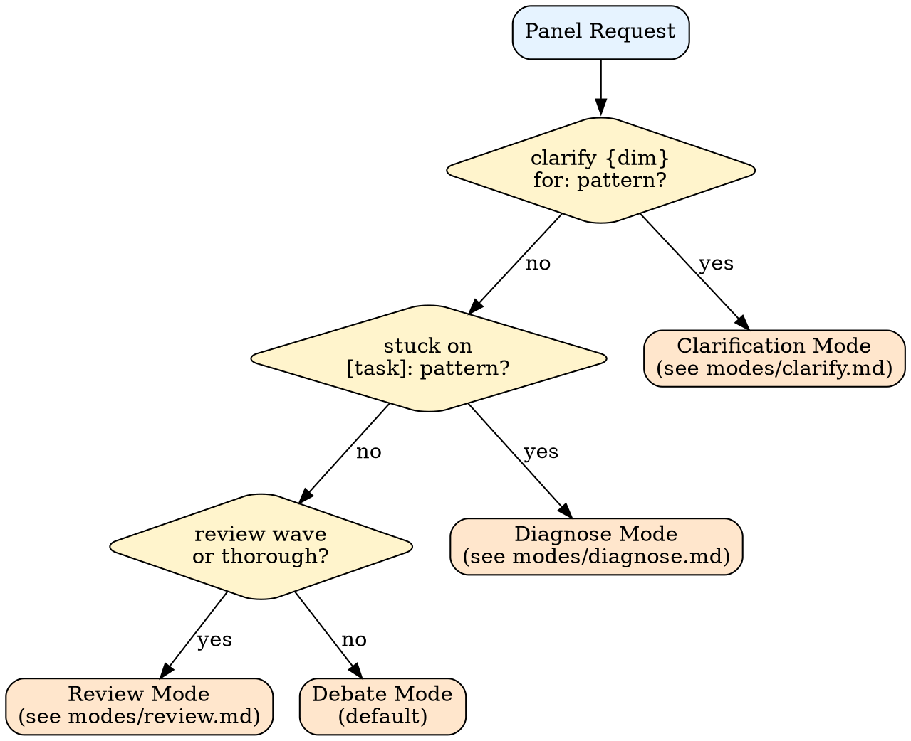
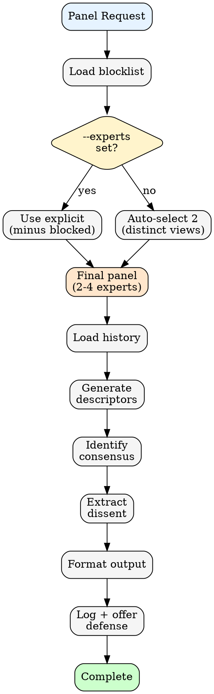

# /counsel:panel

Assemble an expert panel for debate and guidance.

## Usage

```
/counsel:panel "Should I use Zustand or Redux?"
/counsel:panel --experts="osmani,hickey" review this architecture
/counsel:panel for this PR
/counsel:panel clarify outcome for: make auth better
/counsel:panel stuck on "Add ValidationError": "Module not found"
/counsel:panel review wave 1 changes for: {spec}
/counsel:panel thorough review for: {spec}
```

## Mode Detection



## Inputs

- `$1` — Question, topic, or mode-specific pattern (required)
- `--experts` — Comma-separated expert names (optional, auto-selects if omitted)

---

## Debate Mode (Default)

For design decisions, architecture reviews, and tradeoff discussions.

### Process



### Panel Selection

**Pre-filter:** Load `~/.claude/counsel-blocklist.json` and remove blocked profiles.

**Selection:** Select 2 experts with distinct perspectives. If `--experts` specified, use those (minus blocked, max 2 unless `--expand`).

### Output Format

```
## Panel Review: [Topic]

**Panelists:** [descriptor A] (X/10), [descriptor B] (Y/10)

### Consensus
- [Point all panelists would likely agree on]

### Dissent
**[descriptor A]:** [Position] — (cf. documented work)
  -> **[descriptor B] responds:** [Counter-position]

### Open Questions
- [What panel cannot resolve — requires your judgment]

---
*Defense round available. Reply to push back on any point.*
*Simulated perspectives based on documented work, not the experts' actual opinions.*
```

### Panel Size

- **Default:** 2 experts (load only 2 profiles)
- **Maximum:** 4 experts (only if user requests `--expand`)
- **Progressive:** After initial response, offer "Want another perspective? Reply 'expand'."

### Constraints

- Every panelist must have distinct perspective
- Cite prior work for every strong position
- Flag genuine tradeoffs that panel cannot resolve
- Never manufacture false consensus

### Escalation

When panel splits with no resolution: flag as "GENUINE TRADEOFF — requires your judgment" and summarize both positions with citations.

---

## Clarification Mode

Pattern: `clarify {dimension} for: {spec}`

See [modes/clarify.md](../skills/counsel/references/modes/clarify.md) for full logic.

**Quick reference:**
- Dimensions: Outcome, Scope, Constraints, Success, Done
- Select 2 experts from dimension pool
- Each expert proposes concrete, measurable clarification
- Output includes reasoning from expert's philosophy

---

## Diagnose Mode (Stuck)

Pattern: `stuck on [task]: [error]`

See [modes/diagnose.md](../skills/counsel/references/modes/diagnose.md) for full logic.

**Quick reference:**
- Parse task, error, failed approach
- Select 2-3 diagnostic experts
- Generate diagnosis + consensus recommendation
- **Retry loop:** 3 attempts before escalating to thorough review

**Loop integration:**
- Loop invokes when stuckCount >= 1 or same error twice
- Loop extracts consensus, updates approach, retries
- After 3 failures: escalates to thorough review

---

## Review Mode

Patterns: `review wave {N}` or `thorough review for:`

See [modes/review.md](../skills/counsel/references/modes/review.md) for full logic.

### Light Review

Pattern: `review wave {N} changes for: {spec}`

- Quick (~30s) idiomaticity check
- Non-blocking: loop continues
- Output: score/10 + findings table

### Thorough Review

Pattern: `thorough review for: {spec} with constraints: {mustNot}`

- Full panel (3-4 experts)
- Interactive findings loop: [Approve] [Create task] [Discuss] [Skip]
- Constraint-aware: checks fixes against SHAPE.md mustNot
- Severity levels: BLOCKER / WARNING / SUGGESTION
