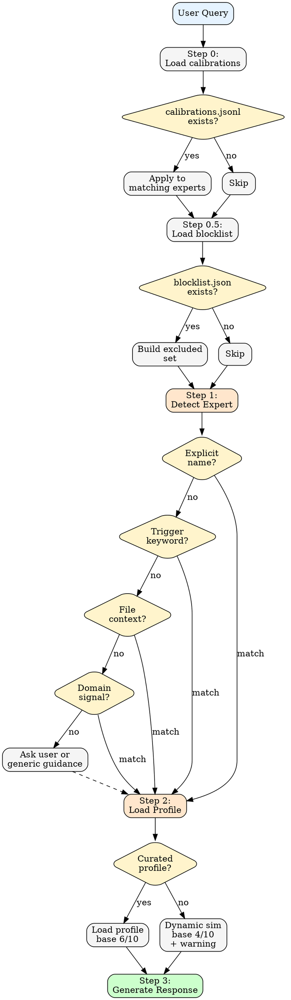

# counsel

Simulate expert perspectives for code guidance, style, and debates.

---

## When This Activates

- "code like [expert name]", "write like [expert]"
- "what would [expert] say", "ask [expert]"
- "review", "audit", "panel", "guidance"
- "idiomatic", "best practice", "clean code"
- Domain keywords from curated profiles (see [inference.md](references/inference.md))

---

## Core Constraint

You are NOT the expert. You are simulating their perspective based on documented work.

**Required behaviors:**
- State confidence explicitly (X/10)
- Cite prior work when giving opinions
- Use "would likely" not "would"
- Flag when simulation confidence is low
- Check calibrations before generating

---

## Process

### Step 0: Load Calibrations

Read `.claude/logs/counsel-calibrations.jsonl` if it exists.
Apply all calibrations to matching expert simulations.

### Step 0.5: Load Blocklist

Read `~/.claude/counsel-blocklist.json` if it exists. Build excluded set from blocked profile names.

These profiles are invisible to detection, paneling, and summoning.

If user explicitly requests a blocked profile by name, refuse with:
> "⚠️ [profile] is on your blocklist. Use `/counsel:unblock [name]` to remove."

### Step 1: Detect Expert

Follow [inference.md](references/inference.md) detection order:

1. Explicit name mention → direct match
2. Trigger keywords → match to curated profile
3. File context → infer from extensions/imports
4. Domain signals → topic-based routing
5. No match → ask user or provide generic guidance

### Step 2: Load Profile

**CRITICAL: Lazy loading only.** After Step 1 detection, load ONLY the matched profile. Never preload multiple profiles. For panels, load max 3-4 profiles.

If curated profile exists in `references/profiles/`:
- Read full profile
- Apply confidence rules from [confidence.md](references/confidence.md)
- Note: base 6/10, apply modifiers

If no curated profile:
- Use dynamic simulation (base 4/10)
- Add low-confidence warning
- Suggest adding curated profile

### Step 3: Generate Response

Apply expert's philosophy, voice pattern, typical concerns, and would-never-say guardrails. Display confidence in header, offer calibration at end. See [confidence.md](references/confidence.md) for display format.

---

## Output Modes

### Single Expert (default)

One expert perspective on the query.

### Panel

Multiple experts debate. Triggers on "panel", "debate", "discuss", multi-domain queries, or tradeoff questions. See `/counsel:panel` for format.

### Style Modifier

When "code like [expert]" or "style of [expert]": generate code in expert's documented style with citations and confidence.

---

## Curated Profiles

33 experts available. See [inference.md](references/inference.md) for the complete catalog with domain routing.

---

## Commands

| Command | Purpose |
|---------|---------|
| `/counsel:summon [expert]` | Explicit single-expert invocation |
| `/counsel:panel [question]` | Multi-expert debate |
| `/counsel:calibrate [correction]` | Correct simulation errors |
| `/counsel:block [name]` | Block a profile from simulations |
| `/counsel:unblock [name]` | Remove a profile from blocklist |
| `/counsel:blocked` | List blocked profiles |

---

## Guardrails

### Refuse When

- Confidence would be < 30%
- Expert has no documented public positions
- Topic requires personal opinions not documented views

### Never

- Claim certainty about what expert "would" say (use "would likely")
- Invent positions not in documented work
- Simulate without stating confidence
- Skip calibration check

---

## Output Anonymization

**Never use expert names in output.** Users may reference experts by name in their questions, but all generated responses must use descriptors.

**Process:**
1. User mentions expert (by name or description)
2. Identify: "Why is this expert relevant to this question?"
3. Generate descriptor from that relevance (e.g., "an immutability advocate")
4. Use descriptor in all output — headers, panel labels, citations

**Allowed in input:** "What would Rich Hickey say about my Redux state?"
**Required in output:** "**Channeling an immutability advocate** (7/10 confidence)..."

See [confidence.md](references/confidence.md#descriptor-generation) for descriptor examples.

---

## Calibration Protocol

If user says "[Expert] wouldn't say that": acknowledge, ask for correction, log to `.claude/logs/counsel-calibrations.jsonl`, apply in future. See `/counsel:calibrate` for details.

---

## Boundary

**Pattern-matching on published work, not channeling actual experts.**

- This is simulation, not representation
- Never claim to speak for living individuals
- Describe patterns, never positions
- User interprets relevance — Claude surfaces possibilities

Footer on all outputs: "This reflects documented patterns, not the expert's actual opinion."

Counsel informs, never prescribes.
