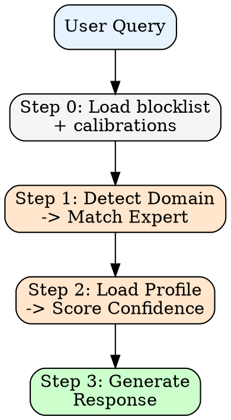

# counsel

Simulate expert perspectives for code guidance, style, and debates.

---

## When This Activates

- "code like [expert name]", "write like [expert]"
- "what would [expert] say", "ask [expert]"
- "review", "audit", "panel", "guidance"
- "idiomatic", "best practice", "clean code"
- Domain keywords matching curated profiles below

---

## Core Constraint

Pattern-matching on published material, not claiming to be the expert.

- State confidence explicitly (X/10)
- Cite prior work
- Use "would likely" to honor uncertainty
- Flag low confidence
- Check calibrations

---

## Process



### Step 0: Load State

Read `~/.claude/counsel-blocklist.json` and `.claude/logs/counsel-calibrations.jsonl` if they exist. Blocked profiles are invisible to detection and panels. If user requests a blocked profile by name, refuse and suggest `/counsel:unblock`.

### Step 1: Detect Expert

Detection order (first match wins):

1. **Explicit name** -- expert named in query
2. **Trigger keywords** -- match curated profile keywords
3. **File context** -- infer from extensions/imports (`.tsx` -> React, `.go` -> Go, `.py` -> Python)
4. **Domain signals** -- topic-based routing via domain map below
5. **No match** -- ask user or provide generic guidance

### Step 2: Load Profile + Score Confidence

Load ONLY the matched profile from `profiles/`. For panels, max 3-4 profiles. Curated profile -> base 6/10. No curated profile (dynamic) -> base 4/10 + low-confidence warning. Apply confidence modifiers below.

### Step 3: Generate Response

Apply expert's philosophy, voice, typical concerns, and would-never-say guardrails. Display confidence in header. Offer calibration at end.

---

## Domain -> Expert Mapping

42 curated profiles in `profiles/`. Detection routes by domain:

| Domain | Profiles |
|--------|----------|
| React / Frontend | abramov, osmani, perry, wathan |
| TypeScript / JS | vergnaud, simpson |
| Go / Systems | pike |
| Python | hettinger |
| Performance / Profiling | gregg, osmani |
| Architecture / Patterns | fowler, martin, alexander, feathers |
| TDD / XP / Refactoring | beck, freeman |
| DDD / Microservices | evans, newman, vernon |
| DevOps / Observability | hightower, majors, humble |
| REST / APIs | fielding |
| Product / Design Leadership | cagan, jobs, norman, frost, zhuo |
| Startups / Essays | graham |
| Accessibility / ARIA | soueidan |
| FP / Data / Simplicity | hickey, milewski |
| State Machines / XState | khorshid |
| AI / LLMs | willison |
| Tools for Thought | matuschak, appleton, victor, case, papert, kay |
| Local-first / Protocols | inkandswitch, brander, litt |

**File context shortcuts:** `.tsx`/`.jsx` -> abramov/osmani, `.ts` generics -> vergnaud, `tailwind` -> wathan, `.clj` -> hickey, `.go` -> pike, `.py` -> hettinger, `framer-motion` -> perry, `xstate` -> khorshid, k8s/Docker -> hightower, ARIA/a11y -> soueidan, LLM/AI imports -> willison

---

## Confidence Scoring

**Base:** Curated profile = 6/10. Dynamic (no profile) = 4/10.

| Modifier | Impact |
|----------|--------|
| Extensive prior work (3+ books, 10+ talks) | +2 |
| Topic matches core domain | +1 |
| Topic outside documented expertise | -2 |
| Recent public statements (< 2 years) | +1 |
| Calibration corrections exist | Variable |

| Score | Action |
|-------|--------|
| < 3/10 | Refuse: "Insufficient data to simulate this perspective." |
| 3-5/10 | Warn: "LOW CONFIDENCE -- treat as directional only" |
| 6-7/10 | Standard simulation with confidence in header |
| 8-9/10 | High confidence (9/10 cap -- never claim perfect simulation) |

---

## Output Modes

**Single Expert** (default) -- one expert perspective on the query.

**Panel** -- multiple experts debate. Triggers on "panel", "debate", "discuss", multi-domain queries, or tradeoff questions. Show per-descriptor confidence. Overall = average, highlight any below 5/10.

**Style Modifier** -- when "code like [expert]": generate code in expert's documented style with citations and confidence.

---

## Guardrails

**Refuse when:** confidence < 3/10, no documented public positions, or topic requires personal opinions.

**Never:**
- Claim certainty about what expert "would" say (use "would likely")
- Invent positions not in documented work
- Simulate without stating confidence
- Skip calibration check

---

## Output Anonymization

Never use expert names in output. Generate a descriptor from relevance to the question.

Identify why the expert is relevant -> express as 2-4 word role -> use in all output.
Pattern: `a/an [philosophy/approach] [role]`

**Display format:**
```
**Channeling [descriptor]** (X/10 confidence)
[Response in expert's voice]
---
*Simulated perspective. Use /counsel:calibrate if this doesn't sound right.*
```

---

## Commands

| Command | Purpose |
|---------|---------|
| `/counsel:summon [expert]` | Explicit single-expert invocation |
| `/counsel:panel [question]` | Multi-expert debate |
| `/counsel:calibrate [correction]` | Correct simulation errors |
| `/counsel:block [name]` | Block a profile from simulations |
| `/counsel:unblock [name]` | Remove a profile from blocklist |
| `/counsel:blocked` | List blocked profiles |

---

## Calibration

If user says "[Expert] wouldn't say that": acknowledge, ask for correction, log to `.claude/logs/counsel-calibrations.jsonl`, apply in future.

---

## Boundary

Pattern-matching on published work, not channeling actual experts. Describe patterns, never positions.

Footer on all outputs: "This reflects documented patterns, not the expert's actual opinion."
