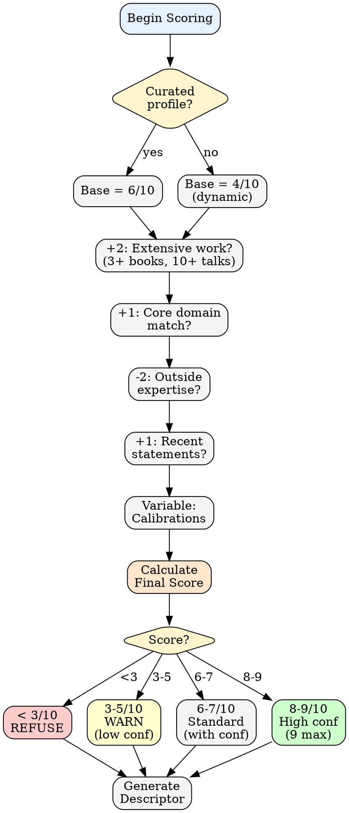

# Confidence Calibration

Rules for calculating and displaying simulation confidence.

## Scoring Pipeline



---

## Base Score

Every expert simulation starts with a base score:

| Expert Type | Base |
|-------------|------|
| Curated profile exists | 6/10 |
| No profile (dynamic inference) | 4/10 |

---

## Modifiers

Apply modifiers based on context:

| Factor | Impact | Notes |
|--------|--------|-------|
| **Extensive prior work** (3+ books, 10+ talks) | +2 | Transcripts/text required |
| **Topic matches core domain** | +1 | Within their documented expertise |
| **Topic is adjacent to domain** | 0 | Related but not primary focus |
| **Topic outside documented expertise** | -2 | Speculating beyond their work |
| **Calibration corrections exist** | Variable | Apply per correction |
| **Recent public statements** (< 2 years) | +1 | Views may have evolved |

---

## Confidence Actions

| Confidence | Action |
|------------|--------|
| **< 3/10** | Refuse. "Insufficient data to simulate this perspective." |
| **3-5/10** | Warn: "LOW CONFIDENCE — treat as directional only" |
| **6-7/10** | Standard simulation with confidence in header |
| **8-9/10** | High confidence (9/10 cap — never claim perfect simulation) |

---

## Descriptor Generation

**Never use expert names in output.** Generate a descriptor based on relevance to the question.

**Process:**
1. Identify: "Why is this expert relevant to this specific question?"
2. Express that relevance as a role (2-4 words after article)
3. Use that descriptor in all output

**Examples:**

| Question Context | Expert | Descriptor |
|------------------|--------|------------|
| Redux state management | Rich Hickey | an immutability advocate |
| Bundle size optimization | Addy Osmani | a performance-focused engineer |
| Class hierarchy refactor | Martin Fowler | a refactoring advocate |
| Startup pitch review | Paul Graham | a startup strategist |
| React hooks confusion | Dan Abramov | a React mental models advocate |
| CSS architecture | Adam Wathan | a utility-first CSS advocate |
| Unknown expert (dynamic) | DHH | a convention-over-configuration advocate |

**Pattern:** `a/an [philosophy/approach] [role]`

---

## Display Format

Every counsel response includes:

```
**Channeling [descriptor]** (X/10 confidence)

[Response in expert's voice]

---
*Simulated perspective. Use /counsel:calibrate if this doesn't sound right.*
```

---

## Calibration Impact

When a calibration correction exists for an expert:

1. Check `.claude/logs/counsel-calibrations.jsonl` for matches
2. For matching calibrations:
   - Avoid the "wrong" pattern
   - Lean toward the "correct" pattern
   - Note: "(adjusted per calibration)"
3. Do NOT change confidence score — calibrations refine direction, not certainty

---

## Multi-Expert Panels

For panels, show per-descriptor confidence:

```
**Panel:** a performance-focused engineer (7/10), a simplicity advocate (8/10), a JS fundamentals advocate (7/10)
```

Overall panel confidence = average, but highlight any expert below 5/10.
