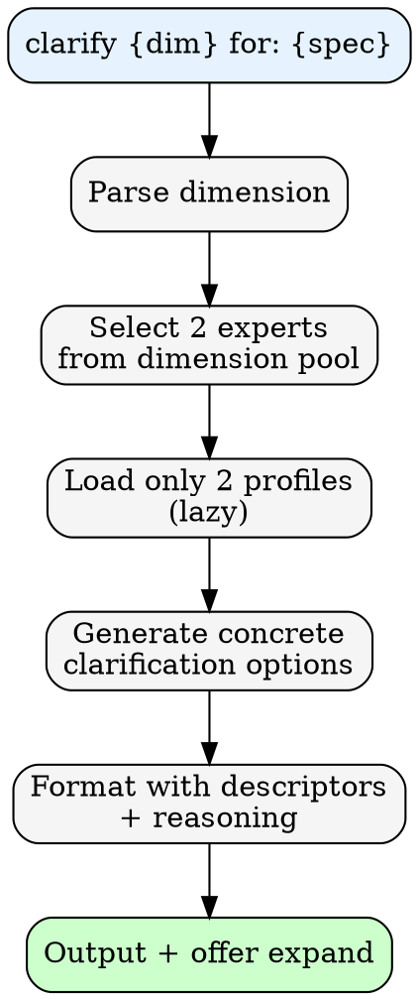

# Clarification Mode

Logic for `/counsel:panel clarify {dimension} for: {spec}` pattern.

---

## Process



---

## Dimension Pools

| Dimension | Expert Pool |
|-----------|-------------|
| Outcome | Jobs, Graham, Kay, Victor |
| Scope | Fowler, Hickey, Feathers, Alexander |
| Constraints | Pike, Osmani, Hightower, Gregg |
| Success | Norman, Majors, Zhuo, Beck |
| Done | Cagan, Humble, Newman |

**Extended aspects:**

| Aspect | Experts |
|--------|---------|
| Design | Norman, Zhuo, Frost, Alexander |
| UI | Abramov, Osmani, Perry, Wathan |
| UX | Norman, Zhuo, Victor, Case |
| Innovation | Jobs, Kay, Victor, Matuschak |

---

## Output Format

```
### Clarification Options: {Dimension}

**[Expert A descriptor] (X/10)** recommends:
"[Specific, measurable clarification]"
_Reasoning: [Why from their philosophy]_

**[Expert B descriptor] (Y/10)** recommends:
"[Alternative clarification]"
_Reasoning: [Why from their philosophy]_

---
*Want another perspective? Reply 'expand' to add 1-2 more experts.*
```

---

## Requirements

- Each option must be specific and measurable
- Include brief reasoning from expert's philosophy
- Generate descriptor per [confidence.md](../confidence.md#descriptor-generation)
- Load only selected profiles (lazy loading)
