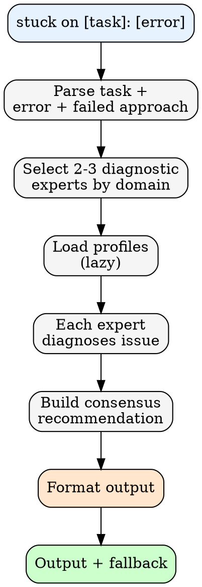
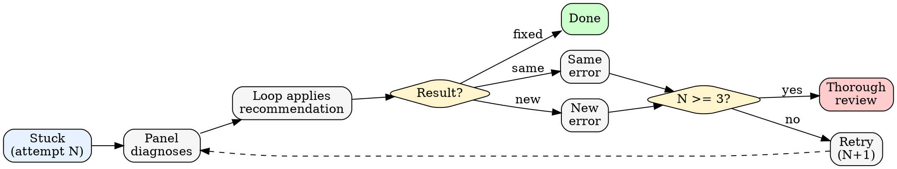

# Diagnose Mode (Stuck)

Logic for `/counsel:panel stuck on [task]: [error]` pattern.

---

## Process



---

## Retry Loop (Loop Integration)

When loop applies recommendation and retries:



**Loop contract:**
- Attempt 1-2: Retry with different diagnostic angle
- Attempt 3+: Escalate to thorough review
- Same error twice: Select different experts
- New error: Fresh diagnosis with error history

---

## Output Format

```
## Stuck Analysis: [task]

**Error:** [error summary]
**Failed Approach:** [what was tried]

### Diagnosis

**[Expert A descriptor] (X/10):** [diagnosis from their philosophy]
**[Expert B descriptor] (Y/10):** [diagnosis from their philosophy]

### Recommendations

1. **[approach]** (confidence: X/10)
   - Expert A supports because: [reason]
   - Expert B adds: [reason]

2. **[alternative approach]** (confidence: Y/10)
   - Expert C suggests because: [reason]

### Consensus Recommendation

[Most agreed-upon approach with confidence level]

### If Still Stuck

[What to try if first recommendation fails — different angle, not same advice]
```

---

## Loop Integration

Loop invokes `counsel:panel stuck on...` when:
- Task fails verification (stuckCount >= 1)
- Same error occurs twice

Loop applies recommendation by:
1. Extracting consensus recommendation
2. Updating task approach based on diagnosis
3. Retrying with new approach
4. On 3rd failure: escalates to thorough review
