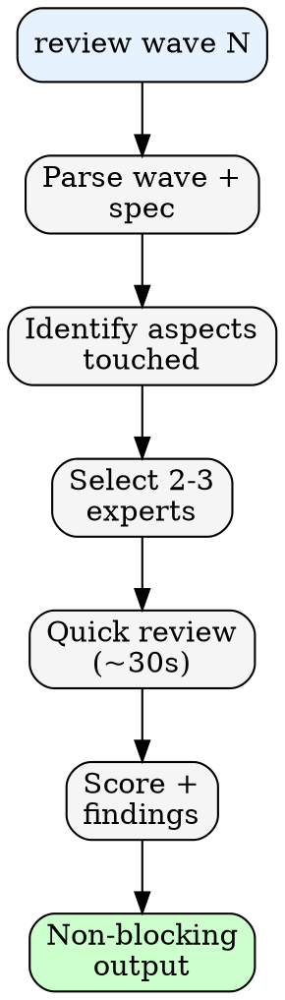
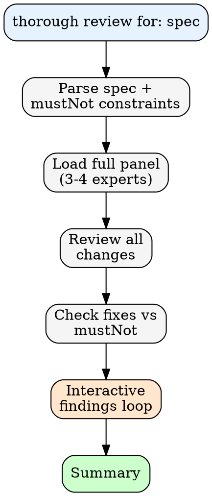
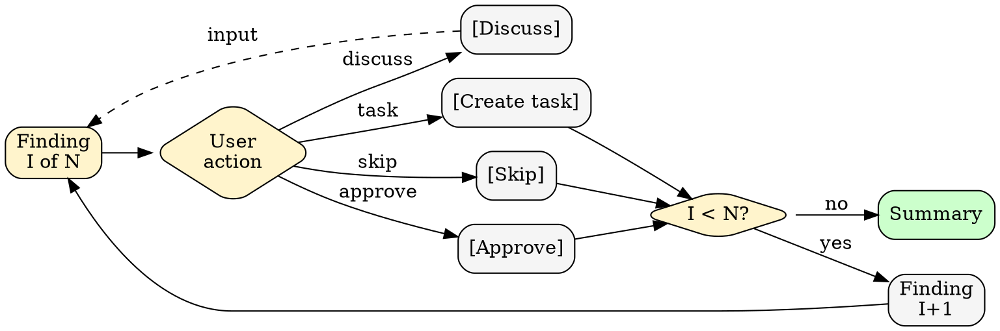

# Review Mode

Logic for `/counsel:panel review wave {N}` and `thorough review` patterns.

---

## Light Review

Pattern: `review wave {N} changes for: {spec}`



### Output Format (Light)

```
## Wave {N} Review: {score}/10

**Reviewers:** [expert A descriptor] (X/10), [expert B descriptor] (Y/10)

### Findings

| Severity | Issue | Guidance |
|----------|-------|----------|
| SUGGESTION | Consider extracting validation | Move to utils/validation.ts |
| WARNING | Missing null check | Add `user?.email` guard |

### Summary
- Score: {score}/10
- Issues: {count} ({blockers} blockers, {warnings} warnings)

*Non-blocking review. Loop continues.*
```

---

## Thorough Review

Pattern: `thorough review for: {spec} with constraints: {mustNot}`



### Interactive Findings Loop



### Output Format (Thorough)

```
## Thorough Review

**Panel:** [expert A] (X/10), [expert B] (Y/10), [expert C] (Z/10)

### Finding 1 of {N}

+----- {BLOCKER|WARNING|SUGGESTION} -----+
| {Issue description}                      |
+------------------------------------------+
| **Guidance:** {Idiomatic fix approach}   |
| **Constraint check:** {OK | BLOCKED}     |
+------------------------------------------+

**If fix violates constraint:**
  -> Alternative: {Constraint-respecting approach}

[Approve] [Create task] [Discuss] [Skip]
```

---

## Severity Definitions

| Severity | Definition | Action |
|----------|------------|--------|
| **BLOCKER** | Must fix before ship | Auto-creates task if not approved |
| **WARNING** | Should fix | Requires acknowledgment |
| **SUGGESTION** | Optional improvement | Informational |

---

## Expert-to-Aspect Mapping

| Aspect | Light Review | Thorough Review |
|--------|--------------|-----------------|
| API Design | Fowler | Fowler, Fielding |
| State | Hickey | Hickey, Abramov |
| Testing | Beck | Beck, Freeman |
| Security | OWASP | OWASP, Pike |
| Performance | Gregg | Gregg, Osmani |
| UI/UX | Norman | Norman, Zhuo |
| Architecture | Martin | Martin, Evans, Vernon |

---

## Constraint-Aware Guidance

Before suggesting fixes, check against mustNot from SHAPE.md:

1. Load constraints from `.loop/shape/SHAPE.md`
2. For each suggested fix:
   - Evaluate if fix violates any mustNot
   - If violation: mark as "BLOCKED - violates: {constraint}"
   - Provide alternative that respects constraints
3. Include constraint check in output
