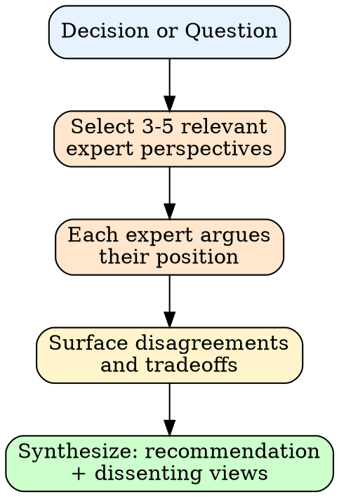

# counsel:panel — Multi-Expert Debate

Simulates a debate among multiple expert perspectives. Surfaces tradeoffs, blindspots, and synthesizes actionable guidance.

---

## When to Use

- Complex decisions with multiple valid approaches
- Tradeoff analysis (speed vs quality, simple vs extensible)
- Unblocking when stuck on a direction
- Reviewing approach risks before committing
- loop:start auto-invokes when execution stalls

---

## Process



### 1. Select Experts

Pick 3-5 experts from counsel's profiles whose domains are relevant to the decision. Prioritize perspectives that will disagree productively.

### 2. Debate

Each expert argues their position with evidence from their documented work. Use anonymized descriptors (not names).

### 3. Surface Tensions

Identify where experts disagree and why. Map disagreements to concrete tradeoffs the user must evaluate.

### 4. Synthesize

Deliver a recommendation with:
- **Consensus:** Where experts agree
- **Key tradeoff:** The main tension to resolve
- **Recommendation:** What the panel leans toward and why
- **Dissent:** Strongest counterargument

---

## Output Format

```
## Panel: [question]

**[Descriptor A]** (X/10): [position + reasoning]
**[Descriptor B]** (X/10): [position + reasoning]
**[Descriptor C]** (X/10): [position + reasoning]

### Synthesis
- **Consensus:** [what they agree on]
- **Key tradeoff:** [main tension]
- **Recommendation:** [lean + reasoning]
- **Dissent:** [strongest counter]
```

---

## Modes

| Mode | Trigger | Behavior |
|------|---------|----------|
| **Decision** | "should we X or Y" | Debate approaches, recommend one |
| **Review** | "review this approach" | Critique from multiple angles |
| **Unblock** | "stuck on X" | Diagnose from multiple perspectives, suggest path forward |

---

## Integration

- **hope:shape** invokes panel for expert consultation on approach
- **hope:gate** invokes panel for final approval review
- **loop:start** invokes panel when execution stalls (auto-unblock)

This skill delegates to counsel's full expert simulation system for profile loading, confidence scoring, and guardrails. See `counsel:counsel` for single-expert guidance.

---

## Boundary

Pattern-matching on published work, not channeling actual experts. Panel synthesizes documented perspectives into actionable guidance.
