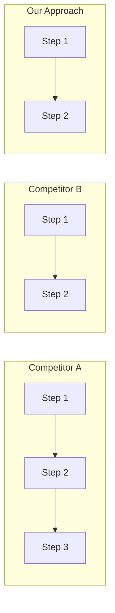

# UX Comparison

Competitive UX flow teardown. Screen-by-screen analysis of how competitors handle specific user journeys.

## ⚠️ Required Inputs

Ask for ALL before proceeding. Never assume.

- **Competitors** (3 products/apps) — Source: [?] Confidence: [H/M/L]
- **User flow** (e.g., onboarding, checkout) — Source: [?] Confidence: [H/M/L]
- **Your product context** (what you're designing) — Source: [?] Confidence: [H/M/L]
- **Specific questions** (what you want to learn) — Source: [?] Confidence: [H/M/L]

If inputs missing → ASK. If >50% low confidence → FLAG.

## Core Principles

1. **Flow over features**: Analyze UX journeys, not feature checklists
2. **Trigger → Action → Reward**: Framework for every step
3. **Patterns over observations**: Categorize what's standard vs unique vs anti-pattern
4. **Friction is strategic**: Some friction is intentional — understand why

## Output Structure

### Flow Definition
Start/end points, user goal, competitors analyzed, analysis questions

### Step-by-Step Breakdown
For each step, compare across all competitors:
- **Trigger** (what prompts this step)
- **Action** (what user does)
- **Reward** (feedback/result)
- **Notable Differentiator** (≤15 words)

### Comparison Table
| Step | Competitor A | Competitor B | Competitor C | Differentiator |

### Pattern Analysis
Common patterns (industry standard), unique approaches (differentiation), anti-patterns (what to avoid)

### Friction Analysis
High friction points (user struggle), low friction (smooth), strategic trade-offs

### Recommendations
Must-have (table stakes), should consider (best practices), differentiation opportunity, what to avoid

## Anti-Patterns

- ❌ Feature comparison — this is UX flow analysis, not feature matrix
- ❌ Observations without patterns — categorize or it's noise
- ❌ Ignoring friction trade-offs — some friction is intentional

## Commitment Readiness

Before moving to next workflow:
- [ ] ≥3 steps analyzed per competitor
- [ ] Trigger → Action → Reward applied consistently
- [ ] Patterns categorized (common, unique, anti-pattern)
- [ ] Clear recommendations provided

**Handoff artifact:** Competitive insights + recommendations

## Handoff Options

Before generating final output, ask:

> What format would you like for handoff?
> 1. **Marp slides** — Presentation deck for stakeholders
> 2. **Markdown table** — Comparison matrix for documentation
> 3. **Figma AI prompt** — UI based on best practices found

### Markdown Comparison Table

| Step | Competitor A | Competitor B | Our Approach | Rationale |
|------|--------------|--------------|--------------|-----------|
| Signup | Email + Google | Email only | Both | Lower friction |
| Onboarding | 5 steps | 3 steps | 3 steps | Reduce drop-off |

### Mermaid Comparison (renders in GitHub, mermaid.live, or via CLI)

## Related Workflows

- **Before:** constraints, journey
- **After:** directions, ia
- **Complements:** journey (validates assumptions), directions (informs visual approach)
