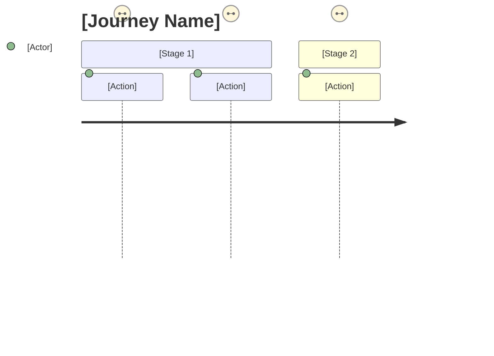

# Journey Mapping

Map user experience before designing screens. Understand the full context of how someone accomplishes a goal.

## ⚠️ Required Inputs

Ask for ALL before proceeding. Never assume.

- **User persona** — Source: [Research/Assumption] Confidence: [H/M/L]
- **Goal** (what they're trying to accomplish) — Source: [?] Confidence: [H/M/L]
- **Starting context** (where they come from, trigger) — Source: [?] Confidence: [H/M/L]
- **Current pain points** — Source: [?] Confidence: [H/M/L]
- **Success criteria** — Source: [?] Confidence: [H/M/L]

If inputs missing → ASK. If >30% low confidence → FLAG as hypothesis-based.

## Reasoning Step (Before Mapping)

Before creating the journey map, explicitly identify:

1. **Key assumptions** you're making about user behavior
2. **What evidence would change** your approach
3. **Where you need validation** vs where you have confidence

## Evidence Check (Required)

For each journey stage, track evidence:

| Stage   | Pain Point | Source                | Confidence |
| ------- | ---------- | --------------------- | ---------- |
| [Stage] | [Pain]     | [Research/Assumption] | [H/M/L]    |

**If >30% are low-confidence assumptions:**

> ⚠️ This journey map reflects hypotheses, not validated user behavior.
> Recommend user research before proceeding to design.

## Core Principles

1. **Map current state first**: Understand before proposing changes
2. **Include emotions**: Thinking + Feeling, not just actions
3. **Identify moments that matter**: Where design has outsized impact
4. **Surface anti-patterns**: What to avoid for this journey type

## Output Structure

### Journey Overview

Persona, goal, entry/exit points, time span

### Stage Map

For each stage: Action, Thinking, Feeling, Touchpoint, Pain Point, Opportunity

### Moments That Matter (3-5)

Critical moments where design has outsized impact

### Anti-Patterns to Avoid

Common mistakes for this journey type

### Design Implications

Information needs, emotional arc, key design questions

## Anti-Patterns

- ❌ Journey maps without research — visualized assumptions, false confidence
- ❌ Actions only, no emotions — misses the human experience
- ❌ Too many stages — loses focus, dilutes insights

## Commitment Readiness

Before moving to next workflow:

- [ ] Evidence sources documented for each stage
- [ ] Confidence levels honest (flag low-confidence areas)
- [ ] Moments that matter prioritized
- [ ] Stakeholder review of journey accuracy

**Handoff artifact:** Journey map + moments that matter (with confidence levels)

## Handoff Options

Before generating final output, ask:

> What format would you like for handoff?
> 1. **Marp slides** — Presentation deck for stakeholders
> 2. **WireMD wireframe** — Screen mockups for key moments
> 3. **Figma AI prompt** — Text to paste into Figma AI
> 4. **Mermaid diagram** — Journey visualization (renders in GitHub, mermaid.live, or via CLI)
> 5. **Markdown** — Structured text (copy-paste anywhere)

### Mermaid Journey Format

## Related Workflows

- **Before:** constraints
- **After:** ia, directions
- **Complements:** compare (competitor journey analysis)
