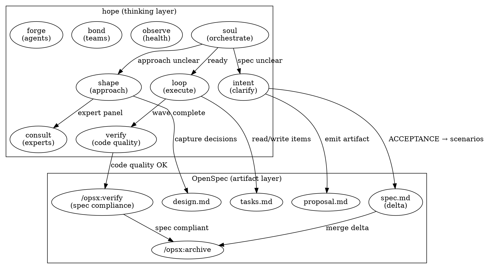

# OpenSpec Integration Audit

**Date**: 2026-02-27
**Scope**: Deep audit of OpenSpec (v0.x, github.com/Fission-AI/OpenSpec) vs hope (v3.12.3)
**Question**: What overlaps? What can we remove? How should we integrate?

## Executive Summary

OpenSpec and hope operate at **different layers** with **real but narrow overlap**:

- **OpenSpec** = durable artifact management (specs, proposals, designs, tasks, archive)
- **hope** = thinking quality within a session (clarification, expert consultation, execution discipline)

OpenSpec gives hope what it deliberately lacks: **persistent, cross-session artifacts**. Hope gives OpenSpec what it deliberately lacks: **thinking rigor, expert simulation, verification beyond spec compliance**.

The overlap exists in **4 areas**. Three are compositional (hope should produce OpenSpec artifacts instead of its own formats). One is complementary (both verify, but different dimensions).

## Layer Model

```
┌─────────────────────────────────────────────────┐
│  hope (thinking quality layer)                  │
│  soul, consult, bond, forge, observe, search    │
│  criteria/holdout separation, wave execution    │
│  engagement modulation, cognitive zones         │
├─────────────────────────────────────────────────┤
│  INTEGRATION SURFACE (overlap zone)             │
│  intent ↔ proposal    (clarify WHAT)            │
│  shape ↔ design       (decide HOW)              │
│  loop ↔ tasks         (decompose & track)       │
│  verify ↔ /opsx:verify (check before ship)      │
├─────────────────────────────────────────────────┤
│  OpenSpec (artifact management layer)           │
│  specs, delta specs, archive, schemas           │
│  change lifecycle, project config               │
│  multi-tool support, validation                 │
└─────────────────────────────────────────────────┘
```

## Overlap Analysis

### Overlap 1: Intent ↔ Proposal (Clarify WHAT)

| Dimension | hope intent | OpenSpec proposal |
|-----------|------------|-------------------|
| Purpose | Turn vague request into testable work order | Document why, what changes, capabilities, impact |
| Output | OBJECTIVE, ACCEPTANCE, NON-GOALS, CONSTRAINTS, STOP CONDITIONS, BLAST RADIUS | proposal.md (Why, What Changes, Capabilities, Impact) |
| Durability | Conversation-only (ephemeral) | Filesystem (persists across sessions) |
| Clarification | 3 rounds MCQ, adversarial questions | None (AI generates from user prompt) |
| Testability | ≥2 "must NOT" in ACCEPTANCE, all ≤20w | Capabilities section (NEW/MODIFIED) |

**Assessment**: Intent's *process* (clarification rounds, adversarial questions, gap-closing) is unique. Its *output format* overlaps with proposal.md.

**Verdict**: **Compose**. Intent does the thinking, then emits an OpenSpec proposal instead of a standalone conversation artifact. The clarification process stays; the output format changes.

### Overlap 2: Shape ↔ Design (Decide HOW)

| Dimension | hope shape | OpenSpec design |
|-----------|-----------|-----------------|
| Purpose | Expert-informed approach selection | Document context, goals, decisions, risks |
| Output | criteria[], holdout[], mustNot[], mode recommendation | design.md (Context, Goals/Non-Goals, Decisions, Risks, Migration) |
| Expert input | Consult panel, synthesize by concern | None (AI generates) |
| Unique mechanism | Disjoint criteria/holdout (prevents gaming verification) | Records decisions for posterity |
| Pre-mortem | Yes (critical risk only) | No |

**Assessment**: Shape's *mechanisms* (expert panel, criteria/holdout separation, mode recommendation, pre-mortem) have no OpenSpec equivalent. Design.md captures *decisions* that shape doesn't persist.

**Verdict**: **Compose**. Shape does expert consultation and criteria/holdout generation, then captures decisions into OpenSpec design.md. Shape's criteria/holdout/mustNot stay in conversation (they're execution state, not archival artifacts). Design.md records the WHY for posterity.

### Overlap 3: Loop ↔ Tasks (Decompose & Execute)

| Dimension | hope loop | OpenSpec tasks |
|-----------|----------|----------------|
| Purpose | Wave-based execution with satisfaction gating | Checklist of implementation items |
| Output | 5-21 atomic items, wave reports, LEARN insights | tasks.md (grouped checkboxes) |
| Progress tracking | Done/Carry/Stall per wave, satisfaction score | Checkbox state `[x]` |
| Verification | Holdout subagent per wave (PASS/WEAK/PARTIAL/FAIL) | None (apply just works through list) |
| Retry | Carry items with failure context | Rerun /opsx:apply |

**Assessment**: This is the **strongest overlap**. Both decompose work into checkable items. But loop's execution mechanics (wave ordering, satisfaction gating, holdout verification, carry with context) are far richer than OpenSpec's simple checkbox tracking.

**Verdict**: **Compose**. Loop should read/write OpenSpec tasks.md as its backing store, but keep its wave execution mechanics. Checkbox updates in tasks.md replace loop's internal tracking. Wave reports and satisfaction gating remain conversation-only.

### Overlap 4: Verify ↔ /opsx:verify (Check Before Ship)

| Dimension | hope verify | OpenSpec verify |
|-----------|------------|-----------------|
| Dimensions | Correctness, Security, Performance, Standards | Completeness, Correctness, Coherence |
| Scope | git diff (changed files only) | Spec compliance (tasks done, requirements met, design reflected) |
| Output | BLOCKER/WARNING/SUGGESTION per file:line | CRITICAL/WARNING/SUGGESTION per dimension |
| Unique | Security + performance analysis | Spec-requirement traceability |

**Assessment**: **Complementary**, not overlapping. OpenSpec verifies "did we build what the spec says?" Hope verifies "is the code we built actually good?"

**Verdict**: **Compose sequentially**. Run OpenSpec verify for spec compliance, then hope verify for code quality. Two gates, different concerns.

## What Hope Does That OpenSpec Cannot

These are **unique to hope** and have **no OpenSpec equivalent**:

| Capability | Why It's Unique |
|-----------|----------------|
| **Soul** (session orchestration) | Per-turn thinking audit, type/zone/engagement detection. OpenSpec has no session-level awareness. |
| **Consult** (74 expert profiles) | Grounded expert simulation with panel debates, unblock diagnosis. OpenSpec has no expert system. |
| **Criteria/holdout separation** | Prevents generator from gaming verification rubric. OpenSpec has no equivalent mechanism. |
| **Wave execution** | Satisfaction gating, carry-with-context, circuit breakers. OpenSpec's apply is a simple task list walk. |
| **Engagement modulation** | Autonomous/Collaborative/Guided calibration per session. OpenSpec doesn't adapt to user. |
| **Cognitive zones** | Zone 1/2/3 assessment adjusting ceremony level. OpenSpec applies same process regardless. |
| **Observe** (codebase health) | 5-dimension parallel health assessment. OpenSpec has no codebase analysis. |
| **Bond** (team composition) | 4-dimension fitness assessment for agent teams. OpenSpec has no team orchestration. |
| **Forge** (agent creation) | Interactive agent design with skill discovery + expert review. OpenSpec has static AGENTS.md. |
| **Search** (sg/rg reference) | AST-grep and ripgrep pattern reference. OpenSpec has no search guidance. |
| **Pre-mortem gates** | Proactive failure mode surfacing for critical risk. OpenSpec doesn't assess risk tiers. |
| **Pyramid summaries** | L1/L2/L3 communication scaling to stakes. OpenSpec doesn't scale output format. |
| **[SESSION] markers** | Context preservation across turns and compaction. OpenSpec relies on filesystem. |
| **Comprehension probes** | Testing-effect learning interventions. OpenSpec doesn't assess human understanding. |

## What OpenSpec Does That Hope Cannot

These are **unique to OpenSpec** and have **no hope equivalent**:

| Capability | Why It's Unique |
|-----------|----------------|
| **Spec management** | Source-of-truth specs that evolve across sessions. Hope has conversation-only state. |
| **Delta specs** | ADDED/MODIFIED/REMOVED/RENAMED for brownfield changes. Hope doesn't track change types. |
| **Spec merge on archive** | Automated spec evolution when changes complete. Hope has no archival. |
| **Change lifecycle** | Propose → apply → archive with full audit trail. Hope's pipeline is per-session. |
| **Cross-session persistence** | Filesystem artifacts survive session boundaries. Hope's conversation dies. |
| **Custom schemas** | Configurable workflow definitions per team. Hope has fixed pipeline. |
| **Project config** | Persistent tech stack, patterns, rules in config.yaml. Hope reads CLAUDE.md but doesn't maintain config. |
| **Multi-tool support** | 24+ AI tools via generated skills/commands. Hope is Claude Code only. |
| **Validation system** | Spec format validation, requirement structure checks. Hope validates thinking, not document format. |
| **Onboarding** | Interactive tutorial for new contributors. Hope has no onboarding flow. |
| **Explore command** | Investigation-only mode with no artifacts. Hope's intent always produces output. |
| **Bulk archive** | Archive multiple completed changes with conflict detection. Hope has no batch operations. |

## Recommendations

### What to Remove from Hope

**Nothing should be deleted outright.** Hope's mechanisms are unique. But hope's **output formats** should yield to OpenSpec's artifact formats where they overlap:

#### 1. Intent: Remove standalone work order format

**Current**: Intent emits OBJECTIVE + ACCEPTANCE + NON-GOALS + CONSTRAINTS + STOP CONDITIONS + BLAST RADIUS as conversation text.

**Change**: Intent's clarification process stays identical. Final output writes an OpenSpec `proposal.md` instead. Map:

| Intent field | OpenSpec proposal section |
|-------------|-------------------------|
| OBJECTIVE | Why |
| NON-GOALS + CONSTRAINTS | What Changes (exclusions) |
| ACCEPTANCE | → becomes OpenSpec spec.md scenarios |
| STOP CONDITIONS | Impact |
| BLAST RADIUS | Impact |

**Keep in conversation**: OBJECTIVE (1 sentence) and STOP CONDITIONS (circuit breakers). These are execution-critical and must survive compaction.

**Why**: Intent's value is the thinking process (3 rounds, adversarial questions, gap-closing). The output format is a lightweight version of what OpenSpec does durably. Let OpenSpec handle the artifact; let intent handle the thinking.

#### 2. Loop: Remove custom decomposition format

**Current**: Loop creates 5-21 atomic items with its own internal format, tracks Done/Carry/Stall.

**Change**: Loop reads/writes OpenSpec `tasks.md` for its work items. Wave execution, satisfaction gating, holdout verification, carry-with-context all stay. The backing store changes from conversation to filesystem.

| Loop mechanism | Keep? | Why |
|---------------|-------|-----|
| Wave ordering (reversible first) | Yes | OpenSpec has no execution ordering |
| Satisfaction gating (≥85 threshold) | Yes | OpenSpec has no quality threshold |
| Holdout verification per wave | Yes | OpenSpec has no independent verification |
| Carry with failure context | Yes | OpenSpec has no retry semantics |
| `[LEARN]` insights | Yes | OpenSpec has no learning extraction |
| Custom 5-21 item format | **No** | Use OpenSpec tasks.md format instead |
| Internal Done/Carry/Stall counters | **Partial** | Checkpoint state in tasks.md; carry/stall remain in conversation |

**Why**: Tasks.md gives loop what it lacks: persistence across sessions. Loop gives tasks.md what it lacks: intelligent execution ordering and quality gates.

#### 3. Shape: Capture decisions in design.md

**Current**: Shape produces criteria[], holdout[], mustNot[], and mode recommendation as conversation text only.

**Change**: After shape completes, capture decisions (expert findings, tensions, rationale) into OpenSpec `design.md`. Keep criteria/holdout/mustNot in conversation (they're execution state, not archival).

| Shape output | Where it goes |
|-------------|--------------|
| Key findings (by concern) | design.md Decisions section |
| Tensions (expert disagreements) | design.md Risks/Trade-offs section |
| Mode recommendation | design.md Context section |
| Pre-mortem | design.md Risks section |
| criteria[] | Conversation only (execution guidance) |
| holdout[] | Conversation only (verification rubric) |
| mustNot[] | Conversation + design.md Non-Goals |

**Why**: Shape's value is the expert consultation process and criteria/holdout separation. Design.md captures the decisions for team reference. These are complementary outputs from the same thinking.

### Integration Architecture



### How Soul Orchestrates OpenSpec

Soul's per-turn audit gains awareness of OpenSpec state:

| Soul check | Current behavior | With OpenSpec |
|-----------|-----------------|---------------|
| Spec clear? | Check ACCEPTANCE in conversation | Check if `openspec/changes/*/proposal.md` exists + has locked ACCEPTANCE |
| Approach shaped? | Check criteria[] in conversation | Check if `openspec/changes/*/design.md` exists + criteria[] in conversation |
| Ready to execute? | Check criteria + mustNot present | Check if `openspec/changes/*/tasks.md` exists + criteria[] present |
| Work complete? | Satisfaction ≥85 | Satisfaction ≥85 + all tasks.md checkboxes checked |
| Archive ready? | N/A (no archival) | Route to `/opsx:archive` after verify gates pass |

### Lifecycle Mapping

```
BEFORE (hope-only):
  intent (conversation) → shape (conversation) → loop (conversation) → verify (conversation)
  [all artifacts die when session ends]

AFTER (hope + OpenSpec):
  intent (thinking) → /opsx:propose (artifact) → shape (thinking) → design.md (artifact)
  → loop (execution) ↔ tasks.md (artifact) → verify (code quality) → /opsx:verify (spec)
  → /opsx:archive (persist)
  [thinking dies with session; artifacts persist for next session]
```

### What NOT to Change

1. **Soul** — Keep as-is. Session orchestration is orthogonal to OpenSpec.
2. **Consult** — Keep as-is. Expert simulation has no OpenSpec equivalent.
3. **Bond** — Keep as-is. Team composition has no OpenSpec equivalent.
4. **Forge** — Keep as-is. Could optionally generate OpenSpec-compatible AGENTS.md entries, but this is additive, not a change.
5. **Observe** — Keep as-is. Codebase health has no OpenSpec equivalent.
6. **Search** — Keep as-is. Reference skill, no overlap.
7. **Criteria/holdout separation** — Keep as-is. Core mechanism, no OpenSpec equivalent.
8. **Wave execution** — Keep as-is. OpenSpec's apply is a simple list walk.
9. **Satisfaction gating** — Keep as-is. OpenSpec has no quality thresholds.
10. **[SESSION] markers** — Keep as-is. OpenSpec relies on filesystem, not conversation state.
11. **Hooks** — Keep all 4. They manage thinking quality, not artifacts.
12. **Engagement modulation** — Keep as-is. OpenSpec doesn't adapt to user.

### Philosophy Reconciliation

**Tension**: Hope says "conversation is the only state." OpenSpec requires filesystem state.

**Resolution**: This isn't a contradiction. Hope's rule prevents *invisible* persistent state (`.jsonl` files, workflow databases). OpenSpec's artifacts are *visible*, version-controlled, and user-owned. They're closer to "code you wrote" than "state you track." The philosophy audit question is: "Does this introduce persistent state?" The answer for OpenSpec artifacts is: "Yes, but it's the user's spec, not hidden workflow state."

Update hope's constraint from:
> No persistent state (conversation markers only)

To:
> No hidden persistent state. Conversation markers for session state. User-owned spec artifacts (via OpenSpec) for cross-session knowledge.

### Implementation Priority

| Priority | Change | Effort | Impact |
|----------|--------|--------|--------|
| 1 | Loop reads/writes OpenSpec tasks.md | Medium | High — tasks persist across sessions |
| 2 | Intent emits OpenSpec proposal.md | Medium | High — specs survive session boundaries |
| 3 | Shape captures decisions in design.md | Low | Medium — decisions documented for team |
| 4 | Soul checks OpenSpec artifact state | Low | Medium — smarter routing |
| 5 | Verify composes with /opsx:verify | Low | Low — complementary gates |
| 6 | Archive routing after verify | Low | Low — lifecycle completion |

### Migration Path

1. **Phase 1**: Install OpenSpec alongside hope. No changes to hope. Users manually `/opsx:propose` after `/hope:intent`.
2. **Phase 2**: Modify intent to optionally emit proposal.md. Loop optionally reads tasks.md. Shape optionally writes design.md. Feature-flagged via OpenSpec detection (if `openspec/` exists, compose; otherwise, standalone).
3. **Phase 3**: Soul gains OpenSpec awareness. Routing includes artifact state checks. Verify chains with /opsx:verify. Archive becomes natural pipeline endpoint.

## Summary Table

| hope skill | Overlap with OpenSpec | Action |
|-----------|----------------------|--------|
| soul | None | Keep as-is |
| intent | Proposal overlap (output format) | Compose: intent thinking → OpenSpec proposal |
| shape | Design overlap (decision capture) | Compose: shape thinking → OpenSpec design |
| loop | Tasks overlap (decomposition) | Compose: loop execution ↔ OpenSpec tasks |
| verify | Complementary (different dimensions) | Compose sequentially |
| observe | None | Keep as-is |
| consult | None | Keep as-is |
| bond | None | Keep as-is |
| forge | Minimal (AGENTS.md) | Keep as-is, optional AGENTS.md generation |
| search | None | Keep as-is |

**Bottom line**: Hope is a thinking quality layer. OpenSpec is an artifact management layer. They compose naturally. Hope should produce OpenSpec artifacts instead of its own formats for the 3 overlapping areas (proposal, design, tasks), keep all its unique mechanisms, and gain OpenSpec lifecycle awareness in soul.
