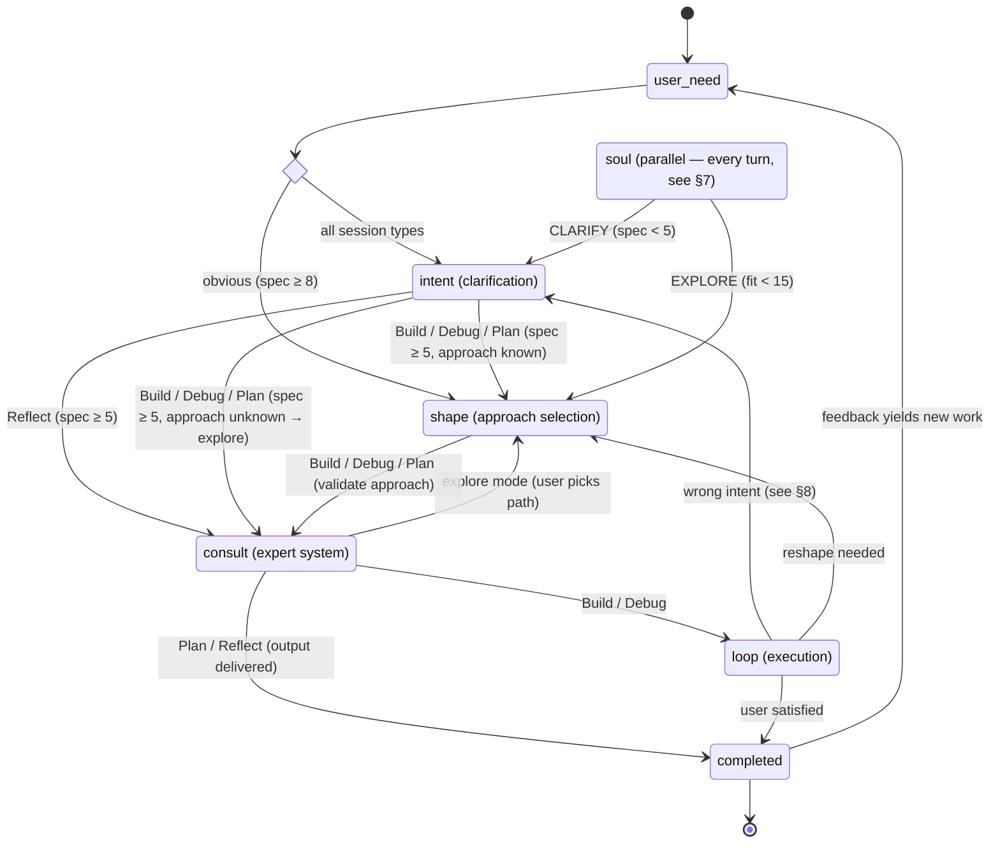
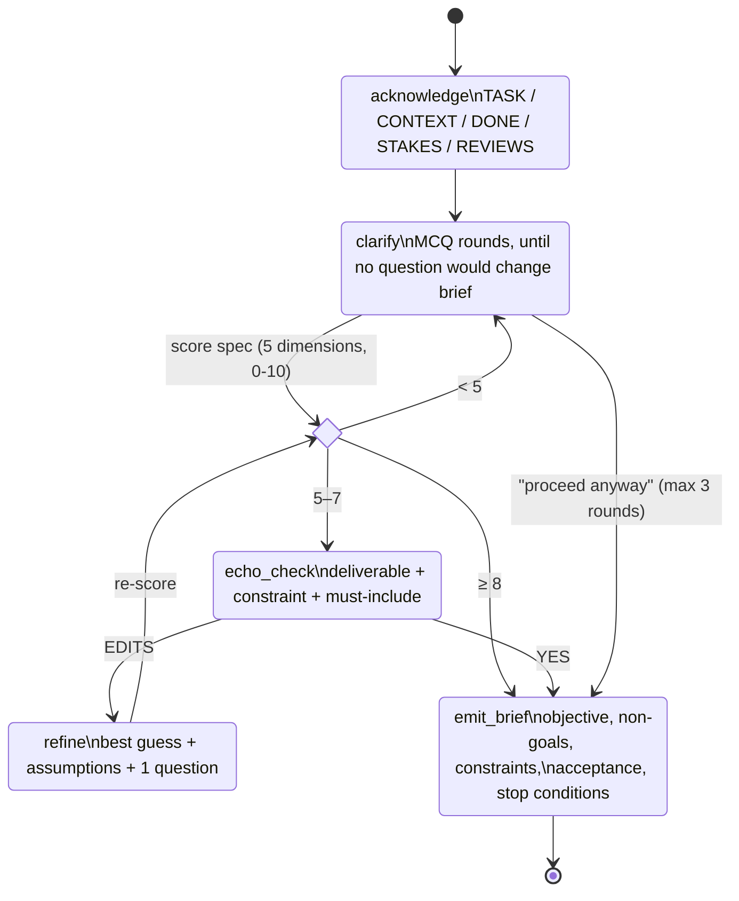
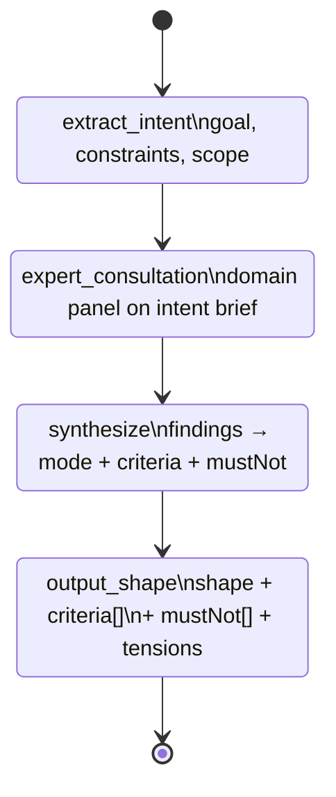
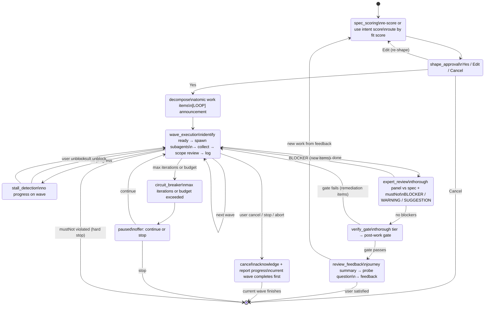
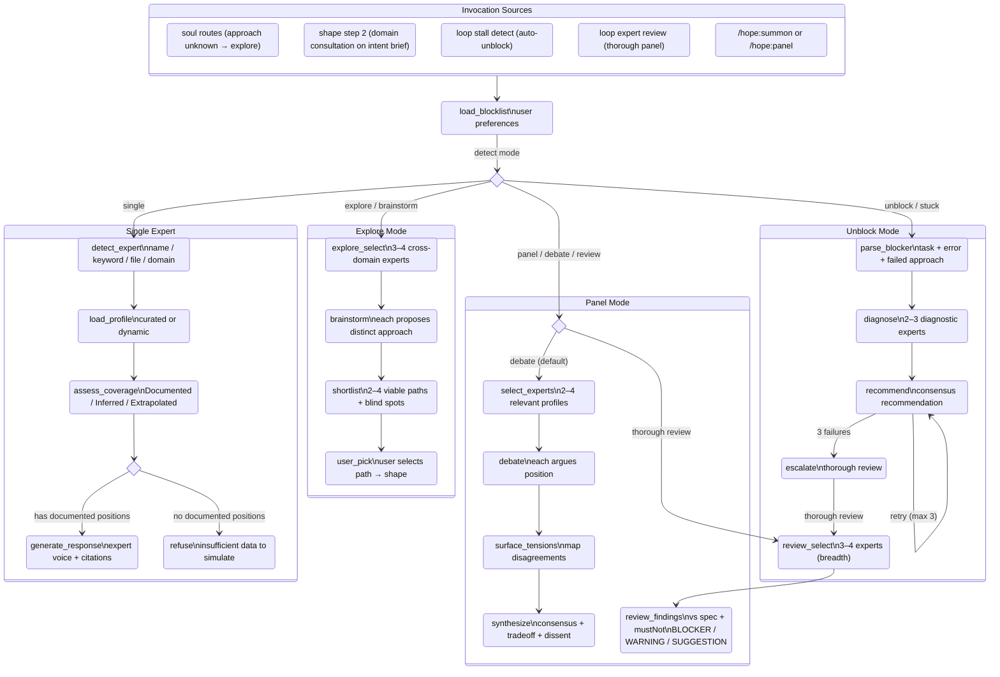
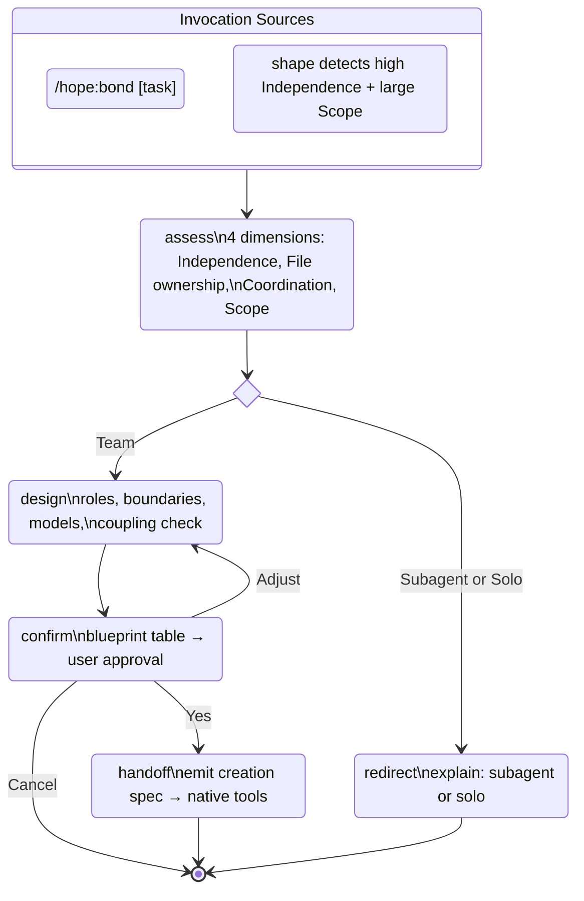
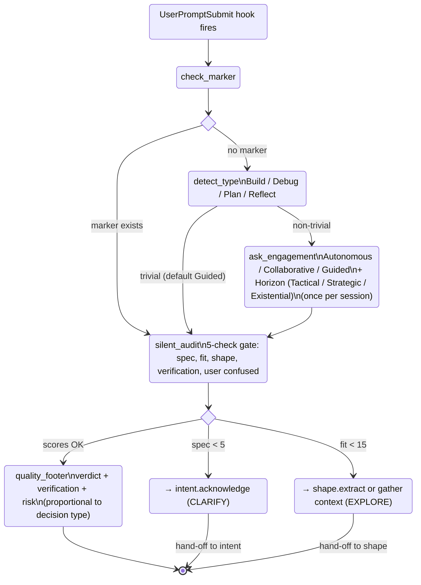

# Statechart — Canonical Reference

Single source of truth for hope plugin behavior. Skills implement this statechart. When this file changes, update affected skills to match.

**How to read:** Section 1 shows the full pipeline at a glance. Sections 2–7 expand each composite state. Section 8 maps hooks/commands to states. Section 9 lists cross-cutting rules.

---

## 1. Top-Level Pipeline

### Session Types

Soul detects type from the user's first message. Sets skill composition for the session.

| Type        | Signals                                           | Pipeline                                   |
| ----------- | ------------------------------------------------- | ------------------------------------------ |
| **Build**   | "build", "implement", "create", "add"             | intent → shape → consult → loop            |
| **Debug**   | "fix", "bug", "error", "broken"                   | intent (diagnose) → shape → consult → loop |
| **Plan**    | "plan", "design", "architect", "explore"          | intent → shape → consult → output          |
| **Reflect** | "postmortem", "review session", "what went wrong" | intent → consult → output                  |

### Engagement Level Effects

Engagement does not change state topology — it changes interaction density within states. Set once per session.

| Skill   | Autonomous                   | Collaborative (default)         | Guided                       |
| ------- | ---------------------------- | ------------------------------- | ---------------------------- |
| intent  | Consult auto-clarifies       | User + consult co-clarify       | User drives                  |
| shape   | Consult shapes, auto-selects | Consult shapes, user approves   | User drives, consult advises |
| loop    | Tool shape, milestones only  | Tool-Review, checkpoints        | Colleague, iterate each step |
| consult | Auto-invoked on stalls       | Invoked at decision points      | Only on explicit request     |
| unstuck | Consult auto-unblocks        | Consult unblocks, user informed | User unblocks                |

---

## 2. Intent Detail

**Session-type adaptation:** Debug focuses on symptom / changed / expected. Plan focuses on decision / options / criteria. Reflect focuses on outcome / surprised / change.

---

## 3. Shape Detail

**Expert consult:** Default: invoke panel consultation after extract. Expert findings drive mode recommendation (Colleague / Tool-Review / Tool) with cited evidence. Safety valve: high-risk or irreversible findings → minimum Tool-Review. Default when uncertain: Tool-Review. Skip only for trivial tasks (single obvious change, clear precedent, no ambiguity, low risk, trivially reversible).

**Pre-mortem gate:** After synthesize→output, when risk tier = Critical (13+ points OR irreversible OR auth/data/infra): emit `premortem:` alongside criteria[] and mustNot[]. Skipped for Trivial/Standard.

**Engagement annotations:**

- Autonomous: consult shapes, auto-selects
- Collaborative: consult shapes, user approves selection
- Guided: user drives, consult advises on request

---

## 4. Loop Detail

**Circuit breakers:** max iterations (user-configured) and budget exceeded (user-configured) pause for user decision. mustNot violated (from shape output) is a hard stop — these are inviolable constraints.

**Engagement annotations on wave_execution:**

- Autonomous (Tool shape): milestones only
- Collaborative (Tool-Review): checkpoint at major decisions
- Guided (Colleague): iterate each step together

---

## 5. Consult Detail

Consult may also be invoked by any skill via `Skill(skill="hope:consult", ...)`. The 5 modes cover the full spectrum from single-expert queries to generative discovery.

---

## 6. Bond Detail

**Session-aware decomposition:** Tactical → maximize parallel. Strategic → phase by dependency chain. Existential → foundation layers first.

---

## 7. Soul Detail

**Session marker:** `[SESSION] Type: Build | Engagement: Collaborative | Horizon: Strategic | Feasible: time (2h)` — emitted after strategy set, maintained through conversation, preserved on compaction. Horizon defaults: Build/Plan → Strategic, Debug → Tactical, Reflect → Existential. Feasibility defaults: Build → solo, Debug → time, Plan/Reflect → none.

**Compaction resilience:** If marker lost, re-derive from conversation artifacts. If re-derivation fails, ask user. Be transparent about gaps.

---

## 8. Hooks and Commands

### Hooks

| Hook            | Trigger                            | State Effect                                                    |
| --------------- | ---------------------------------- | --------------------------------------------------------------- |
| `SessionStart`  | Session start/resume/clear/compact | Injects full soul SKILL.md into context via `session-start.sh`  |
| `SubagentStart` | Every subagent spawn               | Propagates [SESSION] + criteria + mustNot + compaction guidance |
| `PreToolUse:ExitPlanMode` | ExitPlanMode tool call    | Sequential deny chain: checks pipeline artifacts in order (intent → shape → coverage), denies on first missing, max 3 denials |

### Commands

| Command         | Entry State              | Notes                                      |
| --------------- | ------------------------ | ------------------------------------------ |
| `/hope:intent`  | `intent.acknowledge`     | Direct re-entry from any state             |
| `/hope:panel`   | `consult.load_blocklist` | Panel mode, parallel to current state      |
| `/hope:summon`  | `consult.load_blocklist` | Single mode, parallel to current state     |
| `/hope:block`   | (no state change)        | Modifies blocklist, affects future consult |
| `/hope:unblock` | (no state change)        | Removes from blocklist                     |
| `/hope:blocked` | (no state change)        | Read-only blocklist display                |
| `/hope:bond`    | `bond.assess`            | Team composition, standalone or from shape |
| `/hope:full`    | `soul.detect_type`       | Full pipeline orchestrator                 |

---

## 9. Cross-Cutting Rules

### Back-Transition Criteria

| From                 | To                 | Trigger           | Detection                                            |
| -------------------- | ------------------ | ----------------- | ---------------------------------------------------- |
| loop.spec_scoring    | intent.acknowledge | Wrong intent      | Spec re-score drops below 5                          |
| loop.wave_execution  | intent.acknowledge | Wrong intent      | Expert review flags intent mismatch                  |
| loop.wave_execution  | shape.extract      | Reshape needed    | Expert review flags approach failure + user confirms |
| loop.review_feedback | loop.spec_scoring  | New work          | User feedback adds requirements                      |
| shape (any)          | intent.acknowledge | Spec insufficient | Spec score found < 5 during extraction               |

Back-transition magnitude determines response: minor drift → inline adjustment, major mismatch → formal re-entry with user consent.

### Deadlock Prevention

Every cycle has a break condition:

| Cycle                         | Break Condition                                                       |
| ----------------------------- | --------------------------------------------------------------------- |
| intent clarify loop           | Max 3 rounds → "proceed anyway" with [ASSUMPTION] labels              |
| consult unblock retry         | Max 3 → escalate to thorough review                                   |
| loop wave execution           | Circuit breaker: max iterations / budget → pause. mustNot → hard stop |
| shape uncertain mode          | Default Tool-Review                                                   |
| soul audit → intent interrupt | Intent handles with its own max-round clarify loop                    |
| loop → intent back-transition | Intent's clarify loop has its own escape                              |
| bond adjust loop              | Max 3 revisions → proceed with current or cancel                      |
| cancel                        | Always available from loop                                            |

### Key Rules

- **Intent is sacred** — never changes without user consent
- **Shape changes must be communicated** — user always knows when approach shifts
- **Gates advise, never prevent** — user owns their work
- **Compaction preserve list:** [SESSION] marker (including Horizon + Feasible), criteria, mustNot, horizon, feasibility axis + bound, wave number, key decisions

---

## 10. Skill-to-State Mapping

| State Region                     | Primary Skill | Sub-States                                                                                                                                                                                                                |
| -------------------------------- | ------------- | ------------------------------------------------------------------------------------------------------------------------------------------------------------------------------------------------------------------------- |
| user_need → clarifying           | intent        | acknowledge, clarify, score_spec, echo_check, refine, emit_brief                                                                                                                                                          |
| clear_intent → session_execution | shape         | extract, expert_consultation, synthesize, output_shape                                                                                                                                                                    |
| session_execution                | loop          | spec_scoring, shape_approval, decompose, wave_execution, stall_detection, expert_review, verify_gate, review_feedback, cancel, circuit_breaker, paused                                                                    |
| (any stage)                      | consult       | load_blocklist, detect_mode — single: detect_expert, load_profile, assess_coverage, generate/refuse — panel: select_experts, debate, surface_tensions, synthesize — explore: explore_select, brainstorm, shortlist, user_pick — unblock: parse_blocker, diagnose, recommend, escalate |
| (parallel, always)               | soul          | hook_fires, check_marker, detect_type, ask_engagement, audit, quality_footer                                                                                                                                              |
| shape → loop (team path)         | bond          | assess, design, confirm_create                                                                                                                                                                                            |
