# Statechart — Canonical Reference

This is the single source of truth for hope plugin behavior. Skills implement this statechart. When this file changes, update affected skills to match.

---

## Full Hierarchy

```dot
digraph moo {
  rankdir=TB

  user_need
  completed

  subgraph cluster_intent {
    label="intent (user_need -> clear_intent)"
    intent_acknowledge [label="acknowledge\nTASK/CONTEXT/DONE/STAKES/REVIEWS"]
    intent_clarify [label="clarify\nMCQ rounds, >=95% confidence"]
    intent_score_spec [label="score_spec\n5 dimensions (0-10)"]
    intent_echo_check [label="echo_check\nYES / EDITS / BLUEPRINT / RISK"]
    intent_refine [label="refine\nbest guess + assumptions + 1 question"]
    intent_emit_brief [label="emit_brief\nobjective, non-goals, constraints,\nacceptance, stop conditions"]

    intent_acknowledge -> intent_clarify
    intent_clarify -> intent_score_spec
    intent_score_spec -> intent_emit_brief [label=">=8"]
    intent_score_spec -> intent_clarify [label="<5"]
    intent_score_spec -> intent_echo_check [label="5-7"]
    intent_echo_check -> intent_emit_brief [label="YES"]
    intent_echo_check -> intent_refine [label="EDITS"]
    intent_refine -> intent_score_spec
  }

  subgraph cluster_shape {
    label="shape (clear_intent -> session_execution)"
    shape_extract [label="extract_intent\ngoal, constraints, scope"]
    shape_score_aspects [label="score_aspects\n8 aspects x 3 shapes"]
    shape_consult [label="consult_experts\npanel on tradeoffs"]
    shape_select [label="select_shape\nmajority column, risk override,\ndefault Tool-Review"]
    shape_output [label="output_shape\nshape + criteria[] + mustNot[]\n+ verification{}"]

    shape_extract -> shape_score_aspects -> shape_consult -> shape_select -> shape_output
  }

  subgraph cluster_loop {
    label="loop (session_execution)"
    loop_spec_scoring [label="spec_scoring\nre-score or use intent score\nroute by fit score"]
    loop_shape_approval [label="shape_approval\nYes / Edit / Cancel"]
    loop_decompose [label="decompose\natomic work items\n[LOOP] announcement"]
    loop_wave_execution [label="wave_execution\nspawn subagents -> collect\n-> expert scope review -> log"]
    loop_expert_review [label="expert_review\nthorough panel vs spec + mustNot\nBLOCKER -> new items"]
    loop_verify_gate [label="verify_gate\ntool discovery -> thorough tier\n-> post-work gate"]
    loop_review_feedback [label="review_feedback\njourney summary -> questions\n-> feedback -> loop or complete"]

    loop_spec_scoring -> loop_shape_approval -> loop_decompose -> loop_wave_execution
    loop_wave_execution -> loop_wave_execution [label="next wave"]
    loop_wave_execution -> loop_expert_review [label="all items done"]
    loop_expert_review -> loop_wave_execution [label="BLOCKER found"]
    loop_expert_review -> loop_verify_gate [label="no blockers"]
    loop_verify_gate -> loop_wave_execution [label="gate fails"]
    loop_verify_gate -> loop_review_feedback [label="gate passes"]
    loop_review_feedback -> loop_spec_scoring [label="new work from feedback"]
  }

  subgraph cluster_consult {
    label="consult (available at any stage)"
    consult_load_blocklist [label="load_blocklist\nuser preferences"]
    consult_detect_mode [label="detect_mode\nsingle / panel / unblock"]
    consult_detect_expert [label="detect_expert\nname / keyword / file / domain"]
    consult_load_profile [label="load_profile\ncurated or dynamic"]
    consult_score_confidence [label="score_confidence\n1-9 scale"]
    consult_generate [label="generate_response\nexpert voice + citations"]
    consult_select_experts [label="select_experts\n3-5 relevant profiles"]
    consult_debate [label="debate\neach argues position"]
    consult_surface_tensions [label="surface_tensions\nmap disagreements"]
    consult_synthesize [label="synthesize\nconsensus + tradeoff + dissent"]
    consult_parse_blocker [label="parse_blocker\ntask + error + failed approach"]
    consult_diagnose [label="diagnose\n2-3 diagnostic experts"]
    consult_recommend [label="recommend\nconsensus recommendation"]

    consult_load_blocklist -> consult_detect_mode
    consult_detect_mode -> consult_detect_expert [label="single"]
    consult_detect_mode -> consult_select_experts [label="panel"]
    consult_detect_mode -> consult_parse_blocker [label="unblock"]
    consult_detect_expert -> consult_load_profile -> consult_score_confidence -> consult_generate
    consult_select_experts -> consult_debate -> consult_surface_tensions -> consult_synthesize
    consult_parse_blocker -> consult_diagnose -> consult_recommend
    consult_recommend -> consult_recommend [label="retry (max 3)"]
  }

  subgraph cluster_soul {
    label="soul (parallel, always active)"
    soul_detect_type [label="detect_type\nBuild / Debug / Plan / Reflect"]
    soul_ask_engagement [label="ask_engagement\nAutonomous / Collaborative / Guided\n(once per session)"]
    soul_silent_audit [label="silent_audit\nspec score, fit score,\n12-item checklist (every turn)"]
    soul_quality_footer [label="quality_footer\nverdict + verification + risk\n(every response)"]

    soul_detect_type -> soul_ask_engagement
    soul_silent_audit -> soul_quality_footer
  }

  // Top-level transitions
  user_need -> intent_acknowledge [label="ambiguous"]
  user_need -> shape_extract [label="obvious (spec >=8)"]
  intent_emit_brief -> shape_extract [label="spec >=5"]
  intent_score_spec -> intent_clarify [label="<5 (back to clarify)"]
  shape_output -> loop_spec_scoring [label="shaped"]
  loop_review_feedback -> completed [label="user satisfied"]
  completed -> user_need [label="feedback yields new work"]

  // Back-transitions
  loop_spec_scoring -> intent_acknowledge [label="wrong intent"]
  loop_wave_execution -> intent_acknowledge [label="wrong intent"]
  loop_wave_execution -> shape_extract [label="reshape needed"]
}
```

---

## Parallel Regions (Always Active)

These run independently of the main pipeline and are not gated by transitions:

- **Thinking Audit** — soul's silent audit runs before every response (spec score, fit score, 12-item checklist)
- **Engagement Mode** — Autonomous/Collaborative/Guided shapes interaction density across all skills (set once per session)
- **Unstuck Detection** — monitors stalls by stage: clarification stuck (ask differently), shape stuck (research first), execution stuck (research then reshape), wrong intent (surface per engagement level)

---

## Key Rules

- **Intent is sacred** — never changes without user consent
- **Shape changes must be communicated** — user always knows when approach shifts
- **Back-transitions allowed** — magnitude determines inline adjustment vs formal re-entry
- **Compaction resilience** — `[SESSION]` markers survive via hooks; re-derive if lost; be transparent about gaps
- **Feedback loop** — completed -> user_need when user has new work

---

## Skill-to-State Mapping

| State Region | Primary Skill | Sub-States |
|---|---|---|
| user_need -> clarifying | intent | acknowledge, clarify, score_spec, echo_check, refine, emit_brief |
| clear_intent -> session_execution | shape | extract_intent, score_aspects, consult_experts, select_shape, output_shape |
| session_execution | loop | spec_scoring, shape_approval, decompose, wave_execution, expert_review, verify_gate, review_feedback |
| (any stage) | consult | load_blocklist, detect_mode, detect/load/score/generate (single), select/debate/tensions/synthesize (panel), parse/diagnose/recommend (unblock) |
| (parallel, always) | soul | detect_type, ask_engagement, silent_audit, quality_footer |
