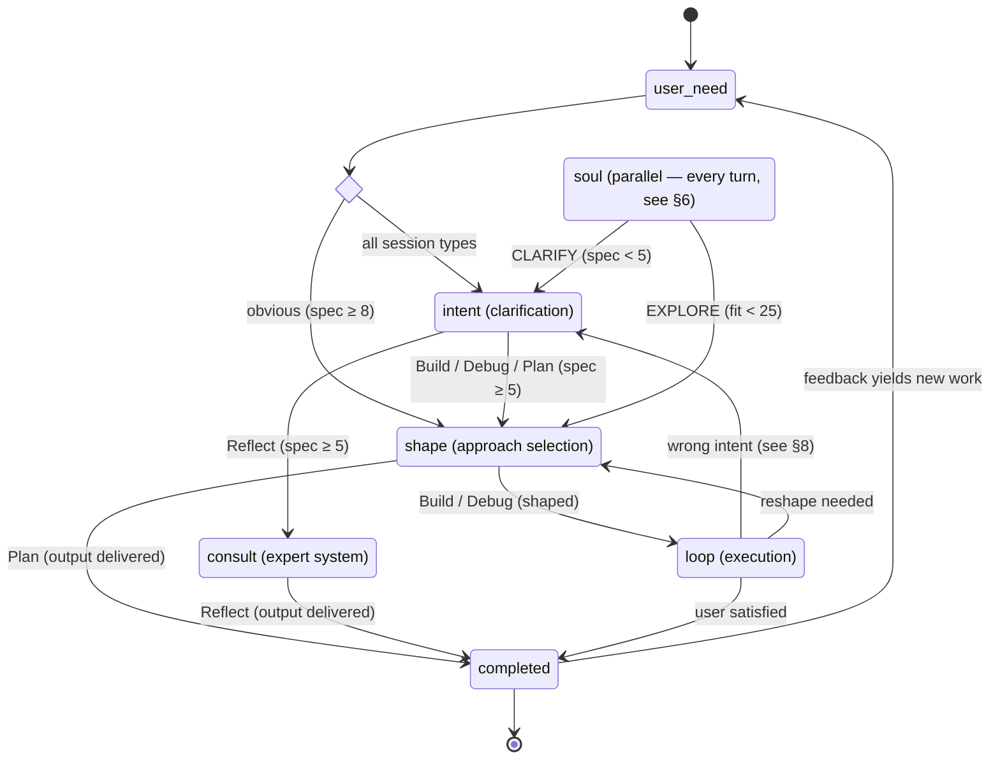
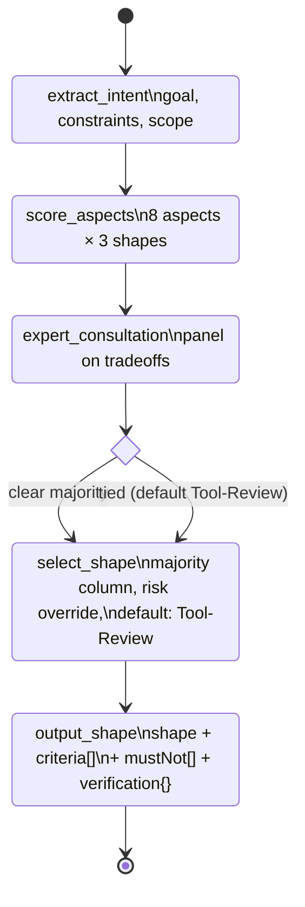
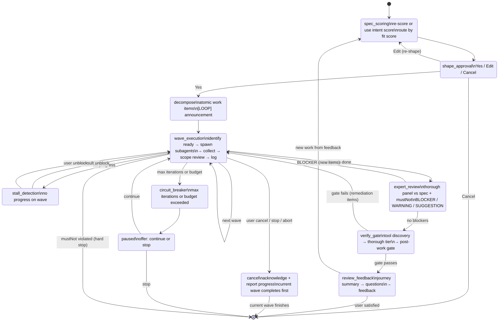
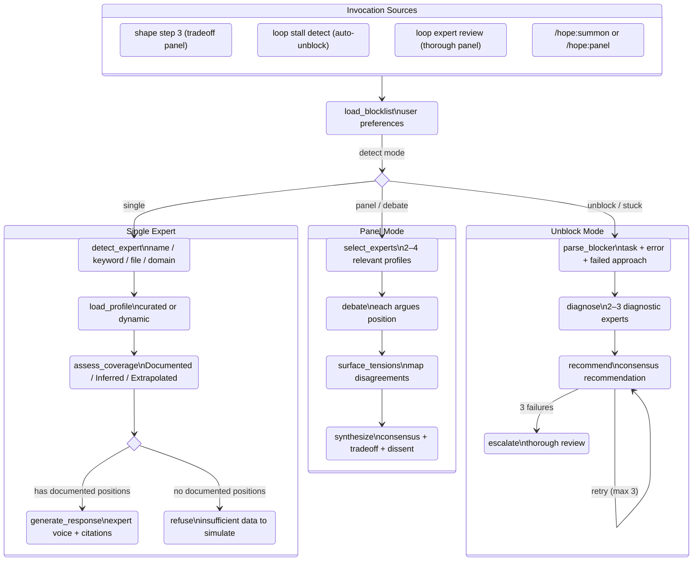
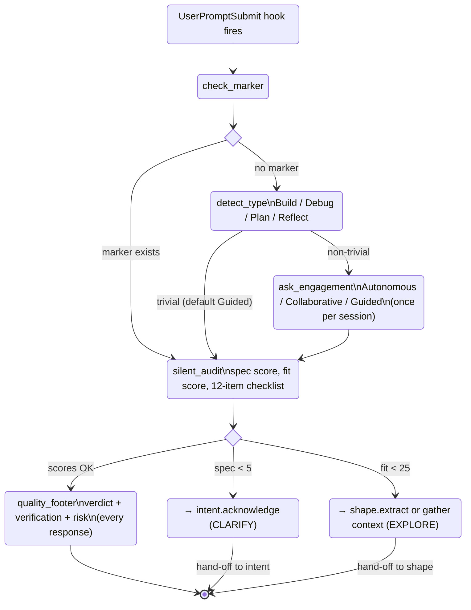

# Statechart — Canonical Reference

Single source of truth for hope plugin behavior. Skills implement this statechart. When this file changes, update affected skills to match.

**How to read:** Section 1 shows the full pipeline at a glance. Sections 2–6 expand each composite state. Section 7 maps hooks/commands to states. Section 8 lists cross-cutting rules.

---

## 1. Top-Level Pipeline

### Session Types

Soul detects type from the user's first message. Sets skill composition for the session.

| Type | Signals | Pipeline |
|------|---------|----------|
| **Build** | "build", "implement", "create", "add" | intent → shape → loop |
| **Debug** | "fix", "bug", "error", "broken" | intent (diagnose) → shape → loop |
| **Plan** | "plan", "design", "architect", "explore" | intent → shape → output |
| **Reflect** | "postmortem", "review session", "what went wrong" | intent → consult → output |

### Engagement Level Effects

Engagement does not change state topology — it changes interaction density within states. Set once per session.

| Skill | Autonomous | Collaborative (default) | Guided |
|-------|-----------|------------------------|--------|
| intent | Consult auto-clarifies | User + consult co-clarify | User drives |
| shape | Consult shapes, auto-selects | Consult shapes, user approves | User drives, consult advises |
| loop | Tool shape, milestones only | Tool-Review, checkpoints | Colleague, iterate each step |
| consult | Auto-invoked on stalls | Invoked at decision points | Only on explicit request |
| unstuck | Consult auto-unblocks | Consult unblocks, user informed | User unblocks |

---

## 2. Intent Detail

**Session-type adaptation:** Debug focuses on symptom / changed / expected. Plan focuses on decision / options / criteria. Reflect focuses on outcome / surprised / change.

---

## 3. Shape Detail

**Expert consult:** After scoring aspects, invoke consult panel on tradeoffs. Expert input informs selection — shape decides, experts advise. If expert insight changes aspect evaluation, re-score before selecting.

**Engagement annotations:**
- Autonomous: consult shapes, auto-selects
- Collaborative: consult shapes, user approves selection
- Guided: user drives, consult advises on request

---

## 4. Loop Detail

**Circuit breakers:** max iterations (user-configured) and budget exceeded (user-configured) pause for user decision. mustNot violated (from shape output) is a hard stop — these are inviolable constraints.

**Engagement annotations on wave_execution:**
- Autonomous (Tool shape): milestones only
- Collaborative (Tool-Review): checkpoint at major decisions
- Guided (Colleague): iterate each step together

---

## 5. Consult Detail

Consult may also be invoked by any skill via natural language triggers ("what would an expert say", "expert input needed"). The 4 sources above are the primary structured invocation paths.

---

## 6. Soul Detail

**Session marker:** `[SESSION] Type: Build | Engagement: Collaborative | Feasible: time (2h)` — emitted after strategy set, maintained through conversation, preserved on compaction. Feasibility defaults: Build → solo, Debug → time, Plan/Reflect → none. User overrides via `FEASIBLE:` slot.

**Compaction resilience:** If marker lost, re-derive from conversation artifacts. If re-derivation fails, ask user. Be transparent about gaps.

---

## 7. Hooks and Commands

### Hooks

| Hook | Trigger | State Effect |
|------|---------|-------------|
| `UserPromptSubmit` | Every user message | → `soul.audit` via `ensure-soul.sh` (injects session context) |
| `SubagentStart` | Every subagent spawn | Propagates [SESSION] + criteria + mustNot + compaction guidance |

### Commands

| Command | Entry State | Notes |
|---------|------------|-------|
| `/hope:intent` | `intent.acknowledge` | Direct re-entry from any state |
| `/hope:panel` | `consult.load_blocklist` | Panel mode, parallel to current state |
| `/hope:summon` | `consult.load_blocklist` | Single mode, parallel to current state |
| `/hope:block` | (no state change) | Modifies blocklist, affects future consult |
| `/hope:unblock` | (no state change) | Removes from blocklist |
| `/hope:blocked` | (no state change) | Read-only blocklist display |

---

## 8. Cross-Cutting Rules

### Back-Transition Criteria

| From | To | Trigger | Detection |
|------|-----|---------|-----------|
| loop.spec_scoring | intent.acknowledge | Wrong intent | Spec re-score drops below 5 |
| loop.wave_execution | intent.acknowledge | Wrong intent | Expert review flags intent mismatch |
| loop.wave_execution | shape.extract | Reshape needed | Expert review flags approach failure + user confirms |
| loop.review_feedback | loop.spec_scoring | New work | User feedback adds requirements |
| shape (any) | intent.acknowledge | Spec insufficient | Spec score found < 5 during extraction |

Back-transition magnitude determines response: minor drift → inline adjustment, major mismatch → formal re-entry with user consent.

### Deadlock Prevention

Every cycle has a break condition:

| Cycle | Break Condition |
|-------|----------------|
| intent clarify loop | Max 3 rounds → "proceed anyway" with [ASSUMPTION] labels |
| consult unblock retry | Max 3 → escalate to thorough review |
| loop wave execution | Circuit breaker: max iterations / budget → pause. mustNot → hard stop |
| shape tied scores | Default Tool-Review |
| soul audit → intent interrupt | Intent handles with its own max-round clarify loop |
| loop → intent back-transition | Intent's clarify loop has its own escape |
| cancel | Always available from loop |

### Key Rules

- **Intent is sacred** — never changes without user consent
- **Shape changes must be communicated** — user always knows when approach shifts
- **Gates advise, never prevent** — user owns their work
- **Compaction preserve list:** [SESSION] marker (including Feasible: axis), criteria, mustNot, feasibility axis + bound, wave number, key decisions

---

## 9. Skill-to-State Mapping

| State Region | Primary Skill | Sub-States |
|---|---|---|
| user_need → clarifying | intent | acknowledge, clarify, score_spec, echo_check, refine, emit_brief |
| clear_intent → session_execution | shape | extract, score_aspects, expert_consultation, select_shape, output_shape |
| session_execution | loop | spec_scoring, shape_approval, decompose, wave_execution, stall_detection, expert_review, verify_gate, review_feedback, cancel, circuit_breaker, paused |
| (any stage) | consult | load_blocklist, detect_mode — single: detect_expert, load_profile, assess_coverage, generate/refuse — panel: select_experts, debate, surface_tensions, synthesize — unblock: parse_blocker, diagnose, recommend, escalate |
| (parallel, always) | soul | hook_fires, check_marker, detect_type, ask_engagement, audit, quality_footer |
