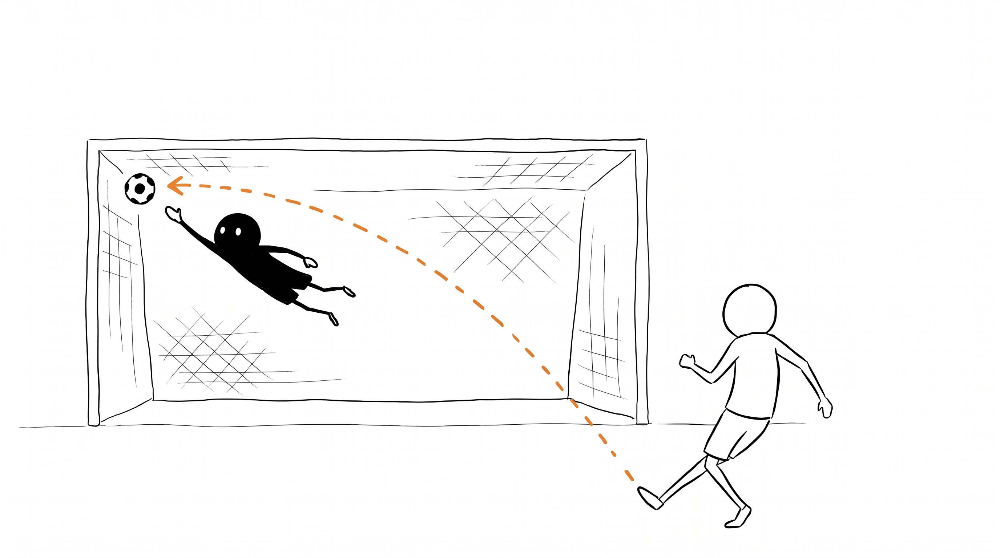
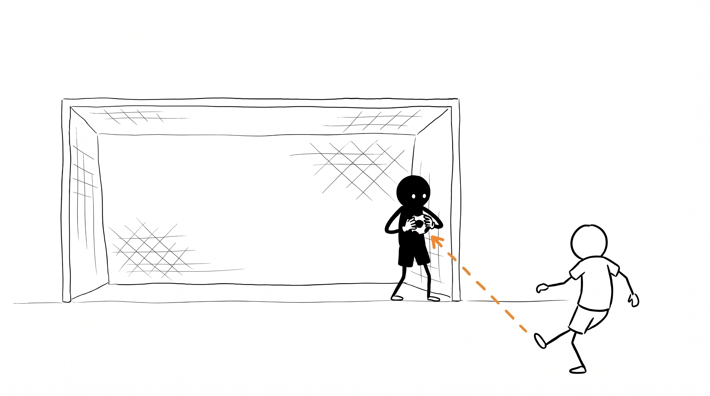
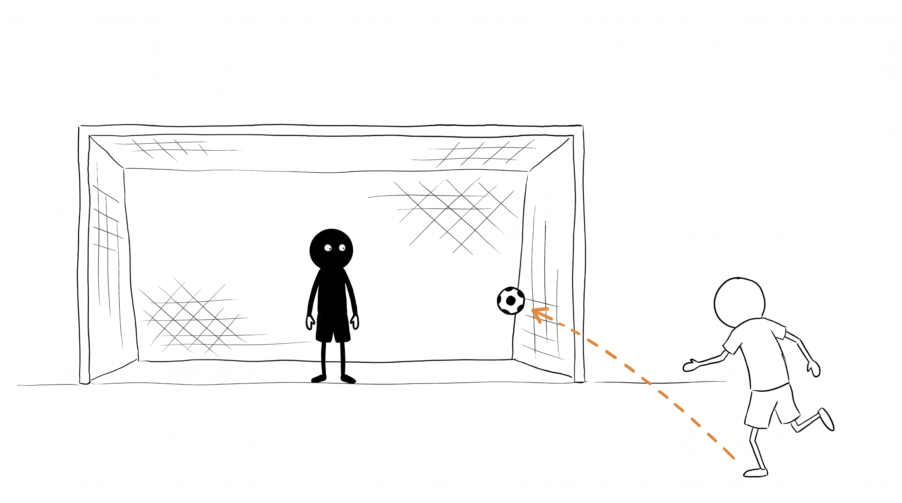
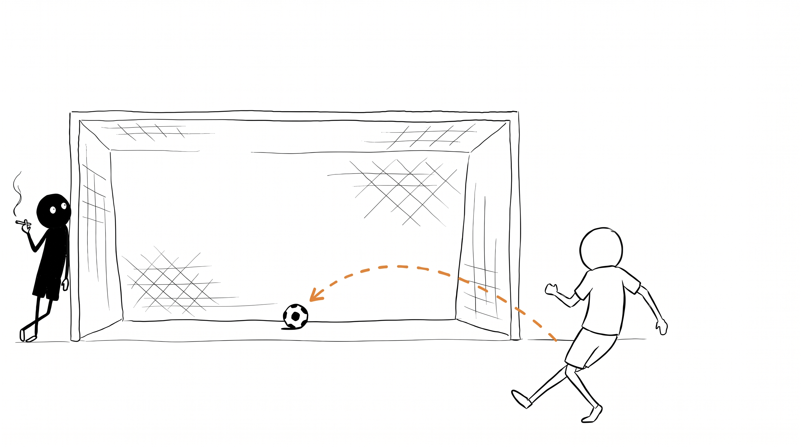
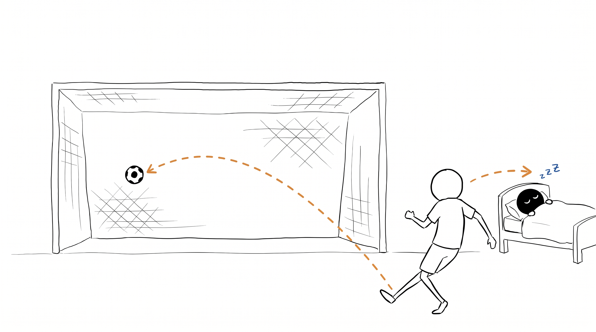

# The Engineer's Anxiety at the Penalty Kick

_How do you expect to be accountable for something you don't understand?_

Picture a goalkeeper facing ninety penalties in ninety minutes. One a minute, the entire match.

The first one, he is everything a keeper is supposed to be. Full horizontal stretch, fingertips grazing the ball, beaten by centimeters.

The miss doesn't matter. The effort is total. Every cell of him is in the moment of that kick.

By the fourth, the heroics have settled into craft. He reads the run-up, picks the corner, gets there, and the ball sticks in his gloves.

This is competence working as designed. Attention, skill, and a decision that matters because there aren't many of them.

But there are many of them. By the forty-eighth, he stands on his line and doesn't move. His body is in the goal. The rest of him is somewhere else. The kick happens near him, like weather.

By the seventy-third he has left the goal entirely. He leans against the post from the outside, smoking, watching the balls go in the way you'd watch a neighbor's sprinkler.

And the eighty-ninth finds him at home, asleep in bed, the goal standing empty behind the kicker.

Nobody saves the 89th penalty. The kicks never got harder. Each one is exactly as saveable as the first. Nobody is built to mean the eighty-ninth decision of the hour the way they meant the first.

This is my working day now. Agentic coding multiplied how many decisions cross my desk in a day, and that volume is what wears comprehension down. A migration here, a refactor there, a dependency bump, a schema change, each diff arriving minutes after the last, each waiting for the same verdict. Approve or reject. I used to make a handful of consequential calls in a day and could feel the weight of each one. Now the calls arrive on a conveyor, and the conveyor doesn't care which number I'm on.

The easy version of this fear is being out-skilled. Mine is quieter - that I keep signing while I stop understanding what I sign. What concerns me is when I find myself approving whatever without realising the decision nor the stakes at hand.

The trap is that disengagement doesn't feel like disengagement. You steer the agent all day, your hands never leave the keyboard, and the motion feels like work. You can be busy approving and understand none of what you approve. Nothing in the loop stops to ask whether you still follow what you're signing. The keeper at penalty 48 would tell you he's still playing. His boots are on the line.

So where does the line between the model and me actually run? It's a question of position. The model can generate a decision. It can't be the place the decision lands - it can't bear the consequence, hold the liability, be the person an organization trusts, or want one outcome over another for reasons of its own.

Suppose the agent ships a migration that corrupts content in production. What happens to the agent? Nothing. Its context window closes and it ceases to exist in any meaningful sense. There's no Tuesday morning for it. What happens to you? You're in the incident channel, your name is on the merge, your credibility with the leadership you just won over takes the hit, your one-month deadline track record gets an asterisk. The consequences of the decision have somewhere to land - a continuous person with a reputation, a salary, a future at Wise, anxiety at 2am. The model generates the decision; you absorb its results.

If I'm the place the decision lands, my approval is supposed to mean something. It can only mean something if I understand what I approved. To own it. And ownership without comprehension is just a signature. A signature on penalty 89, scrawled from bed, eyes closed. The org chart still says I own the system. The git log still says I merged the change.

The agents are good, and I want them kicking. What displaces me is my own drift, the slow unfelt slide from penalty 1 to penalty 89 while the approvals keep flowing and everything looks like productivity.

The goalkeeper who faces five penalties a season stays sharp by default. The one who faces ninety an hour has to train to stay present, deliberately, against the grain of the format. So the practice has to be deliberate - the comprehension won't rebuild itself by accident. Hands-on practice is the only way I know to build the comprehension that gives my approval any weight. What that looks like for engineering is the question moo.md new own/SKILL is for. The real risk is to the practice that keeps my accountability honest.
