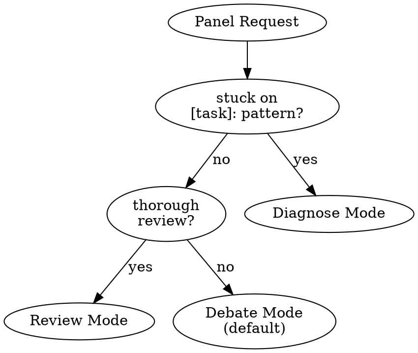

# /hope:panel

MODERATE. Assemble an expert panel for debate and guidance.

## Usage

```
/hope:panel "Should I use Zustand or Redux?"
/hope:panel --experts="osmani,hickey" review this architecture
/hope:panel for this PR
/hope:panel stuck on "Add ValidationError": "Module not found"
/hope:panel thorough review for: {spec}
/hope:panel Should we use event sourcing?
POSITION: Leaning yes for audit trail
TRADEOFF: complexity vs compliance
```

## Mode Detection



## Inputs

- `$1` — Question, topic, or mode-specific pattern (required)
- `--experts` — Comma-separated expert names (optional, auto-selects if omitted)

**Context slots** (optional, recognized from user input):
- `POSITION:` — user's current stance and reasoning
- `TRIED:` — previous attempts and their outcomes
- `TRADEOFF:` — specific tension being weighed
- `CONSTRAINT:` — non-negotiable factor limiting solution space

When present, inject into debate framing. Each expert responds to the stated position and respects stated constraints.

---

## Debate Mode (Default)

For design decisions, architecture reviews, and tradeoff discussions.

Run the consult panel mode: select experts with distinct perspectives, debate from documented positions, surface disagreements, synthesize recommendation.

### Panel Size

- **Default:** 2 experts (load only 2 profiles)
- **Maximum:** 4 experts (only if user requests `--expand`)
- **Progressive:** After initial response, offer "Want another perspective? Reply 'expand'."

### Escalation

When panel splits with no resolution: flag as "GENUINE TRADEOFF — requires your judgment" and summarize both positions with citations.

---

## Diagnose Mode (Stuck)

Pattern: `stuck on [task]: [error]`

- Parse task, error, failed approach
- Select 2-3 diagnostic experts
- Run the consult unblock mode: diagnosis + consensus recommendation
- Max 3 attempts with re-diagnosis between each before escalating to thorough review

**Loop integration:** Loop stall detection triggers this mode. Consult tracks attempts internally. After 3 failures: escalates to thorough expert review.

---

## Review Mode

Pattern: `thorough review for: {spec} with constraints: {mustNot}`

- Full panel (3-4 experts)
- Interactive findings loop: [Approve] [Discuss] [Skip]
- Constraint-aware: checks against mustNot
- Severity levels: BLOCKER / WARNING / SUGGESTION
