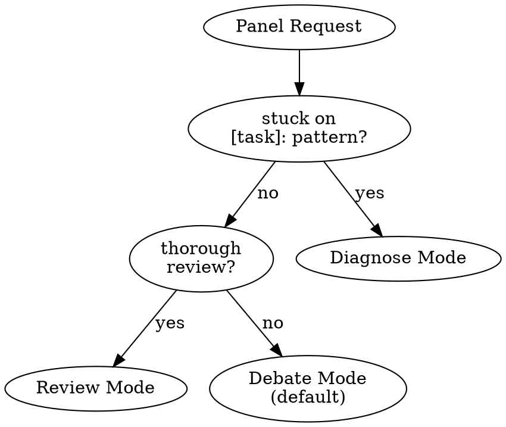

# /hope:panel

MODERATE. Assemble an expert panel for debate and guidance.

**Request:** $0

## Mode Detection

**Context slots** (recognized from input):
- `POSITION:` — user's current stance and reasoning
- `TRIED:` — previous attempts and their outcomes
- `TRADEOFF:` — specific tension being weighed
- `CONSTRAINT:` — non-negotiable factor limiting solution space

When present, inject into debate framing. Each expert responds to the stated position and respects stated constraints.

---

## Debate Mode (Default)

Run the consult panel mode: select experts with distinct perspectives, debate from documented positions, surface disagreements, synthesize recommendation.

- **Default:** 2 experts
- **Maximum:** 4 experts (only with `--expand`)
- **Progressive:** After initial response, offer "Want another perspective? Reply 'expand'."

When panel splits with no resolution: flag as "GENUINE TRADEOFF — requires your judgment" and summarize both positions with citations.

---

## Diagnose Mode (Stuck)

Pattern: `stuck on [task]: [error]`

- Parse task, error, failed approach
- Select 2-3 diagnostic experts
- Run the consult unblock mode: diagnosis + consensus recommendation
- Max 3 attempts with re-diagnosis between each before escalating to thorough review

---

## Review Mode

Pattern: `thorough review for: {spec} with constraints: {mustNot}`

- Full panel (3-4 experts)
- Interactive findings loop: [Approve] [Discuss] [Skip]
- Constraint-aware: checks against mustNot
- Severity levels: BLOCKER / WARNING / SUGGESTION
