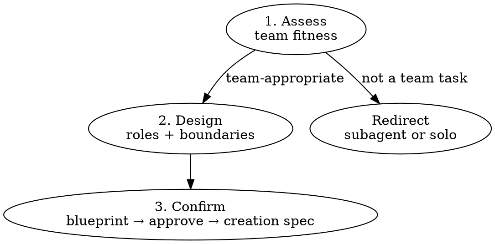

# Bond

COMPOSE. Design who works on what, with what boundaries, before spinning up a team.

## Entry

Requires a task description (from user or prior intent brief). Output: team blueprint → user approves → Claude creates team with native agent team tools. Never writes project files.

---

## Pipeline Context

Scan for: intent brief → task description | shape output (criteria[]/mustNot[]) → pass to teammate prompts | `FEASIBLE:` → if solo, redirect to single session; if time-bound tight, warn about team overhead.

---

## Protocol



### 1. Assess Fitness

Score 4 dimensions from task description + conversation context. Each dimension maps to one verdict column.

| Dimension | Team | Subagent | Solo |
|-----------|------|----------|------|
| **Independence** | Workers don't need each other's output | Tasks isolated, only results matter | Sequential dependency chain |
| **File ownership** | Each role owns distinct areas | Each task touches isolated files | Same files need editing |
| **Coordination** | Must share findings or challenge each other | Only report back | One mind holds it all |
| **Scope** | Multi-module, 8+ story points | Focused exploration or analysis | Single file, 1-3 story points |

**Scoring:** Majority column wins. Override: any Solo in File ownership → Solo (merge conflicts kill teams). Default when tied: Subagent (cheaper, less coordination overhead).

**Red flags — warn before proceeding:**

| Red Flag | Why It Fails | Suggest Instead |
|----------|-------------|-----------------|
| All roles touch same files | Merge conflicts, wasted effort | Single session or sequential subagents |
| >5 teammates | Coordination cost exceeds parallelism | Reduce scope or phase the work |
| Tasks have serial dependencies | Team overhead with no parallel gain | Single session with subagents for research |
| Task is ≤3 story points | Overhead of team setup > benefit | Just do it in current session |

Output: `[BOND] Fitness: {Team/Subagent/Solo} | Why: ≤15w`

**If not Team:** explain why, suggest approach (subagent pattern or single session), stop. Do not proceed to Step 2.

### 2. Design Team

From task analysis, decompose into independent workstreams. For each workstream, assign a role.

| Decision | Heuristic |
|----------|-----------|
| Teammate count | 1 per independent workstream (2-5, never more) |
| Role names | By responsibility ("auth-impl", "api-reviewer"), never generic ("agent-1") |
| File boundaries | Each role owns distinct directories or file groups — flag any overlap |
| Models | Opus: architecture, review, complex reasoning. Sonnet: implementation, refactoring. Haiku: research, exploration |
| Permission mode | `plan`: architectural or risky changes. `default`: implementation with clear scope |
| Delegate mode | Recommend when >3 teammates (lead coordinates only) |
| Task count | 5-6 per teammate, each self-contained with a clear deliverable |

**Coupling check:** For each pair of roles, ask: "If role A changes X, does role B's work break?" If yes → merge roles into one OR add explicit coordination checkpoint ("A completes X before B starts Y").

**Session-aware:** If `[SESSION]` marker present, use Horizon for decomposition:
- Tactical → maximize parallel items per wave
- Strategic → phase by dependency chain
- Existential → foundation layers first

Output blueprint:

```
## Team Blueprint: [descriptive-name]

| Role | Model | Focus | Owns |
|------|-------|-------|------|
| [name] | [model] | [responsibility ≤10w] | [dirs/files] |

Coordination: [delegate / active-lead]
Tasks/teammate: ~[N]
Coupling risks: [named risks or "none detected"]

Create this team? [Yes / Adjust / Cancel]
```

SELF-AUDIT (before presenting blueprint, revise if any FAIL) →
  Fitness assessed before design         → [pass/fail]
  Each role has distinct file ownership  → [pass/fail] → overlap: [names or "none"]
  Coupling risks named                   → [pass/fail] → risks: [list or "none detected"]
  Tasks per teammate: 5-6               → [pass/fail] → [actual count]
  No >5 teammates                        → [pass/fail] → [count]

### 3. Confirm + Handoff

- **Yes** → Emit creation spec: team name, each role's spawn prompt (role focus, file boundaries, task descriptions, constraints from shape criteria/mustNot if available). Claude creates the team using native agent team tools.
- **Adjust** → User specifies changes. Revise blueprint, re-present. Max 3 revisions — after 3, proceed with current or cancel.
- **Cancel** → Acknowledge, suggest alternative approach.

After team creation, announce: `[BOND] Team created: {name} | Roles: {N} | Coordination: {delegate/active-lead}`

---

## Integration

Bond receives shape output (criteria/mustNot) when available, passes them to teammate spawn prompts.

| Bond Input | Source |
|-----------|--------|
| Task description | User or intent brief |
| criteria[] / mustNot[] | shape (if run) |
| Horizon | [SESSION] marker |

| Bond Output | Consumer |
|-------------|----------|
| Team blueprint | User approval |
| Per-role spawn prompts | Native agent team tools |

---

## Boundary

Bond recommends team structure; user owns the final composition. Bond designs the team after explicit approval — Claude creates it with native tools.
