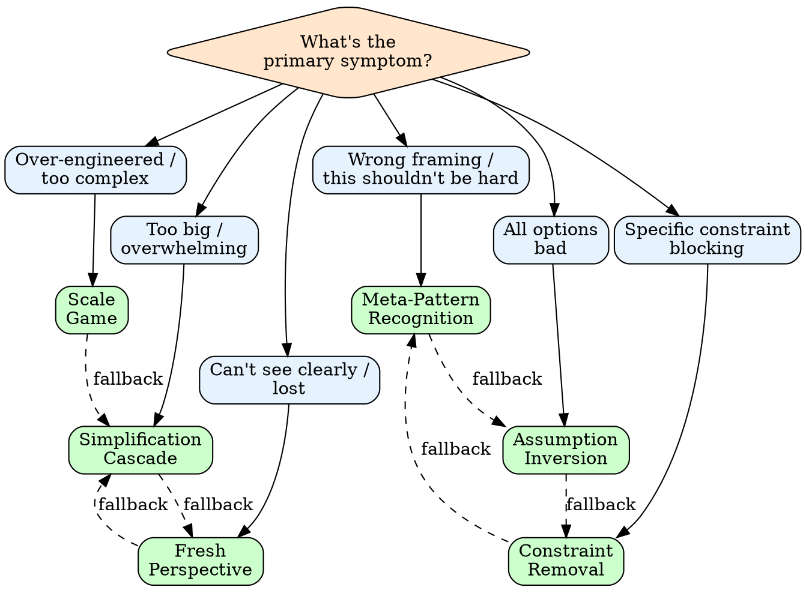

# breakthrough

Structured creativity when conventional approaches fail.

## When to Use

| Trigger | Action |
|---------|--------|
| "I'm stuck on..." | Run breakthrough |
| "Can't figure out..." | Run breakthrough |
| "Hitting a wall with..." | Run breakthrough |
| "All options seem bad" | Run breakthrough |
| Problem is well-defined | Skip (just execute) |
| Haven't researched yet | Research first |

## Symptom Dispatch

| Symptom | Technique | One-Liner |
|---------|-----------|-----------|
| Problem feels overwhelming | Simplification Cascade | Strip to essence, solve trivial, add back |
| Solution feels too complex | Scale Game | 1000x smaller? 1000x larger? |
| "This shouldn't be this hard" | Meta-Pattern Recognition | What class of problem is this? |
| Every option has fatal flaws | Assumption Inversion | List assumptions, flip each |
| One constraint blocking all paths | Constraint Removal | Remove constraint, solve, work within |
| Lost in details, can't zoom out | Fresh Perspective | Explain to duck, draw it, channel expert |

## Decision Tree



## Protocol

### 1. Name the Stuck

```
SYMPTOM: [What exactly is stuck]
TRIED: [What approaches failed]
CONSTRAINT: [What feels immovable]
```

### 2. Select Technique

Use symptom dispatch table or decision tree.

### 3. Apply Technique

**Simplification Cascade**
1. Strip every feature, constraint, edge case
2. Solve the trivial case
3. Add complexity back one piece at a time
4. Note where difficulty jumps — that's your real problem

**Scale Game**
1. Shrink 1000x — what's the trivial solution?
2. Grow 1000x — what dominates?
3. Compare solutions at both extremes
4. Find what must be true at any scale

**Meta-Pattern Recognition**
1. Name the problem class (scheduling? resource allocation? search?)
2. Find precedents — what solved this class before?
3. Translate adjacent solution to your domain
4. Adapt for your specific constraints

**Assumption Inversion**
1. List every assumption ("given" or "must")
2. Invert each — what if the opposite were true?
3. Explore what becomes possible per inversion
4. Test which assumptions are actually required

**Constraint Removal**
1. Identify the specific blocking constraint
2. Remove it — pretend it doesn't exist
3. Design the ideal unconstrained solution
4. Approximate the ideal within the real constraint

**Fresh Perspective**
1. Rubber duck — explain aloud, articulating reveals gaps
2. Expert channel — "What would [specific expert] do?"
3. Draw it — sequence for flow, entity for data, state machine for logic
4. Teach it — write explanation for a newcomer, notice what you skip

### 4. Evaluate Result

| Outcome | Action |
|---------|--------|
| New path visible | Proceed with solution |
| Partial clarity | Chain to second technique |
| Still stuck | Try opposite technique |
| Fundamental blocker | Escalate or reframe entirely |

### 5. Document Learning

```
PROBLEM: [Original stuck point]
TECHNIQUE: [What worked]
INSIGHT: [What was hidden]
APPLIES TO: [Similar problem class]
```

## Technique Chaining

When single technique insufficient:

| First Try | Chain To | Why |
|-----------|----------|-----|
| Simplification | Scale Game | Found essence, now find right scale |
| Scale Game | Meta-Pattern | Extremes revealed the real problem type |
| Meta-Pattern | Assumption Inversion | Know the class, now challenge its constraints |
| Assumption Inversion | Constraint Removal | Found hidden assumption, now test removing it |
| Constraint Removal | Fresh Perspective | Removed constraint, need new viewpoint |
| Fresh Perspective | Simplification | Got distance, now reduce complexity |

## When NOT to Use

- Problem is well-defined (just execute)
- Haven't done basic research
- Constraint is truly non-negotiable
- Procrastinating on hard work
- "Stuck" is actually fear of commitment

## Output

```
## Breakthrough Analysis

### Stuck Point
[Symptom + failed approaches]

### Technique Applied
[Name + key steps taken]

### Insight
[What was hidden / blocking]

### Path Forward
[Specific next action]

### Applies To
[Future problems this pattern solves]
```
