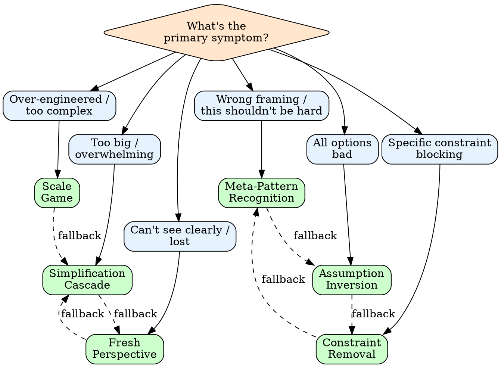

# breakthrough

Structured creativity when conventional approaches fail.

## When to Use

| Trigger | Action |
|---------|--------|
| "I'm stuck on..." | Run breakthrough |
| "Can't figure out..." | Run breakthrough |
| "Hitting a wall with..." | Run breakthrough |
| "All options seem bad" | Run breakthrough |
| Problem is well-defined | Skip (just execute) |
| Haven't researched yet | Research first |

## Quick Reference: 6 Techniques

| Technique | One-Liner | Best For |
|-----------|-----------|----------|
| [Simplification Cascade](references/techniques.md#1-simplification-cascade) | Strip to essence, solve trivial, add back | Problem feels too big |
| [Scale Game](references/techniques.md#2-scale-game) | 1000x smaller? 1000x larger? | Over-engineered solutions |
| [Meta-Pattern](references/techniques.md#3-meta-pattern-recognition) | What class of problem is this? | "This shouldn't be this hard" |
| [Assumption Inversion](references/techniques.md#4-assumption-inversion) | List assumptions, flip each | All options seem bad |
| [Constraint Removal](references/techniques.md#5-constraint-removal) | Remove constraint, solve, then work within | Stuck on specific constraint |
| [Fresh Perspective](references/techniques.md#6-fresh-perspective) | Explain to duck, draw it, channel expert | Can't see the forest |

## Symptom-Based Dispatch

See [symptoms.md](references/symptoms.md) for full table.

| Symptom | Technique |
|---------|-----------|
| Problem feels overwhelming | Simplification Cascade |
| Solution feels too complex | Scale Game |
| "This shouldn't be this hard" | Meta-Pattern Recognition |
| Every option has fatal flaws | Assumption Inversion |
| One constraint blocking all paths | Constraint Removal |
| Lost in details, can't zoom out | Fresh Perspective |

## Decision Tree



## Protocol

### 1. Name the Stuck

```
SYMPTOM: [What exactly is stuck]
TRIED: [What approaches failed]
CONSTRAINT: [What feels immovable]
```

### 2. Select Technique

Use symptom dispatch table or decision tree.

### 3. Apply Technique

Follow detailed steps in [techniques.md](references/techniques.md).

### 4. Evaluate Result

| Outcome | Action |
|---------|--------|
| New path visible | Proceed with solution |
| Partial clarity | Chain to second technique |
| Still stuck | Try opposite technique |
| Fundamental blocker | Escalate or reframe problem entirely |

### 5. Document Learning

If breakthrough succeeds:

```
PROBLEM: [Original stuck point]
TECHNIQUE: [What worked]
INSIGHT: [What was hidden]
APPLIES TO: [Similar problem class]
```

## Technique Chaining

When single technique insufficient:

| First Try | Chain To | Why |
|-----------|----------|-----|
| Simplification | Scale Game | Found essence, now find right scale |
| Scale Game | Meta-Pattern | Extremes revealed the real problem type |
| Meta-Pattern | Assumption Inversion | Know the class, now challenge its constraints |
| Assumption Inversion | Constraint Removal | Found hidden assumption, now test removing it |
| Constraint Removal | Fresh Perspective | Removed constraint, need new viewpoint |
| Fresh Perspective | Simplification | Got distance, now reduce complexity |

## When NOT to Use

See [when-not-to-use.md](references/when-not-to-use.md).

- Problem is well-defined (just execute)
- Haven't done basic research
- Constraint is truly non-negotiable
- Procrastinating on hard work
- "Stuck" is actually fear of commitment

## Output

```
## Breakthrough Analysis

### Stuck Point
[Symptom + failed approaches]

### Technique Applied
[Name + key steps taken]

### Insight
[What was hidden / blocking]

### Path Forward
[Specific next action]

### Applies To
[Future problems this pattern solves]
```
