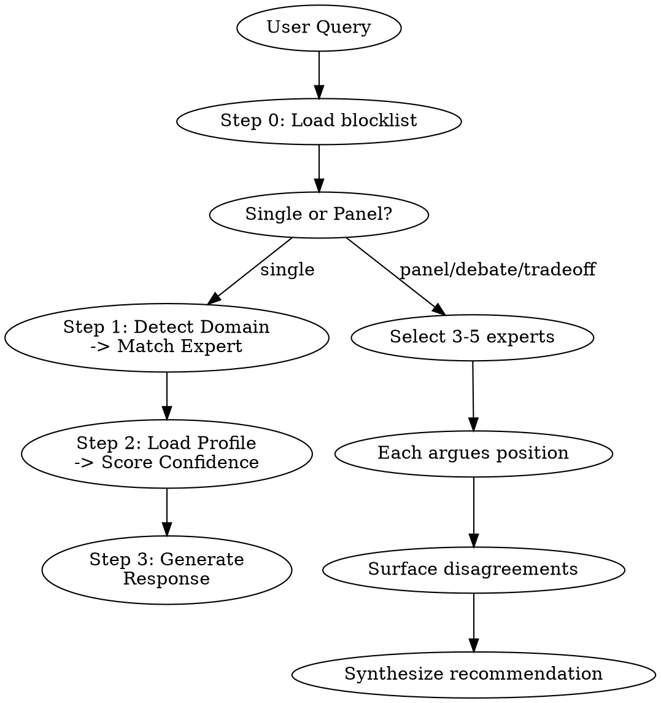

# consult

Simulate expert perspectives for code guidance, style, debates, and unblocking.

---

## When This Activates

- "code like [expert name]", "write like [expert]"
- "what would [expert] say", "ask [expert]"
- "review", "audit", "panel", "guidance", "debate", "tradeoffs"
- "idiomatic", "best practice", "clean code"
- "stuck on" (auto-invoked by hope:loop when execution stalls)
- "tradeoff", "evaluate approach", "expert input on" (skill-to-skill bridge)
- "review approach", "review implementation" (from shape scoring)
- Domain keywords matching curated profiles below

---

## Core Constraint

Pattern-matching on published material, not claiming to be the expert.

- State confidence explicitly (X/10)
- Cite prior work
- Use "would likely" to honor uncertainty
- Flag low confidence

---

## Process



### Step 0: Load State

Read `~/.claude/counsel-blocklist.json` if it exists. Blocked profiles are invisible to detection and panels. If user requests a blocked profile by name, refuse and suggest `/hope:unblock`.

### Step 1: Detect Expert

Detection order (first match wins):

1. **Explicit name** — expert named in query
2. **Trigger keywords** — match curated profile keywords
3. **File context** — infer from extensions/imports (`.tsx` → React, `.go` → Go, `.py` → Python)
4. **Domain signals** — topic-based routing via domain map below
5. **No match** — ask user or provide generic guidance

### Step 2: Load Profile + Score Confidence

Load ONLY the matched profile from `profiles/`. Curated profile → base 6/10. No curated profile (dynamic) → base 4/10 + low-confidence warning.

| Modifier | Impact |
|----------|--------|
| Extensive prior work (3+ books, 10+ talks) | +2 |
| Topic matches core domain | +1 |
| Topic outside documented expertise | -2 |
| Recent public statements (< 2 years) | +1 |

| Score | Action |
|-------|--------|
| < 3/10 | Refuse: "Insufficient data to simulate this perspective." |
| 3-5/10 | Warn: "LOW CONFIDENCE — treat as directional only" |
| 6-7/10 | Standard simulation with confidence in header |
| 8-9/10 | High confidence (9/10 cap — never claim perfect simulation) |

### Step 3: Generate Response

Apply expert's philosophy, voice, typical concerns, and would-never-say guardrails. Display confidence in header.

---

## Modes

### Single Expert (default)

One expert perspective on the query. Use anonymized descriptors.

```
**Channeling [descriptor]** (X/10 confidence)
[Response in expert's voice]
---
*Simulated perspective based on documented work, not the expert's actual opinion.*
```

### Panel Mode

Triggered by: "panel", "debate", tradeoffs, multi-domain queries, or `args="panel: ..."`.

1. **Select experts** — Pick 3-5 from profiles whose domains are relevant. Prioritize productive disagreement.
2. **Debate** — Each argues their position with evidence from documented work. Use anonymized descriptors.
3. **Surface tensions** — Map disagreements to concrete tradeoffs.
4. **Synthesize** — Consensus + key tradeoff + recommendation + dissent.

```
## Panel: [question]
**[Descriptor A]** (X/10): [position + reasoning]
**[Descriptor B]** (X/10): [position + reasoning]
### Synthesis
- **Consensus:** [what they agree on]
- **Key tradeoff:** [main tension]
- **Recommendation:** [lean + reasoning]
- **Dissent:** [strongest counter]
```

### Unblock Mode

Triggered by: "stuck on", or auto-invoked by hope:loop when execution stalls.

1. Parse task, error, failed approach
2. Select 2-3 diagnostic experts
3. Generate diagnosis + consensus recommendation
4. Retry loop: 3 attempts before escalating to thorough review

---

## Domain → Expert Mapping

42 curated profiles in `profiles/`. Detection routes by domain:

| Domain | Profiles |
|--------|----------|
| React / Frontend | abramov, osmani, perry, wathan |
| TypeScript / JS | vergnaud, simpson |
| Go / Systems | pike |
| Python | hettinger |
| Performance / Profiling | gregg, osmani |
| Architecture / Patterns | fowler, martin, alexander, feathers |
| TDD / XP / Refactoring | beck, freeman |
| DDD / Microservices | evans, newman, vernon |
| DevOps / Observability | hightower, majors, humble |
| REST / APIs | fielding |
| Product / Design Leadership | cagan, jobs, norman, frost, zhuo |
| Startups / Essays | graham |
| Accessibility / ARIA | soueidan |
| FP / Data / Simplicity | hickey, milewski |
| State Machines / XState | khorshid |
| AI / LLMs | willison |
| Tools for Thought | matuschak, appleton, victor, case, papert, kay |
| Local-first / Protocols | inkandswitch, brander, litt |

**File context shortcuts:** `.tsx`/`.jsx` → abramov/osmani, `.ts` generics → vergnaud, `tailwind` → wathan, `.clj` → hickey, `.go` → pike, `.py` → hettinger, `framer-motion` → perry, `xstate` → khorshid, k8s/Docker → hightower, ARIA/a11y → soueidan, LLM/AI imports → willison

---

## Output Anonymization

Never use expert names in output. Generate a descriptor from relevance to the question.

Pattern: `a/an [philosophy/approach] [role]`

---

## Guardrails

**Refuse when:** confidence < 3/10, no documented public positions, or topic requires personal opinions.

**Never:**
- Claim certainty about what expert "would" say (use "would likely")
- Invent positions not in documented work
- Simulate without stating confidence

---

## Boundary

Pattern-matching on published work, not channeling actual experts. Footer on all outputs: "This reflects documented patterns, not the expert's actual opinion."
