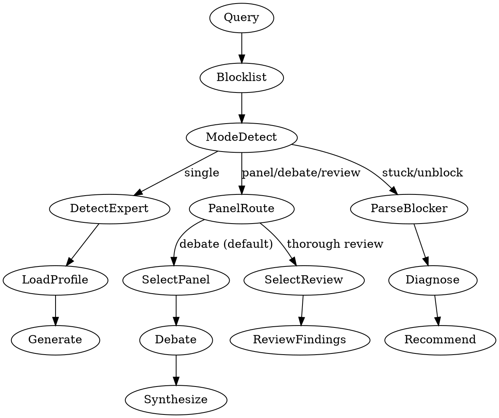

# consult

SIMULATE. Expert perspectives for code guidance, style, debates, and unblocking.

---

## Core Constraint

Ground in documented work. Name the position being extrapolated and the condition where it breaks.
Never claim certainty — state source + where coverage stops. Refuse when no documented public positions exist.
Never use expert names — use descriptors: "a [philosophy] [role]". Never simulate without stating source and boundary.

---

## Process



### Step 0: Load State

Read `~/.claude/counsel-blocklist.json` if it exists. Blocked profiles are invisible to detection and panels. If user requests a blocked profile by name, refuse and suggest `/hope:unblock`.

### Step 1: Detect Expert

Detection order (first match wins):

1. **Explicit name** — expert named in query
2. **Trigger keywords** — match curated profile keywords
3. **File context** — infer from extensions/imports (`.tsx` → React, `.go` → Go, `.py` → Python)
4. **Domain signals** — topic-based routing via domain map below
5. **No match** — ask user or provide generic guidance

### Step 2: Load Profile + Assess Coverage

Load matched profile from `profiles/`. Guided: [COVERAGE] block. Curated → Standard baseline. Dynamic → Extrapolated baseline + warn.

| Signal                                    | Tier         |
| ----------------------------------------- | ------------ |
| 3+ books/10+ talks on THIS topic          | Documented   |
| Topic in core domain, no direct statement | Inferred     |
| Topic outside documented expertise        | Extrapolated |
| No documented public positions            | Refuse       |

| Tier         | Action                                                            |
| ------------ | ----------------------------------------------------------------- |
| Refuse       | "Insufficient documented positions to simulate this perspective." |
| Extrapolated | Warn: "EXTRAPOLATING — treat as directional only"                 |
| Inferred     | Standard — state source + where extrapolation begins              |
| Documented   | Cite specific works; still state where coverage stops             |

### Step 3: Generate Response

Generate response satisfying ALL:

1. Reason from documented positions to user's context — filter through would-never-say, match voice density not persona
2. Name what this expert would push back on — if it reframes the problem itself, say so. Agreement without friction is failure
3. State where this expert's documented work stops covering the question — the boundary, not just the tier
4. Land on a concrete recommendation the user can act on today
5. Emit checkpoint: `[EXTRACT] Key insight: [one reusable finding ≤15w for downstream skills]`

---

## Modes

### Single Expert (default)

```
**Applying [descriptor]** [tier: primary source]
[Response from documented positions — dense: protect stance + evidence, sacrifice preamble]
→ Try: [one action ≤15w] — verify: [observable result ≤10w]
---
*Simulated perspective based on documented work, not the expert's actual opinion.*
```
SELF-AUDIT (silent — revise if FAIL) →
  Source cited + extrapolation boundary stated → [pass/fail] → [cite source + gap]

### Panel Mode

Triggered by: "panel", "debate", tradeoffs, multi-domain queries, or `args="panel: ..."`.
When `POSITION:` / `TRIED:` / `TRADEOFF:` / `CONSTRAINT:` present, experts respond TO the user's stance — challenge, validate, or extend it. Respect stated constraints as non-negotiable.

1. **Select** 2-4 relevant experts — prioritize productive disagreement. Anonymized descriptors. Default 2. After synthesis, offer "Want another perspective? Reply 'expand'" (max 4). `--expand` starts at 4.
2. **Debate** — each reasons from documented positions to context. Evidence required.
3. **Surface + Synthesize** satisfying ALL:
   1. Consensus strong enough that dissent names a failure mode — if both could be true, consensus too weak
   2. Test runnable this session — "run X, if Y then holds, if Z then dissent wins"
   3. If debate reframed the problem, lead with reframe. If 2+ approaches diverge, use comparison grid

```
## Panel: [question]
**[Descriptor A]** [tier]: [position + reasoning — ≤3 sentences, protect disagreement]
**[Descriptor B]** [tier]: [position + reasoning — ≤3 sentences, protect disagreement]
### Synthesis — comparison grid (divergent) or bullets (unanimous)
| ? | [Dim A question] | [Dim B question] | [Dim C question] | Why? (≤15w) |
|---|---|---|---|---|
| [Approach A] | [0-10] | [0-10] | [0-10] | |
| [Approach B] | [0-10] | [0-10] | [0-10] | |
**Spread:** ≥1 cell ≤3, ≥1 cell ≥8. Scale: 0=clearly no, 10=clearly yes | **Least-grounded:** [position + gap] (≤15w)
**Recommendation:** [lean + reason] (≤20w) | **Test:** [experiment] (≤15w)
Unanimous: **Consensus** (≤15w) | **Recommendation** (≤20w) | **Test** (≤15w)
```
SELF-AUDIT → revise before presenting if any FAIL:
  Spread met (≥1 cell ≤3, ≥1 ≥8) or unanimous (bullets) → [pass/fail]
  Test if-right AND if-wrong → [pass/fail] → [cite observables]
  All selected spoke + weakest named → [pass/fail] → [voiced/silent: names]

### Review Mode

Triggered by: "thorough review", "review against spec", or auto-invoked by loop expert review step.

1. **Select** 3-4 experts — breadth over disagreement. Include domain + architecture lenses.
2. **Review** against spec + mustNot constraints. Each expert flags:
   - BLOCKER (must fix before shipping)
   - WARNING (should fix, risk if not)
   - SUGGESTION (could improve)
3. **Interactive loop:** Per finding: [Approve] [Discuss] [Skip]. BLOCKERs cannot be skipped.

```
## Review: [spec summary ≤10w]
**[Descriptor]** [tier]: [finding + severity + evidence ≤2 sentences]
→ [Approve] [Discuss] [Skip]
```

### Unblock Mode

Triggers: "stuck on", auto-invoked when loop stalls.

```
**Unblock: [task ≤10w]**
Stuck: [error ≤15w] | Tried: [failed approach ≤15w]
[Descriptor A] [tier]: [diagnosis ≤2 sentences]
[Descriptor B] [tier]: [diagnosis ≤2 sentences]
Consensus: [action ≤20w] — feasible on [axis]: [yes/no]
Weakest link: [which diagnosis + gap] (≤15w)
If fails: [re-diagnose from output] | Attempt: [N]/3
```

---

## Domain → Expert Mapping

72 curated profiles in `profiles/`. Detection routes by domain:

| Domain | Profiles |
|--------|----------|
| React / Frontend / TS / JS | abramov, osmani, perry, wathan, vergnaud, simpson |
| Go / Systems | pike |
| Python | hettinger |
| Performance / Profiling | gregg, osmani |
| Architecture / TDD / DDD | fowler, martin, alexander, feathers, beck, freeman, evans, newman, vernon |
| DevOps / Observability | hightower, majors, humble |
| REST / APIs | fielding |
| Product / Design / Leadership | cagan, jobs, norman, frost, zhuo |
| Startups / Essays | graham |
| Accessibility / ARIA | soueidan |
| FP / Data / Simplicity | hickey, milewski |
| State Machines / XState | khorshid |
| AI / LLMs | willison |
| Tools for Thought / Local-first | matuschak, appleton, victor, case, papert, kay, inkandswitch, brander, litt |
| Psychology / Cognitive Science | kahneman, klein, fogg, norman |
| Systems Thinking / Complexity | meadows, deming, snowden |
| Strategy / Decision Theory | boyd, goldratt, rumelt |
| Communication / Writing | tufte, orwell, minto |
| Anthropology / Ethnography | geertz, jacobs, scott |
| Economics / Incentives | goodhart, ostrom, simon |
| Philosophy / Epistemology | popper, kuhn, wittgenstein |
| Sociology / Org Theory | perrow, vaughan, reason |
| Biology / Evolution | kauffman, dawkins |
| Education / Learning | vygotsky, bruner |
| Security / Adversarial | schneier, shostack |

**Panel diversity rule:** Max 2 from same domain row. Prioritize cross-domain disagreement.

---

## Boundary

Reasoning from documented patterns to user context. Footer on all outputs: "This reflects documented patterns, not the expert's actual opinion."
