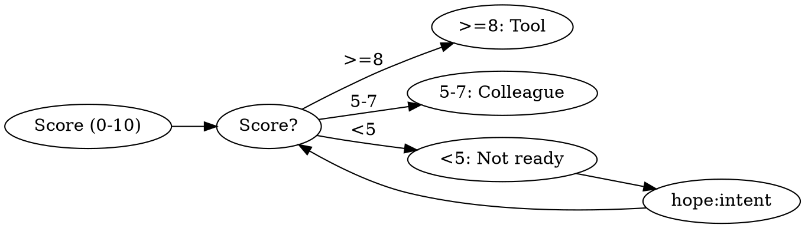
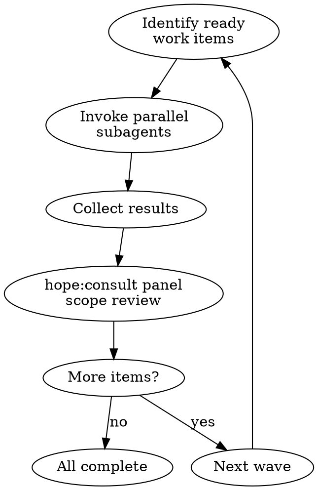

# Loop

EXECUTE. Autonomous iteration: spec scoring → shape → decompose → wave execution → review → verify + gate → user review & feedback.

---

## Pipeline Context

Scan conversation for existing pipeline artifacts:
- Intent brief (OBJECTIVE/NON-GOALS/CONSTRAINTS/ACCEPTANCE) → use as spec input
- Shape output (criteria[]/mustNot[]/shape) → skip Step 2, proceed to decomposition
- Context slots: `PASS:` (user-stated acceptance criteria) and `FAIL:` (user-stated failure conditions) → merge into criteria[] and mustNot[] during shape generation
- Neither → proceed normally from Step 1

---

## Step 1: Spec Scoring

Score on 5 dimensions (0-2 each, max 10):

| Dimension | 0 | 1 | 2 |
|-----------|---|---|---|
| **Outcome** | "Make it better" | "Improve performance" | "p95 latency <100ms" |
| **Scope** | "Fix the app" | "Fix auth" | "Fix /api/auth/token" |
| **Constraints** | None stated | "Use existing stack" | "No new deps, <500 LOC" |
| **Success** | None stated | "Tests pass" | "All tests + manual QA" |
| **Done** | Implied | "When it works" | "PR merged to main" |



| Fit Score | Shape | Behavior |
|-----------|-------|----------|
| 40+ | Tool | Autonomous, milestones only |
| 30-39 | Tool-review | Checkpoint major steps |
| 25-29 | Colleague | Iterate each step |
| <25 | BLOCKED | Clarify first |

Calculation: spec_score x 5 + constraints + success_criteria + done_definition + domain_familiarity

---

## Step 2: Shape Generation & Approval

Request shape generation for the spec — returns shape choice, criteria, mustNot constraints, and verification approach.

Extract: **criteria[]**, **mustNot[]**, **verification{}** from shape output.

Ask user: "Plan ready? [Yes/Edit/Cancel]" → **Yes:** proceed. **Edit:** re-run shape. **Cancel:** exit.

---

## Step 3: Decomposition

Break spec into 5-21 atomic work items. Each passes the "one sentence without and" test.

```
Work Items:
1. [imperative action] — [what + criteria + verify command]
2. [imperative action] — [what + criteria + verify command]
```

Mark dependencies. Announce with visible calculation:

```
[LOOP] Starting | Shape: {shape} | Items: {N}
Fit: {total} = spec({s})×5 + constraints({c}) + success({sc}) + done({d}) + domain({df})
Would drop to {lower shape} if {which input change would cross the threshold}
```

---

## Step 4: Wave Execution

**Wave** = work items with no unresolved dependencies.



1. **Identify ready items:** Work items with no pending dependencies
2. **Spawn subagents:** `Task(prompt="EXECUTE. [session strategy + criteria + mustNot]\n\n[work item instructions]", subagent_type="general-purpose")` for each ready item
3. **Collect results:** Wait for all subagents in the wave
4. **Review:** Request expert panel to review scope compliance — check work stays within spec
5. **Log:** `[WAVE {N} COMPLETE] {completed}/{total} items done`
6. **Blocked detection:** If no progress → request expert diagnosis for the blocker to auto-unblock. Continue, pivot, or escalate to user.

---

## Step 5: Thorough Expert Review

When all items complete, request thorough expert panel review of completed work against spec.

- Findings: BLOCKER / WARNING / SUGGESTION
- Checks against mustNot constraints
- Blockers create new work items, return to Wave Execution
- All resolved: proceed to completion

---

## Step 6: Completion

### Pre-Work Gate

Verify before starting: verification method locked (not "assumption"), at least 2 "must NOT" criteria, fit score determined shape.

### Tool Discovery

Detect tools before verifying — never assume. Check: `package.json` scripts, `pyproject.toml` pytest/ruff, `Cargo.toml` test/clippy, `go.mod` test/vet, `Makefile` targets. If none found → ask user.

### Verification Tiers

| Tier | Budget | Scope |
|------|--------|-------|
| **Quick** | < 5s | Lint or type-check |
| **Standard** | < 30s | Lint + types + tests |
| **Thorough** | < 2min | Full suite + evidence |

Run thorough. Report with evidence:

```
[VERIFY] {PASS/FAIL} | {Y}/{N} criteria | Type: execution output
Ran: `{command}` → {summary of output}
Unverified: "{criterion}" — {why it couldn't be verified by execution}
```

Any criterion not backed by execution output must appear in an `Unverified:` line. User decides whether to ship with assertion-only criteria or test manually.

### Post-Work Gate

Thorough verification passed (all PASS with evidence), expert review passed (no BLOCKERs), feature executes without errors (show output), edge cases: list which were tested or state "assertion only".

If gate fails: create remediation items, continue loop.

Never claim "done" with only assumptions. "Tests pass" requires showing test output.

---

## Step 7: Review & Feedback

After verification passes, present the full journey for user review:

1. **Journey summary** — Recap: original intent, shape chosen, items completed, top 3 decisions (≤20 words each, pattern: "chose X over Y — because Z"), verification results
   e.g. "In-memory Map over Redis — under 10MB, single instance, no distributed state needed"
2. **Open for questions** — User can ask about any decision, inspect any change, or discuss tradeoffs
3. **Gather feedback** — Ask: "Anything to adjust, extend, or revisit?"
4. **Next action:**
   - Feedback yields new work → refine intent from feedback, re-enter loop (Step 1)
   - User satisfied → emit `<loop-complete>` + quality footer

---

## Cancel, Status & Circuit Breakers

**Cancel** ("cancel loop", "stop", "abort"): Report completed/remaining. Current iteration completes before cancel.
**Status** ("loop status", "progress"): Scan for `[LOOP] Starting`, `[WAVE N COMPLETE]`, `<loop-complete>` markers.

| Trigger | Threshold | Action |
|---------|-----------|--------|
| Max iterations | User-configured | Pause, announce progress |
| Budget exceeded | User-configured | Pause, offer continue |
| mustNot true | From shape output | Stop immediately |

## Boundary

**Loop executes, never decides.** User controls what gets built and continuation. Gates advise, never prevent — user owns their work.
