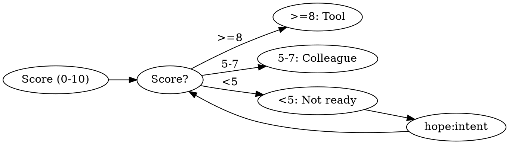

# Loop

EXECUTE. Autonomous iteration: spec scoring → shape → decompose → wave execution → review → verify + gate → user review & feedback.

---

## Pipeline Context

Scan for: intent brief → spec input | shape output (criteria[]/mustNot[]/shape) → skip Step 2 | `PASS:`/`FAIL:`/`FEASIBLE:` slots → merge into constraints/bounds. Nothing → Step 1.

---

## Step 1: Spec Scoring

Score on 5 dimensions (0-2 each, max 10):

| Dimension       | 0                | 1                     | 2                       |
| --------------- | ---------------- | --------------------- | ----------------------- |
| **Outcome**     | "Make it better" | "Improve performance" | "p95 latency <100ms"    |
| **Scope**       | "Fix the app"    | "Fix auth"            | "Fix /api/auth/token"   |
| **Constraints** | None stated      | "Use existing stack"  | "No new deps, <500 LOC" |
| **Success**     | None stated      | "Tests pass"          | "All tests + manual QA" |
| **Done**        | Implied          | "When it works"       | "PR merged to main"     |



| Fit Score | Shape       | Behavior                    |
| --------- | ----------- | --------------------------- |
| 35+       | Tool        | Autonomous, milestones only |
| 25-34     | Tool-review | Checkpoint major steps      |
| 15-24     | Colleague   | Iterate each step           |
| <15       | BLOCKED     | Clarify first               |

Guided: [SCORING] block. spec × 5 + domain (0-10) — tiers 10 apart = domain's range, so domain shifts ±1 tier

---

## Step 2: Shape Generation & Approval

Request shape generation for the spec — returns shape choice, criteria, mustNot constraints, and verification approach.

Extract: **criteria[]**, **mustNot[]**, **verification{}** from shape output.

Ask user: "Plan ready? [Yes/Edit/Cancel]" → **Yes:** proceed. **Edit:** re-run shape. **Cancel:** exit.

---

## Step 3: Decomposition

5-21 atomic work items. Each passes "one sentence without and" test.

```
Work Items (every criteria[] entry maps to ≥1 item):
1. [imperative action] — [verify command] → criteria: [names]
2. [imperative action] — [verify command] → criteria: [names]
```

Mark dependencies. Decompose by horizon: Tactical → maximize parallel items per wave | Strategic → phase by dependency chain | Existential → foundation layers first. If Disposable=yes from shape: items target proof-of-concept, not production — keep items ≤ 3, expect to discard. Announce:

```
[LOOP] Starting | Shape: {shape} | Horizon: {horizon} | Items: {N} | Feasible: {axis} — {bound}
Fit: {total} = spec({s})×5 + domain({df})
Would reframe if {what finding would change the plan, not just delay it}
```

---

## Step 4: Wave Execution

**Wave** = work items with no unresolved dependencies. Within wave: reversible before irreversible.

Spawn per ready item: `Task(prompt="EXECUTE. [session + criteria + mustNot + intent ACCEPTANCE criteria]\n\n[work item]\n\nVerify against ACCEPTANCE criteria and STOP conditions from the intent brief.", subagent_type="general-purpose")`
Include in spawn prompt: "Retrieve facts (APIs, types, dependencies, current docs) using available tools before asserting from memory. Per work item: WHAT/WHY questions (intent, preference, priority) → ask the user. HOW/WHAT-EXISTS questions (API, file, dependency) → retrieve with tools."
Review: run the consult skill: Skill(skill="hope:consult", args="panel checks scope compliance per wave")

Wave report must satisfy ALL:

1. `[WAVE {N}]` header, per item: `{done ≤10w} | Verify: {PASS/FAIL}` — cite command + exit state
2. Footer: `[WAVE {N} COMPLETE] Done: {n} | Carry: {n} | Stall: {n}` — must equal total
3. `[LEARN] What this wave revealed: [one insight ≤15w about the problem domain, not the process]`
4. Carry = verification weaker than execution output — retry next wave with feedback: include `[VERIFY] FAIL: [reason]` in spawn prompt so retry transforms with context, not from scratch
5. Stall → diagnose from execution output — revise remaining if assumptions broke

---

## Step 5: Thorough Expert Review

When all items complete, expert panel Skill(skill="hope:consult", args="reviews completed work against spec") .

- Findings: BLOCKER / REFRAME / WARNING
- Checks against mustNot constraints
- Checks that key decisions cite retrieved evidence (file reads, grep results, web searches), not recall-only assertions
- BLOCKER → reshape; REFRAME → back to intent; item-level → new items, return to Waves
- All resolved: proceed to completion

---

## Step 6: Completion

### Pre-Work Gate — cite evidence or STOP:

Verification method locked → [pass/fail] → [cite verification{} from shape]
≥2 mustNot in mustNot[] → [pass/fail] → [cite mustNot items]

### Verification Tiers

| Tier         | Budget | Scope                 |
| ------------ | ------ | --------------------- |
| **Quick**    | < 5s   | Lint or type-check    |
| **Standard** | < 30s  | Lint + types + tests  |
| **Thorough** | < 2min | Full suite + evidence |

Run thorough. Report with evidence:

```
[VERIFY] {PASS/FAIL} | Pass: {names} | Fail: {names} | Type: execution output
Ran: `{command}` → {summary of output}
Unverified: {names} — {why no evidence} | Coverage: buckets == criteria[]
```

Criterion fails → diagnose cause from output before remediating. No execution output → `Unverified:` line. User decides ship or test.

### Post-Work Gate — Guided: [GATE] block; all must PASS or remediate:
  Thorough verification    → [pass/fail] → [cite VERIFY output]
  Expert review clear      → [pass/fail] → [cite "no BLOCKERs" or list]
  Feature executes         → [pass/fail] → [cite execution output]
  Edge cases accounted     → [pass/fail] → [cite tested list or "assertion: {which}"]
  No assumption-only done  → [pass/fail] → [cite verification type per criterion]
  Key facts retrieved (not recalled) → [pass/fail] → [cite read/grep/search evidence per decision]

---

## Step 7: Review & Feedback

After verification, present journey summary satisfying ALL:
1. Top 3 decisions: `[chose X over Y] — [because Z] (≤20w)` + verification status per criterion
2. Unverified items (if any) with suggested verification command
3. Next: `[one action ≤15w] | Alt: [alternative ≤10w]`

User: Adjust → re-enter loop (Step 1) | Proceed → emit `<loop-complete>` + quality footer

---

## Cancel, Status & Circuit Breakers

**Cancel** ("cancel loop", "stop", "abort"): Report completed/remaining. Current iteration completes before cancel.
**Status** ("loop status", "progress"): Scan for `[LOOP] Starting`, `[WAVE N COMPLETE]`, `<loop-complete>` markers.

| Trigger               | Threshold         | Action                   |
| --------------------- | ----------------- | ------------------------ |
| Max iterations        | User-configured   | Pause, announce progress |
| Budget exceeded       | User-configured   | Pause, offer continue    |
| mustNot true          | From shape output | Stop immediately         |
| Would-reframe-if true | From shape output | Pause, surface finding   |

## Boundary

**Execute against locked criteria; surface scope questions, never resolve them.** Gates flag deviations; user resolves. User owns continuation.
