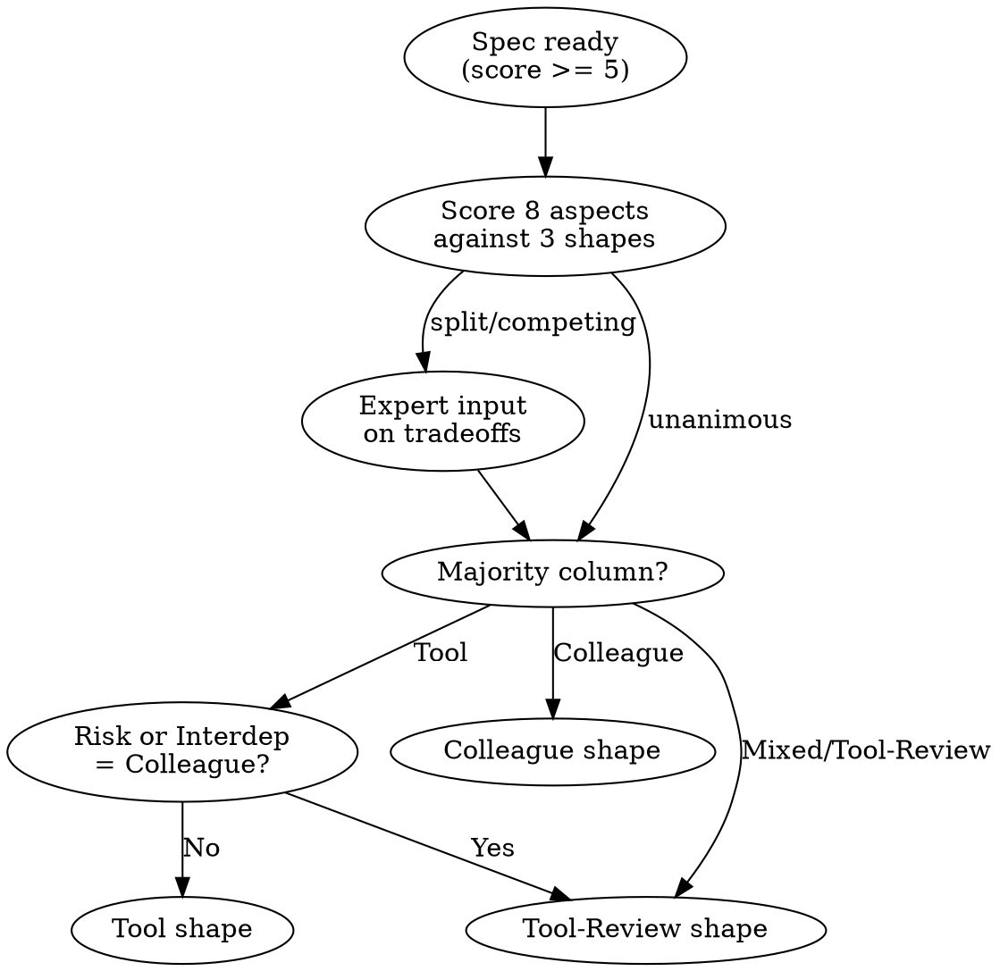

# Shape

DECIDE. Bridge between intent clarification and implementation. Transforms WHAT into HOW.

## When to Use Shape

- After `/hope:intent` when spec_score >= 5
- Explicit request: "shape this", "how should I build this"
- Architecture decisions needed before coding

**If spec_score < 5:** Return to `/hope:intent` for clarification first.

**Output:** Returns shape choice, approach, risks, and criteria in conversation. Never writes files. Caller decides next action.

---

## Protocol

### 1. Extract Intent

From user request or prior `/hope:intent`, extract: goal, constraints, scope, feasibility axis + bound.

Also scan for context slots: `PATTERNS:` (existing conventions/precedent), `BOUNDARIES:` (architectural constraints, team norms), and `FEASIBLE:` (constraint axis + bound from intent or session default). When present, use as evidence when scoring Novelty, Domain knowledge, and Risk aspects.

### 2. Identify Candidate Shapes

Three collaboration modes determine how user and agent interact during implementation:

| Shape | Interaction | Best When |
|-------|-------------|-----------|
| **Colleague** | Iterate every step together | High ambiguity, novel domain, irreversible decisions |
| **Tool-Review** | Autonomous with checkpoints at major decisions | Moderate complexity, known patterns with unknowns |
| **Tool** | Fully autonomous, milestone announcements only | Clear requirements, well-trodden patterns, low risk |

### 3. Score Aspects

For each aspect in the discovery table below, determine which shape column the task falls into.

### 4. Expert Consultation

Guided: emit [TALLY] block. Split/competing → expert input. High-risk → panel debate. Re-score once max. Still competing → Tool-Review. Unanimous → skip.

### 5. Select Shape

Count which column each aspect lands in:

- **Majority Colleague** → Colleague shape
- **Majority Tool** → Tool shape
- **Mixed or majority Tool-Review** → Tool-Review shape
- **Override:** Any Colleague in Risk or Interdependency → at minimum Tool-Review
- **Default when uncertain:** Tool-Review

### 5b. Feasibility Filter

When a feasibility axis is active (from `FEASIBLE:` slot or session default), apply it AFTER shape selection to filter the approach:

| Axis | Eliminate approaches that... |
|------|----------------------------|
| **Time** | Require learning curves or multi-phase migrations exceeding the bound |
| **Solo** | Require coordination, specialized roles, or multi-agent orchestration beyond one pass |
| **Cost** | Require paid services or licensed tools |
| **Tools** | Require dependencies not in the project |
| **Access** | Require permissions or environments the user lacks |

If ALL candidate approaches eliminated: surface the conflict — `"Feasibility ([axis]) eliminates all shaped approaches. Recommend: relax [axis] or reduce scope."`

If feasibility is `none`: skip this step.

### 6. Output Shape

Present shape output satisfying ALL:
1. Table: Aspect | Column | Because (≤12w) | Would change if (≤15w) | Feasible: [axis] (≤10w, omit if none)
2. Because must cite a specific observable — file names, line counts, dependency chains, API shapes — not adjectives
3. Would-change-if must be a condition someone could CHECK tomorrow — "if auth moves to middleware (check router.ts)" not "if things change"
4. Tally columns, select majority, emit criteria[] (boolean) + mustNot[] (≥2) — user counter-evidence re-scores that aspect

SELF-AUDIT (after shape output, revise before presenting if any FAIL) →
  ≥5 aspects scored         → [pass/fail] → [count]
  Each has Because           → [pass/fail] → [count with / total]
  Each has Would-change-if   → [pass/fail] → [count with / total]
  criteria[] non-empty       → [pass/fail] → [count items]
  mustNot[] has ≥2 items     → [pass/fail] → [cite items]
  Shape selected + justified → [pass/fail] → [cite majority column]

---

## Aspect Discovery

Score each aspect for the task. The column where most aspects land determines the shape.

| Aspect | Colleague | Tool-Review | Tool |
|--------|-----------|-------------|------|
| Decomposition | Cannot break down without user | Breaks down, user validates | Self-decomposes fully |
| Interdependency | High coupling across unknowns | Moderate, checkpoints at boundaries | Low, independent pieces |
| Novelty | No precedent, unknown patterns | Known patterns with variations | Well-trodden, clear precedent |
| Risk | High blast radius, irreversible | Medium, partially reversible | Low, fully reversible |
| Ambiguity | Requirements unclear or conflicting | Mostly clear, few open questions | Crisp, complete requirements |
| Domain knowledge | Needs user context to proceed | Partial context, can infer rest | Full context available |
| Verification | User must define pass/fail | User approves test plan | Self-verifiable criteria |
| Reversibility | Hard to undo, high stakes | Moderate rollback effort | Trivial to revert |

**Rule:** Score at least 5 of 8 aspects. Skip only those genuinely absent from the spec.

---

## Decision Logic

---

## Integration

1. Ground decisions in session values
2. Run this skill's protocol (steps 1-6)
3. Output shape choice + approach + risks in conversation

Shape output feeds into the execution loop:

| Shape Output | Loop Usage |
|-------------|------------|
| `criteria` | Verification tracking |
| `mustNot` | Circuit breaker triggers |
| `shape` | Interaction mode for waves |

---

## Boundary

Shape surfaces considerations; user owns architecture.

- Expert recommendations are patterns, not prescriptions
- User resolves conflicts
- Shape informs design decisions, never makes them
