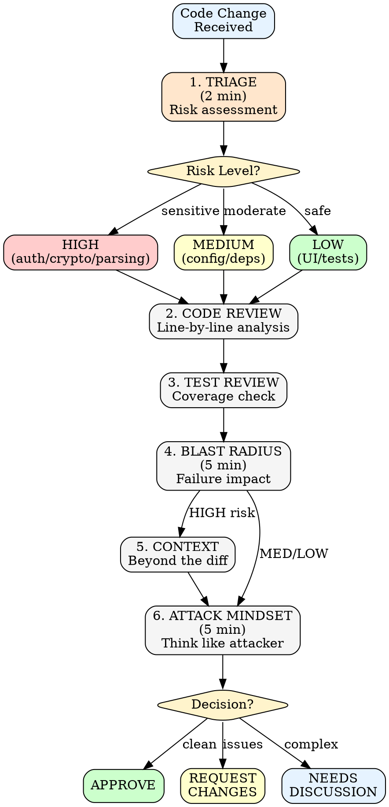

# Differential Review

Security-focused code review for pull requests, diffs, and code changes.

Premise: Every change is an attack surface. Review defensively.

## When to Use

| Trigger | Use This Framework |
|---------|-------------------|
| Reviewing a pull request | Full 6-phase workflow |
| Auditing code changes | Focus on Phase 2-3 |
| Security sign-off required | Emphasize Phase 5-6 |

## 6-Phase Workflow



## Phase 1: Triage

Quick assessment before deep dive (2 min max):
- How many files changed?
- What category? (feature, fix, refactor, dependency)
- Any obvious security-sensitive areas?

### Risk Classification

| Trigger | Risk Level |
|---------|------------|
| Auth/crypto/parsing changes | HIGH |
| User input handling | HIGH |
| Database queries | HIGH |
| Config/environment changes | MEDIUM |
| Dependency updates | MEDIUM |
| UI-only changes | LOW |
| Test-only changes | LOW |

## Phase 2: Code Review

Line-by-line analysis of the diff:
- What's the stated purpose?
- Does the code achieve it?
- What's NOT in the diff that should be?

### Three Questions for Every Change

1. Where does input come from?
2. Where does output go?
3. What could an attacker control?

## Phase 3: Test Review

Evaluate the test changes:
- Do tests cover the happy path?
- Do tests cover error conditions?
- Are security-relevant edge cases tested?

### Test Coverage Red Flags

| Red Flag | Risk |
|----------|------|
| No tests for new functionality | High |
| Tests only check for success | Medium |
| Mocked security boundaries | High |
| Tests assert implementation, not behavior | Medium |

## Phase 4: Blast Radius Analysis

What could go wrong at scale?
- If this fails, what breaks?
- Can this be exploited in production?
- What's the rollback story?

### Consider

- Backwards compatibility
- Database migration safety
- Feature flag coverage
- Deployment dependencies

## Phase 5: Context Gathering

Look beyond the diff:
- Read the linked issue/ticket
- Check related files not in diff
- Review recent changes to same files
- Understand the broader system

## Phase 6: Adversarial Thinking

Think like an attacker:
- How would I abuse this?
- What assumptions can I violate?
- What happens with malicious input?

## Codebase Size Strategy

| Size | Approach |
|------|----------|
| SMALL (<1k lines) | Read everything, understand fully |
| MEDIUM (1k-50k) | Focus on entry points and trust boundaries |
| LARGE (50k+) | Use tooling, focus on changed files + immediate neighbors |

## Red Flags (Stop and Escalate)

- Disabling security controls "temporarily"
- Custom crypto implementation
- `eval()`, `exec()`, or dynamic code execution
- Commented-out security checks
- "TODO: add validation later"
- Credentials or secrets in code
- Overly permissive CORS/permissions
- Silent exception swallowing

## Rationalizations to Reject

| They Say | Reality |
|----------|---------|
| "It's just internal" | Internal systems get compromised |
| "No one would do that" | Attackers do unexpected things |
| "We'll fix it later" | Later never comes |
| "It's behind auth" | Auth can be bypassed |
| "Low priority area" | Attackers love ignored areas |
| "It's only for testing" | Test code reaches production |
| "The user is trusted" | Trust boundaries shift |

## Review Output Template

```markdown
## Summary
[One sentence: what this PR does]

## Risk Assessment
Level: [HIGH/MEDIUM/LOW]
Reason: [Why this level]

## Security Observations
- [Finding 1]
- [Finding 2]

## Questions
- [Clarification needed 1]
- [Clarification needed 2]

## Missing
- [Expected but absent 1]
- [Expected but absent 2]

## Recommendation
[APPROVE / REQUEST CHANGES / NEEDS DISCUSSION]
```

## Anti-Patterns

| Mistake | Consequence | Prevention |
|---------|-------------|------------|
| Reviewing only what changed | Miss context-dependent bugs | Phase 5 always |
| Trusting "minor fix" labels | Major bugs hide in small PRs | Triage based on content |
| Skipping test review | Untested code ships | Phase 3 mandatory |
| Rubber-stamping trusted authors | Trust is not a security control | Review code, not people |

---

*Source: Trail of Bits patterns*
