# Fit Decision

Before delegating to AI, score each dimension 0-10.

## Scoring Dimensions

| Dimension | 10 (Delegate) | 5 (Hybrid) | 0 (Keep) |
|-----------|---------------|------------|----------|
| **Spec Clarity** | Could write acceptance tests now | General direction, fuzzy details | Need drafts to know what I want |
| **Verification Cost** | Check in <5 min (tests, template match) | 15-30 min careful review | Expert-only, errors surface in production |
| **Reversibility** | Delete and retry, no cost | Some rework, contained | Downstream damage, reputation risk |
| **Hidden Coupling** | Fully isolated | Touches few systems | Deeply entangled, cascades unpredictably |
| **Shape Confidence** | Clear-cut choice | Could go either way | Not enough info to decide |

## Decision Rules

| Total Score | Shape | Action |
|-------------|-------|--------|
| **≥40** | Tool-shaped | Delegate and forget |
| **25-39** | Colleague-shaped | Iterate together |
| **<25** | Not ready | Clarify first, don't delegate |

### Decision Flow

```dot
digraph FitDecision {
  rankdir=TB
  node [shape=box, style="rounded,filled", fillcolor="#f5f5f5"]

  Score [label="Score 5 Dimensions\n(0-10 each)", fillcolor="#e6f3ff"]
  Total [label="Calculate\nTotal Score", fillcolor="#ffe6cc"]

  Check [label="Total Score?", shape=diamond, fillcolor="#fff4cc"]

  Tool [label="Tool-shaped\n(≥40)", fillcolor="#ccffcc"]
  Colleague [label="Colleague-shaped\n(25-39)", fillcolor="#ffffcc"]
  Blocked [label="BLOCKED\n(<25)", fillcolor="#ffcccc"]

  ActionTool [label="Delegate\nand forget"]
  ActionColleague [label="Iterate\ntogether"]
  ActionBlocked [label="Clarify first\n→ hope:intent"]

  Score -> Total -> Check
  Check -> Tool [label="≥40"]
  Check -> Colleague [label="25-39"]
  Check -> Blocked [label="<25"]

  Tool -> ActionTool
  Colleague -> ActionColleague
  Blocked -> ActionBlocked
}
```

## Failure Modes

| Wrong Choice | Symptom | Cost |
|--------------|---------|------|
| Tool-shaped task treated as colleague | Excessive check-ins, slow progress | Wasted attention, frustration |
| Colleague-shaped task treated as tool | Output misses mark, requires rework | Wasted cycles, drift |
| Not-ready task delegated anyway | Thrashing, conflicting outputs | Trust erosion, worse than manual |

## Pre-Delegation Checklist

1. Score all 5 dimensions honestly
2. If total <25, invest in spec clarity first
3. If total 25-39, plan iteration checkpoints
4. If total ≥40, write acceptance criteria and let go

## Auto-Selection Thresholds

Silent Audit enforces shape based on fit score:

| Fit Score | Shape | Rationale |
|-----------|-------|-----------|
| **40+** | Tool | High confidence, cheap verification, reversible |
| **30-39** | Tool-with-review | Good enough but checkpoint major steps |
| **25-29** | Colleague | Iterate, don't fire-and-forget |
| **<25** | **BLOCKED** | Must clarify before proceeding |

### Borderline Rules

| Condition | Override |
|-----------|----------|
| Score 35-45 + Verification Cost < 5 | Default to Colleague |
| Score 30-35 + past failures in domain | Default to Colleague |
| Score 25-29 + high urgency | May use Tool-with-review (document risk) |

Verification difficulty outweighs other factors in borderline cases.

### Enforcement

When fit score < 25:
- Silent Audit forces 🔴 RESEARCH verdict
- Cannot proceed without clarifying spec
- Run `/hope:intent` to improve spec clarity

---

## When to Re-Score

- After first draft reveals hidden complexity
- When scope changes mid-task
- When verification takes longer than expected
- After delegation failure (see [delegation-failures.md](delegation-failures.md))
