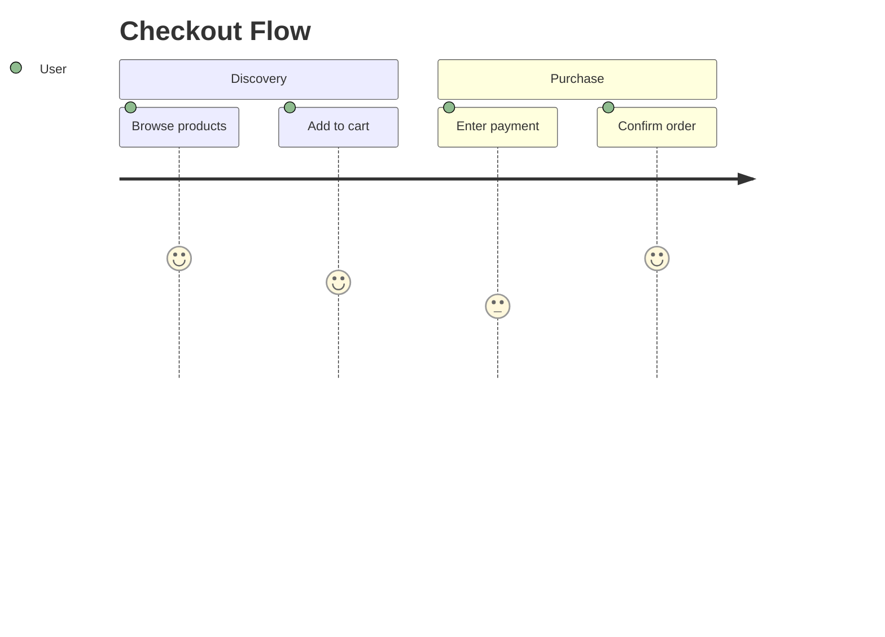
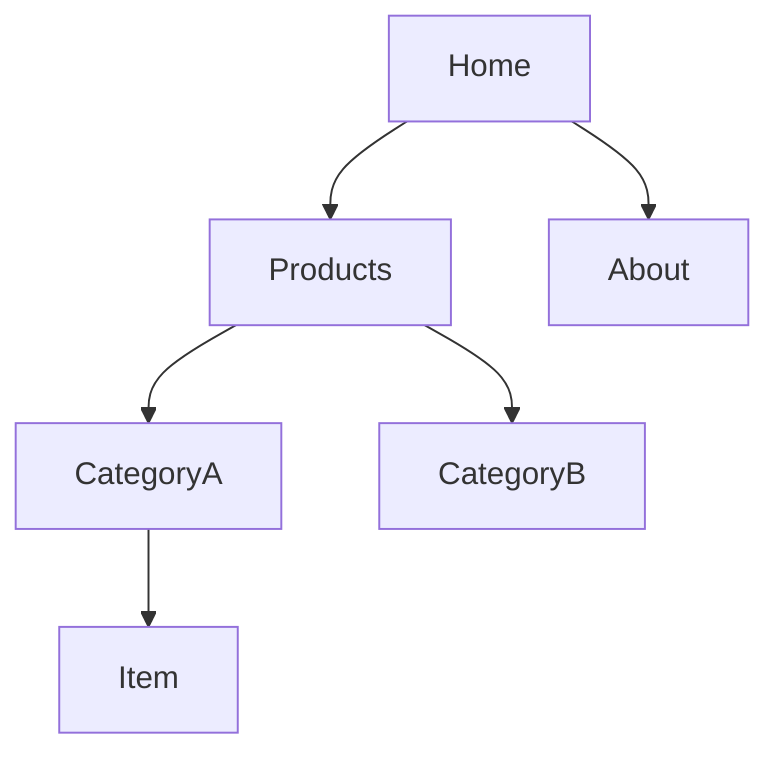
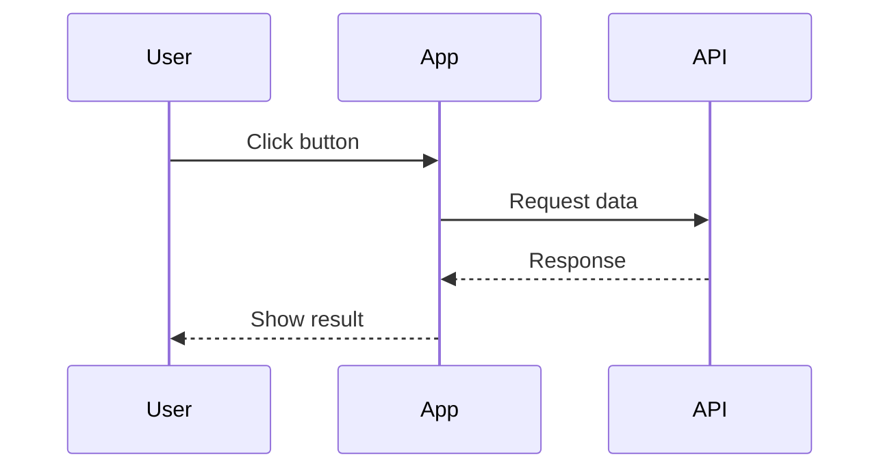
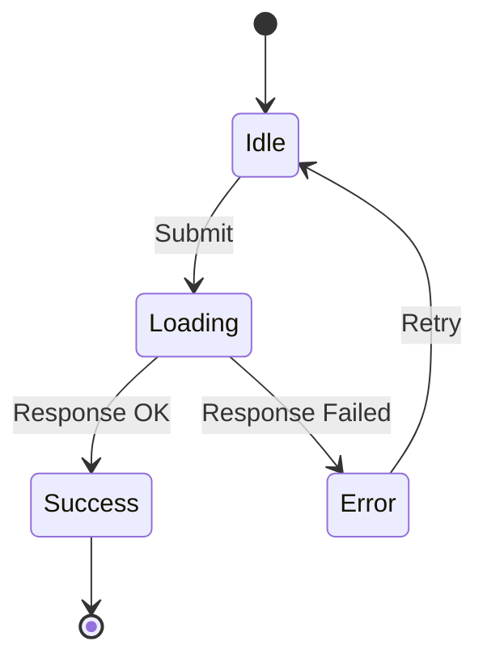

# Mermaid Diagrams

Text-based diagrams: flowcharts, journey maps, sequence diagrams, ER diagrams.

## Rendering Options

Terminals don't render Mermaid. Choose your method:

| Method | Install | Best For |
|--------|---------|----------|
| **GitHub/GitLab** | None | Docs, READMEs (auto-renders in .md files) |
| **mermaid.live** | None | Quick preview, export PNG/SVG |
| **Mermaid CLI** | `npm i -g @mermaid-js/mermaid-cli` | Automation, CI/CD |
| **VSCode** | Markdown Preview Mermaid extension | Dev workflow |

## Mermaid CLI Usage

```bash
npm install -g @mermaid-js/mermaid-cli

# Render to image
mmdc -i diagram.mmd -o output.png
mmdc -i diagram.mmd -o output.svg
mmdc -i diagram.mmd -o output.pdf

# With config
mmdc -i diagram.mmd -o output.png -c config.json
```

**Note:** Puppeteer dependency can be heavy. For simpler local rendering, consider D2.

## Diagram Types

### Journey (user flows)



Score: 1-5 (low to high satisfaction)

### Flowchart (IA/navigation)



Directions: `TD` (top-down), `LR` (left-right), `BT` (bottom-top), `RL` (right-left)

### Sequence (interactions)



### State (UI states)



## Syntax Quick Reference

| Element | Syntax |
|---------|--------|
| Node | `A[Text]` |
| Link | `A --> B` |
| Link with text | `A -->|label| B` |
| Dashed link | `A -.-> B` |
| Thick link | `A ==> B` |
| Subgraph | `subgraph Title ... end` |

## Anti-Patterns

- Diagrams too complex (>15 nodes) — split into multiple
- No clear hierarchy — use subgraphs to group
- Missing labels on links — add context
