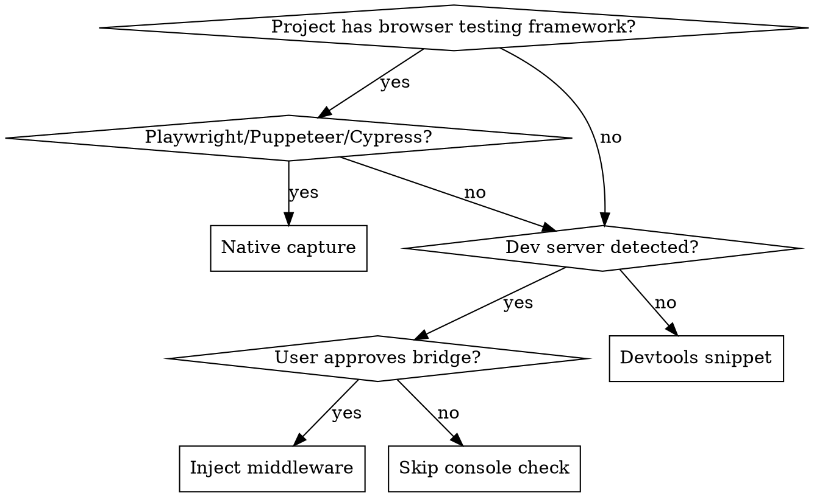
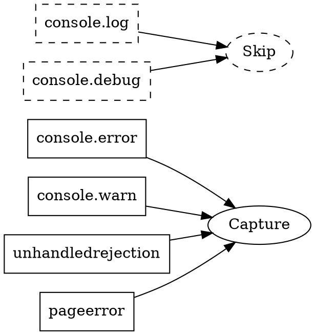

# Console Bridge

Surface browser console errors during verification. Zero user effort.

---

## Strategy Selection



---

## Detection

```bash
# Playwright
jq -e '.devDependencies["@playwright/test"] // .dependencies["playwright"]' package.json 2>/dev/null && echo "playwright"

# Puppeteer
jq -e '.devDependencies.puppeteer // .dependencies.puppeteer' package.json 2>/dev/null && echo "puppeteer"

# Cypress
jq -e '.devDependencies.cypress' package.json 2>/dev/null && echo "cypress"

# Dev servers
jq -e '.devDependencies.vite' package.json 2>/dev/null && echo "vite"
jq -e '.devDependencies.next' package.json 2>/dev/null && echo "next"
jq -e '.devDependencies["react-scripts"]' package.json 2>/dev/null && echo "cra"
```

---

## Strategy 1: Native Capture (Zero Effort)

When Playwright/Puppeteer detected, capture console natively.

### Playwright

```javascript
// Add to test setup or verification script
const { chromium } = require('playwright');

const browser = await chromium.launch();
const page = await browser.newPage();

page.on('console', msg => {
  if (['error', 'warning'].includes(msg.type())) {
    const line = JSON.stringify({
      ts: Date.now(),
      level: msg.type(),
      text: msg.text()
    });
    require('fs').appendFileSync('.loop/console.jsonl', line + '\n');
  }
});

page.on('pageerror', err => {
  const line = JSON.stringify({
    ts: Date.now(),
    level: 'error',
    text: err.message
  });
  require('fs').appendFileSync('.loop/console.jsonl', line + '\n');
});
```

### Puppeteer

```javascript
page.on('console', msg => {
  if (['error', 'warning'].includes(msg.type())) {
    // Same as above
  }
});
```

---

## Strategy 2: Dev Server Middleware (One Approval)

When Vite/Next/CRA detected, offer to inject middleware.

### Offer Prompt

```
AskUserQuestion:
  question: "Add console bridge for debugging?"
  header: "Console Bridge"
  options:
    - label: "Yes, add it"
      description: "I'll add a dev-only middleware to capture browser errors"
    - label: "No, skip"
      description: "Continue without console visibility"
```

### Vite Plugin

```javascript
// vite.config.js - AI generates this on approval
import { defineConfig } from 'vite';
import fs from 'fs';

export default defineConfig({
  plugins: [{
    name: 'console-bridge',
    configureServer(server) {
      server.middlewares.use('/__console', (req, res) => {
        if (req.method === 'POST') {
          let body = '';
          req.on('data', chunk => body += chunk);
          req.on('end', () => {
            fs.appendFileSync('.loop/console.jsonl', body + '\n');
            res.writeHead(204);
            res.end();
          });
        } else {
          res.writeHead(405);
          res.end();
        }
      });
    }
  }]
});
```

### Frontend Shim

```javascript
// AI injects into index.html or main.js (dev mode only)
if (import.meta.env.DEV) {
  ['error', 'warn'].forEach(level => {
    const original = console[level];
    console[level] = (...args) => {
      original.apply(console, args);
      fetch('/__console', {
        method: 'POST',
        headers: { 'Content-Type': 'application/json' },
        body: JSON.stringify({ ts: Date.now(), level, text: args.map(String).join(' ') })
      }).catch(() => {});
    };
  });
  window.addEventListener('unhandledrejection', e => {
    fetch('/__console', {
      method: 'POST',
      headers: { 'Content-Type': 'application/json' },
      body: JSON.stringify({ ts: Date.now(), level: 'error', text: 'Unhandled: ' + e.reason })
    }).catch(() => {});
  });
}
```

### Next.js Middleware

```javascript
// middleware.js - AI generates on approval
import { NextResponse } from 'next/server';
import fs from 'fs';

export function middleware(request) {
  if (request.nextUrl.pathname === '/__console' && request.method === 'POST') {
    // Note: For Next.js, use API route instead
  }
  return NextResponse.next();
}

// Better: pages/api/__console.js
export default function handler(req, res) {
  if (req.method === 'POST') {
    const fs = require('fs');
    fs.appendFileSync('.loop/console.jsonl', JSON.stringify(req.body) + '\n');
    res.status(204).end();
  }
}
```

---

## Strategy 3: Devtools Snippet (Fallback)

When no framework detected, provide paste-able snippet.

### Offer Prompt

```
AskUserQuestion:
  question: "Paste a snippet in browser devtools to capture errors?"
  header: "Console Capture"
  options:
    - label: "Yes, show me"
      description: "I'll give you a one-liner to paste"
    - label: "No, skip"
      description: "Continue without console visibility"
```

### One-Liner

```javascript
// Paste in browser devtools console
((w,l)=>{['error','warn'].forEach(t=>{const o=w[t];w[t]=(...a)=>{o.apply(w,a);l.push({ts:Date.now(),level:t,text:a.join(' ')})}});w.__CONSOLE__=l})(console,[]);

// Later, to export: copy(JSON.stringify(console.__CONSOLE__))
```

---

## Reading Console Logs

### During Verification

```bash
# Check for errors (any tier)
if [ -f ".loop/console.jsonl" ]; then
  ERRORS=$(jq -r 'select(.level == "error") | .text' .loop/console.jsonl 2>/dev/null | wc -l)
  if [ "$ERRORS" -gt 0 ]; then
    echo "Console: ✗ $ERRORS error(s)"
    jq -r 'select(.level == "error") | "  - \(.text)"' .loop/console.jsonl | head -5
  else
    echo "Console: ✓ clean"
  fi
fi
```

### Output Format

```
## Console
✓ clean (8 logs captured)
```

Or on errors:

```
## Console
✗ 2 error(s) detected:
  - TypeError: Cannot read property 'map' of undefined
  - Failed to fetch /api/users: 404
```

---

## What to Capture



| Type | Capture | Reason |
|------|---------|--------|
| `console.error` | Always | Failures |
| `console.warn` | Always | Potential issues |
| `unhandledrejection` | Always | Async failures |
| `pageerror` | Always | Uncaught exceptions |
| `console.log` | Never | Noise |
| `console.debug` | Never | Noise |

---

## Cleanup

Remove `.loop/console.jsonl` at session end or before new verification run:

```bash
rm -f .loop/console.jsonl
```

---

## Integration with Tiers

| Tier | Console Check |
|------|---------------|
| Quick | Skip (velocity) |
| Standard | Error count only |
| Thorough | Full error report with context |
