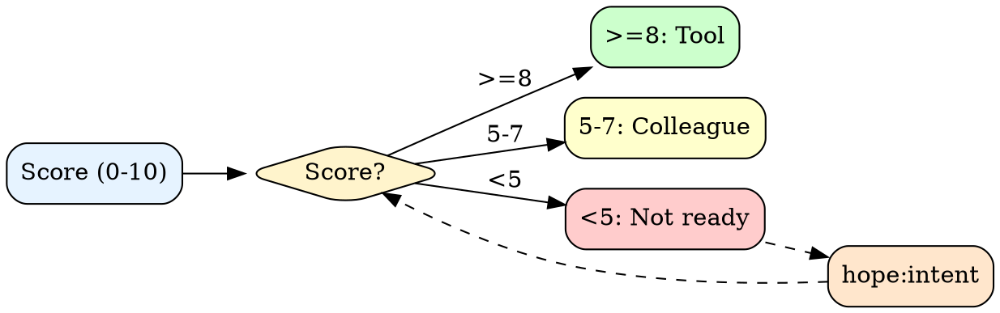
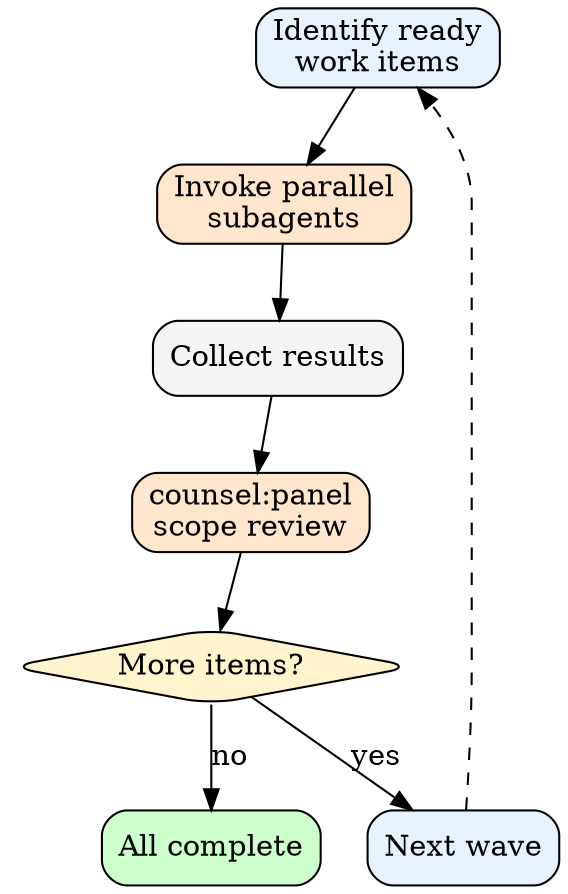

# Loop

Autonomous iteration with wave-based parallel execution. Continues until spec is satisfied or limits reached.

## Architecture

```
User Request
  -> [SPEC SCORING] -> <5? hope:intent
  -> [SHAPE GENERATION] -> hope:shape, extract criteria/mustNot
  -> [DECOMPOSITION] -> atomic work items (prose)
  -> [WAVE EXECUTION] -> parallel subagents + counsel review
  -> [THOROUGH REVIEW] -> counsel:panel, resolve blockers
  -> [COMPLETION] -> hope:gate verification
```

---

## Step 1: Spec Scoring

Score on 5 dimensions (0-2 each, max 10):

| Dimension | 0 | 1 | 2 |
|-----------|---|---|---|
| **Outcome** | "Make it better" | "Improve performance" | "p95 latency <100ms" |
| **Scope** | "Fix the app" | "Fix auth" | "Fix /api/auth/token" |
| **Constraints** | None stated | "Use existing stack" | "No new deps, <500 LOC" |
| **Success** | None stated | "Tests pass" | "All tests + manual QA" |
| **Done** | Implied | "When it works" | "PR merged to main" |



| Fit Score | Shape | Behavior |
|-----------|-------|----------|
| 40+ | Tool | Autonomous, milestones only |
| 30-39 | Tool-review | Checkpoint major steps |
| 25-29 | Colleague | Iterate each step |
| <25 | BLOCKED | Clarify first |

Calculation: spec_score × 5 + constraints + success_criteria + done_definition + domain_familiarity

---

## Step 2: Shape Generation & Approval

Invoke `Skill(skill="hope:shape", args="$ARGUMENTS")` — returns shape choice in conversation.

Extract: **criteria[]**, **mustNot[]**, **verification{}** from shape output.

Ask user: "Plan ready? [Yes/Edit/Cancel]" → **Yes:** proceed to Step 3. **Edit:** re-run shape with modifications. **Cancel:** exit.

---

## Step 3: Decomposition

Break spec into atomic work items. Each passes the "one sentence without and" test.

Output numbered work items as prose instructions:

```
Work Items:
1. [imperative action] — [what + criteria + verify command]
2. [imperative action] — [what + criteria + verify command]
3. [imperative action] — [what + criteria + verify command]
```

Mark dependencies: items that must complete before others can start.

Announce: `[LOOP] Starting | Shape: {Tool/Colleague} ({score}/10) | Items: {N}`

---

## Step 4: Wave Execution

**Wave** = work items with no unresolved dependencies. Invoke parallel subagents.



1. **Identify ready items:** Work items with no pending dependencies
2. **Spawn subagents:** `Task(prompt="[work item instructions]", subagent_type="general-purpose")` for each ready item
3. **Collect results:** Wait for all subagents in the wave to complete
4. **Review:** `Skill(skill="counsel:panel", args="scope review: executed within boundaries?")` — check work stays within spec
5. **Log:** `[WAVE {N} COMPLETE] {completed}/{total} items done`
6. **Blocked detection:** If no progress after a wave → invoke `Skill(skill="counsel:panel", args="stuck on: {blocker}")` to auto-unblock. Counsel decides: continue, pivot, or escalate to user.

---

## Step 5: Thorough Expert Review

When all items complete: `Skill(skill="counsel:panel", args="thorough review for: {spec}")`

- Findings: BLOCKER / WARNING / SUGGESTION
- Checks against mustNot constraints
- Blockers create new work items, return to Wave Execution
- All resolved: proceed to completion

---

## Step 6: Completion

**Prerequisites:** All items completed + thorough review passed.

1. `Skill(skill="hope:verify", args="thorough")`
2. `Skill(skill="hope:gate", args="loop completion verification")`
3. Emit `<loop-complete>` with summary, SHIP footer (items, confidence, alt, risk)
4. If gate fails: create remediation items, continue loop

---

## Circuit Breakers

| Trigger | Threshold | Action |
|---------|-----------|--------|
| Max iterations | User-configured | Pause, announce progress |
| Budget exceeded | User-configured | Pause, offer continue |
| mustNot true | From shape output | Stop immediately |

---

## Boundary

**Loop executes, never decides.** User controls what gets built and continuation.
