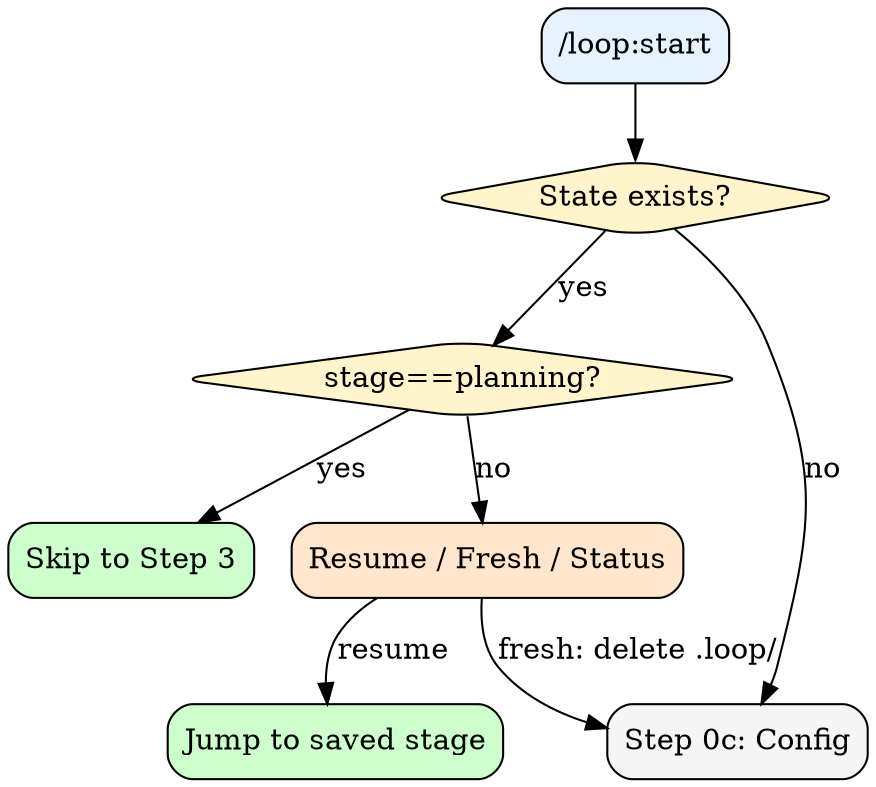
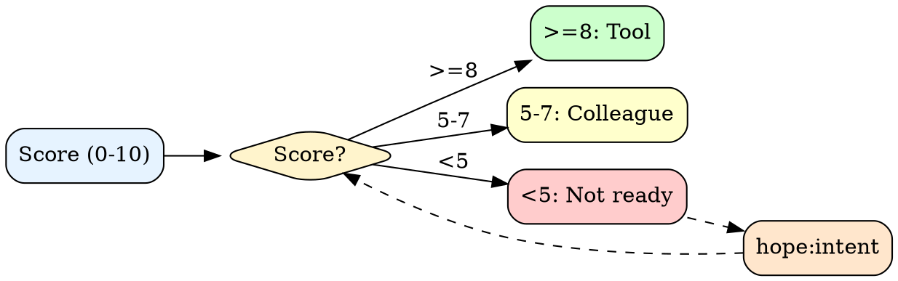

# Loop

Autonomous iteration with wave-based parallel execution. Continues until spec is satisfied or limits reached.

## Architecture

```
User Request -> [STATE DETECTION] -> Resume? / Start fresh?
  -> [RECALL LEARNINGS] -> surface past failures/discoveries
  -> [SPEC + FIT SCORING] -> <5? hope:intent, calculate fit_score
  -> [SHAPE GENERATION] -> hope:shape, extract criteria/mustNot
  -> [DECOMPOSITION] -> atomic tasks via TaskCreate
  -> [TEAM DECISION] -> team_score -> subagents / teams / hybrid
  -> [WAVE EXECUTION] -> parallel subagents or teammates + light review
  -> [THOROUGH REVIEW] -> counsel:panel, resolve blockers
  -> [COMPLETION] -> team cleanup (if teams) -> hope:gate verification
```

---

## Step 0: State Detection & Resume

1. Check `.loop/workflow-state.json` and `.loop/shape/SHAPE.md` exist
2. Check TaskList for pending/in_progress tasks
3. Check `.loop/current-context.json` if exists (Phase 1: wave context, omit if doesn't exist)
4. If `stage == "planning"`: plan created but not yet executed



AskUserQuestion for new loops: task list mode (new/resume/session-only), max iterations (10/25/50/unlimited), budget ($10/$25/$50/none). Set `CLAUDE_CODE_TASK_LIST_ID`.

---

## Step 0.5: Recall Past Learnings

- Invoke `Skill(skill="hope:recall", args="{domain hints from task}")`
- Display top 3-5 relevant learnings (past failures, discoveries, constraints)
- Save surfaced learnings to workflow-state.json

---

## Step 1: Spec Scoring

Score on 5 dimensions (0-2 each, max 10):

| Dimension | 0 | 1 | 2 |
|-----------|---|---|---|
| **Outcome** | "Make it better" | "Improve performance" | "p95 latency <100ms" |
| **Scope** | "Fix the app" | "Fix auth" | "Fix /api/auth/token" |
| **Constraints** | None stated | "Use existing stack" | "No new deps, <500 LOC" |
| **Success** | None stated | "Tests pass" | "All tests + manual QA" |
| **Done** | Implied | "When it works" | "PR merged to main" |



| Fit Score | Shape | Behavior |
|-----------|-------|----------|
| 40+ | Tool | Autonomous, milestones only |
| 30-39 | Tool-review | Checkpoint major steps |
| 25-29 | Colleague | Iterate each step |
| <25 | BLOCKED | Clarify first |

Calculation: spec_score × 5 + constraints + success_criteria + done_definition + domain_familiarity

---

## Step 2: Shape Generation & Approval

Invoke `Skill(skill="hope:shape", args="$ARGUMENTS")` — writes SHAPE.md and returns.

Extract: **criteria[]**, **mustNot[]**, **verification{}** from SHAPE.md.

Ask user: "Plan ready? [Yes/Edit/Cancel]" → **Yes:** set `plan.approved=true`, go to Step 3. **Edit:** user modifies SHAPE.md, re-ask. **Cancel:** cleanup, exit.

---

## Step 3: Task Decomposition

Atomic tasks, each passes "one sentence without and" test.

`TaskCreate(subject="[imperative action]", description="[what + criteria + verify cmd]", activeForm="[present continuous]")`
`TaskUpdate(taskId="4", addBlockedBy=["1", "3"])`

**Note (Phase 1):** Task descriptions will be enhanced with LOOP CONTEXT preambles during Step 4 execution, before subagents spawn. This ensures agents know they're part of autonomous orchestration.

Announce: `[LOOP] Starting | Shape: {Tool/Colleague} ({score}/10) | Tasks: {N} | Budget: ${budget}`

---

## Step 3.5: Team Decision

`team_score = (cross_layer_count * 2) + (review_count * 3) + (hypothesis_count * 4)`

| team_score | Mode | Action |
|-----------|------|--------|
| >= 12 | Agent Teams | Spawn team, assign teammates |
| 10-11 + cross-layer | Hybrid | Teams for complex, subagents for simple |
| < 10 | Subagent Waves | Default parallel execution |

**Teams (>= 12):** Spawn team, assign tasks via owner, update workflow-state.json.
**Subagents (< 10):** Continue to Step 4.

---

## Step 4: Wave Execution (Phase 1, 2, 3)

**Wave** = tasks with no unresolved blockedBy. Spawn parallel subagents or teammates.

1. **Setup:** Write `.loop/current-context.json` + log `[WAVE {N} START]`. Invoke `Skill(skill="hope:verify", args="quick")` to confirm orchestration context.
2. **Strategy:** `Skill(skill="counsel:panel", args="wave strategy: staying within loop boundaries?")`
3. **Task descriptions:** Prefix with `LOOP CONTEXT: Stage {N}, Wave {W}. See .loop/current-context.json.` (signals agents they're orchestrated, not manual)
4. **Monitor:** Watch for optional `[LOOP SIGNAL]` in agent output; warn if absent (hybrid mode: proceed but log weakness)
5. **Review:** Update context file, log `[WAVE {N} COMPLETE]`. Invoke `Skill(skill="counsel:panel", args="scope review: executed within loop boundaries?")`, persist findings

---

## Step 5: Thorough Expert Review

When all tasks complete: `Skill(skill="counsel:panel", args="thorough review for: {spec}")`

- Findings: BLOCKER / WARNING / SUGGESTION
- Checks against SHAPE.md mustNot
- Blockers create remediation tasks, return to Wave Execution
- All resolved: `reviews.thorough.passed = true`, proceed to gate

---

## Step 6: Completion

**Prerequisites:** All tasks completed + thorough review passed.

1. `Skill(skill="hope:verify", args="thorough")`
2. `Skill(skill="hope:gate", args="loop completion verification")`
3. If team mode: `shutdown_request` all teammates, `Teammate(operation="cleanup")`, set `team.shutdown_status = "completed"`
4. Emit `<loop-complete>` with task list, SHIP footer (tasks, confidence, alt, risk)
5. If gate fails: create remediation tasks, continue loop

---

## Circuit Breakers

| Trigger | Threshold | Action |
|---------|-----------|--------|
| Max iterations | User-configured | Pause, announce progress |
| Budget exceeded | User-configured | Pause, offer continue |
| mustNot true | From SHAPE.md | Stop immediately |

---

## Boundary

**Loop executes, never decides.** User controls what gets built, persistence, and continuation.
