# Loop

Autonomous iteration with wave-based parallel execution. Continues until spec is satisfied or limits reached.

## Architecture

```
User Request
    ↓
[STATE DETECTION] → Resume? / Start fresh?
    ↓
[RECALL LEARNINGS] → surface past failures/discoveries
    ↓
[SPEC + FIT SCORING] → <5? hope:intent, calculate fit_score
    ↓
[SHAPE GENERATION] → hope:shape, extract criteria/mustNot
    ↓
[DECOMPOSITION] → atomic tasks via TaskCreate
    ↓
[WAVE EXECUTION] → parallel subagents + light expert review
    ↓
[THOROUGH REVIEW] → counsel:panel, resolve blockers
    ↓
[COMPLETION] → hope:gate verification
```

---

## Step 0: State Detection & Resume

Before starting, check for existing workflow state:

### 0a. Detect Existing State

```
1. Check .loop/workflow-state.json exists
2. Check .loop/shape/SHAPE.md exists
3. Check TaskList for pending/in_progress tasks
4. Read workflow-state.json if exists
```

### 0b. Resume Decision


On "Resume": Skip to current stage (read from workflow-state.json)
On "Start fresh": Delete `.loop/` directory, proceed to Step 0c
On "View status": Show status (see `/loop:status`), then re-ask

**If no existing state:** Proceed to Step 0c

### 0c. User Configuration

Ask user to configure the new loop:

```
AskUserQuestion:
  1. "How should this loop track tasks?"
     - "New task list (project-based)" → Fresh start with '{project-name}-loop' ID
     - "Resume existing" → Continue from existing task list
     - "Session-only" → No persistence

  2. "Max iterations before pausing?"
     - "10 iterations (quick task)"
     - "25 iterations (medium feature)"
     - "50 iterations (large refactor)"
     - "Unlimited (manual stop only)"

  3. "Budget limit?"
     - "$10 (conservative)"
     - "$25 (default)"
     - "$50 (large task)"
     - "No limit"
```

Set `CLAUDE_CODE_TASK_LIST_ID` based on choice.

### Workflow State Schema

Write `.loop/workflow-state.json` at each stage transition:

```json
{
  "version": 1,
  "stage": "intent|shape|decompose|executing|review|complete",
  "task": "original user request",
  "spec_score": 7,
  "fit_score": 35,
  "shape_chosen": "colleague|tool-review|tool",
  "started_at": "2026-02-05T10:00:00Z",
  "last_updated": "2026-02-05T10:15:00Z",
  "recall_surfaced": ["auth edge cases", "validation patterns"],
  "reviews": {
    "wave_1": { "score": 8, "issues": 2, "blockers": 0 },
    "thorough": { "passed": false, "blockers_remaining": 1 }
  }
}
```

---

## Step 0.5: Recall Past Learnings

Before spec scoring, surface relevant learnings:

```
1. Extract domain hints from task (e.g., "auth", "validation", "API")
2. Invoke: Skill(skill="hope:recall", args="{domain hints}")
3. Display top 3-5 relevant learnings:
   - Past failures in this domain
   - High-confidence discoveries
   - Active constraints
4. User confirms or dismisses
5. Save surfaced learnings to workflow-state.json
```

**Output:**
```
[LOOP] Surfacing past learnings for: {domain}

Relevant learnings found:
- [failure] Auth tokens: Missing refresh caused session drops → Prevention: Always implement refresh flow
- [discovery] (85%): JWT validation should happen middleware-level, not per-route
- [constraint] Auth: Must use existing session store (permanent)

→ Apply these learnings? [Y/n]
```

If user dismisses: proceed without applying, note in workflow-state.json

---

## Step 1: Spec Scoring

Score the user request on 5 dimensions (0-2 each, max 10):

| Dimension | 0 | 1 | 2 |
|-----------|---|---|---|
| **Outcome** | "Make it better" | "Improve performance" | "p95 latency <100ms" |
| **Scope** | "Fix the app" | "Fix auth" | "Fix /api/auth/token" |
| **Constraints** | None stated | "Use existing stack" | "No new deps, <500 LOC" |
| **Success** | None stated | "Tests pass" | "All tests + manual QA" |
| **Done** | Implied | "When it works" | "PR merged to main" |

**Decision:**

```dot
digraph SpecDecision {
  rankdir=LR
  node [shape=box, style="rounded,filled", fillcolor="#f5f5f5"]

  Score [label="Spec Score\n(0-10)", fillcolor="#e6f3ff"]
  Check [label="Score?", shape=diamond, fillcolor="#fff4cc"]

  High [label="≥8\nTool-shaped", fillcolor="#ccffcc"]
  Mid [label="5-7\nColleague-shaped", fillcolor="#ffffcc"]
  Low [label="<5\nNot ready", fillcolor="#ffcccc"]

  Decompose [label="Proceed to\ndecomposition"]
  Confirm [label="Confirm approach\nafter decompose"]
  Intent [label="Run\nhope:intent"]

  Score -> Check
  Check -> High [label="≥8"]
  Check -> Mid [label="5-7"]
  Check -> Low [label="<5"]

  High -> Decompose
  Mid -> Confirm
  Low -> Intent -> Check [style=dashed]
}
```



### Fit Score → Shape Decision

| Fit Score | Shape | Behavior |
|-----------|-------|----------|
| 40+ | Tool | Autonomous, milestones only |
| 30-39 | Tool-review | Checkpoint major steps |
| 25-29 | Colleague | Iterate each step |
| <25 | BLOCKED | Clarify first |

See [loop-mechanics.md](references/loop-mechanics.md#fit-score-calculation) for calculation formula.

---

## Step 1.5: Expert-Driven Clarification (if score <5)

For dimensions scoring <2, invoke counsel:panel for expert-informed options.

```
Skill(skill="counsel:panel", args="clarify {dimension} for: {spec}")
```

See [expert-review.md](references/expert-review.md) for dimension → expert mapping.

---

## Step 2: Shape Generation (if score ≥5)

Invoke shape skill to get implementation approach:

```
Skill(skill="hope:shape", args="$ARGUMENTS")
```

Extract from SHAPE.md output:
- **criteria[]** → Success criteria for completion
- **mustNot[]** → Circuit breaker conditions
- **verification{}** → How to verify each criterion

---

## Step 3: Task Decomposition

Break work into atomic tasks using the "one sentence without and" test.

See [decomposition.md](references/decomposition.md) for details.

**For each atomic unit:**
```
TaskCreate(
  subject="[imperative action]",
  description="[detailed what + acceptance criteria + verify command]",
  activeForm="[present continuous for spinner]"
)
```

**Set dependencies:**
```
TaskUpdate(taskId="4", addBlockedBy=["1", "3"])
```

**Announce:**
```
[LOOP] Starting | Shape: {Tool/Colleague} ({score}/10) | Tasks: {N} | Budget: ${budget}
```

---

## Step 4: Wave Execution

A **wave** is tasks with no blockedBy dependencies or all blockedBy tasks completed.

### Wave Detection

```
1. TaskList() → Get all tasks
2. Filter: status="pending" AND blockedBy is empty or all complete
3. Current wave = matching tasks
```

### Wave Strategy (Adaptive)

Before executing each wave, consult panel on strategy:

```
Skill(skill="counsel:panel", args="wave execution strategy for {N} tasks: {task_summaries}")
```

Panel analyzes:
- **Task coupling** — same files/modules → run sequential
- **Independence** — different areas → run parallel
- **Risk level** — risky tasks → sequential with review

```
[LOOP] Wave 2: 4 tasks ready
[LOOP] Consulting panel on execution strategy...
Panel recommendation:
  Sequential: T-003 → T-004 (both modify auth/)
  Parallel: [T-005, T-006] (independent)
[LOOP] Executing strategy...
```

### Execute Wave

For each task in wave:

1. `TaskUpdate(taskId, status="in_progress")`

2. Spawn parallel subagents (all Task calls in single message):
```
Task(prompt="Execute: {subject}. {description}", subagent_type="general-purpose")
```

3. Wait for all subagents to complete

4. For each completed:
   - Success → `TaskUpdate(taskId, status="completed")`
   - Failed → Increment stuckCount, check for stuck handling

### Quick Verification After Task

After each task completes, run quick verify:

```
Skill(skill="hope:verify", args="quick")
```

Quick tier (< 5s): fastest discovered check only. If fails:
- Don't mark task complete
- Escalate to standard tier for diagnostics
- Fix issue before proceeding

### Stuck Handling

When task fails (verification command doesn't pass):

```
IF stuckCount >= 1:
  Announce: "[LOOP] Task {id} stuck. Consulting expert panel..."
  Skill(skill="counsel:panel", args="stuck on {subject}: {error}")
  Apply recommendation from panel
  Retry with new approach
```

Pauses only at max iterations (no mid-loop human escalation).

### Progress Update

After each wave, update `.loop/PROGRESS.md` with completed/pending task status.

### Announcements

```
[LOOP] Wave {N} | Iteration {i}/{max} | Cost: ${X}/${budget} | Tasks: {N}
[LOOP] ✓ Wave {N} complete | Progress: {completed}/{total}
```

### Light Expert Review (After Each Wave)

```
Skill(skill="counsel:panel", args="review wave {N} changes for: {spec}")
```

- Quick check (~30s): idiomaticity, cleanliness, delivery alignment
- Non-blocking: issues are guidance only
- Persist review score to workflow-state.json

See [expert-review.md](references/expert-review.md) for protocol.

---

## Step 5: Thorough Expert Review

When all tasks complete, before gate:

```
Skill(skill="counsel:panel", args="thorough review for: {spec}")
```

- Full expert panel based on all task aspects
- Interactive findings with severity: BLOCKER / WARNING / SUGGESTION
- Constraint-aware: checks fixes against SHAPE.md mustNot
- Blockers create remediation tasks → return to Wave Execution
- All blockers resolved → `reviews.thorough.passed = true` → proceed to gate

See [expert-review.md](references/expert-review.md) for full protocol.

---

## Step 6: Completion

**Prerequisites:** All tasks completed + thorough review passed.

1. Run thorough verification:
```
Skill(skill="hope:verify", args="thorough")
```

Thorough tier (< 2min): all checks + criterion-specific commands + evidence.

2. Invoke verification gate:
```
Skill(skill="hope:gate", args="loop completion verification")
```

3. If gate passes (verify passed), emit completion:
```
<loop-complete>
All tasks verified:
- T-001: ✓ {subject}
- T-002: ✓ {subject}
- T-003: ✓ {subject}

╭─ 🟢 SHIP ──────────────────────────╮
│ Verified: execution output          │
│ Tasks: {N}/{N} complete             │
│ Subjective: ~X% · Type 2B · Npt    │
├────────────────────────────────────┤
│ ↳ Alt: [alternative approach]       │
│ ↳ Risk: [key assumption]            │
╰────────────────────────────────────╯
</loop-complete>
```

3. If gate fails → create remediation tasks, continue loop

---

## Workflow Detection

After spec scoring, detect workflow type:

| Workflow | Indicators | Gate |
|----------|------------|------|
| **A (Build)** | "add", "implement", "create" | Library search required |
| **B (Debug)** | "fix", "debug", "broken", "error" | Root cause before workaround |
| **C (Refactor)** | "refactor", "clean up", "migrate" | Deletion before redesign |

Reference [hope/skills/soul](../../hope/skills/soul/SKILL.md) for workflow details.

---

## Circuit Breakers

| Trigger | Threshold | Action |
|---------|-----------|--------|
| Max iterations reached | User-configured | Pause, announce progress |
| Budget exceeded | User-configured | Pause, offer continue |
| mustNot condition true | From SHAPE.md | Stop immediately, announce |

---

## Commands

| Command | Effect |
|---------|--------|
| `/loop:start [spec]` | Start new loop |
| `/loop:start` | Resume paused loop (auto-detects) |
| `/loop:cancel` | Terminate and clean up |
| `/loop:status` | Show current state from TaskList |

---

## Example

User: "loop - add validation to auth module"

```
[LOOP] Surfacing past learnings for: auth, validation
→ 2 relevant learnings found

[LOOP] Spec scoring: 3/10 → Running /hope:intent
[After clarification: 7/10, fit_score: 35]

[LOOP] Starting | Shape: Colleague | Tasks: 6 | Budget: $25

[LOOP] Wave 1 | T-001, T-002 (parallel)
[LOOP] Wave 1 review: 8/10 | 1 suggestion
[LOOP] ✓ Wave 1 complete | Progress: 2/6

[LOOP] Wave 2 | T-003, T-004 (parallel)
[LOOP] Wave 2 review: 9/10 | 0 issues
[LOOP] ✓ Wave 2 complete | Progress: 4/6

[LOOP] Wave 3 | T-005, T-006 (parallel)
[LOOP] ✓ Wave 3 complete | Progress: 6/6

[LOOP] Thorough review: 3 findings, 0 blockers ✓
[LOOP] Running gate...

<loop-complete>
╭─ 🟢 SHIP ──────────────────────────╮
│ Verified: execution output          │
│ Tasks: 6/6 · Reviews: all passed    │
╰────────────────────────────────────╯
</loop-complete>
```

---

## References (Load by Stage)

| Stage | Reference | When |
|-------|-----------|------|
| decompose | [decomposition.md](references/decomposition.md) | Before TaskCreate |
| executing | [waves.md](references/waves.md) | If wave strategy unclear |
| review | [expert-review.md](references/expert-review.md) | Before counsel:panel |

Architecture overview: [loop-mechanics.md](references/loop-mechanics.md) (for troubleshooting only)

---

## Boundary

**Loop executes, never decides.** User controls what gets built, persistence, and continuation.
