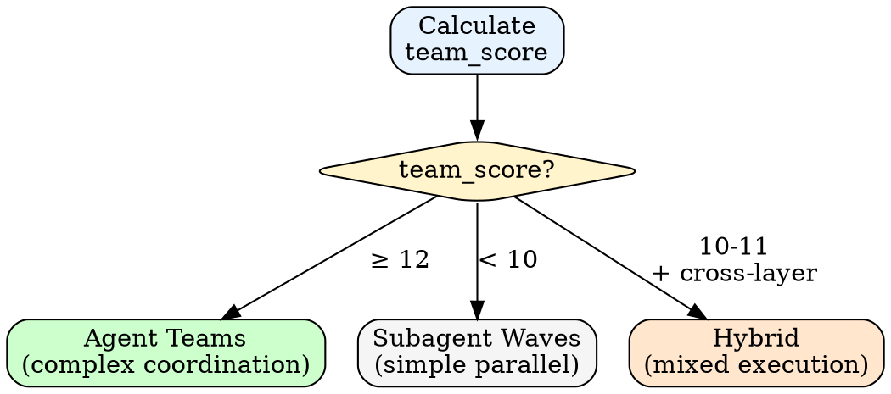

# Agent Teams Integration

When to use agent teams vs subagents, and how team execution works.

---

## Team Score Calculation

After decomposition, analyze task complexity to decide execution mode:

```
team_score = (cross_layer_count × 2) + (review_count × 3) + (hypothesis_count × 4)
```

| Factor | Description | Weight |
|--------|-------------|--------|
| **Cross-layer** | Tasks touching different subsystems (frontend + backend, API + DB) | ×2 |
| **Review** | Tasks requiring expert perspectives or competing review | ×3 |
| **Hypothesis** | Tasks with multiple valid approaches to test | ×4 |

### Decision



- **team_score ≥ 12**: Use agent teams
- **team_score < 10**: Use subagent waves (default)
- **team_score 10-11 with cross-layer tasks**: Consider hybrid

---

## When to Use Teams

| Scenario | Mode | Why |
|----------|------|-----|
| 3 simple tasks, same file | Subagent | Low coordination overhead |
| 8 tasks across frontend/backend/tests | Team | Cross-layer ownership |
| 5 tasks, hypothesis testing | Team | Competing approaches |
| Simple feature, 4 independent tasks | Subagent | Cost efficiency |
| Large refactor, 15+ interdependent tasks | Team | Teammate context isolation |

---

## Team Lifecycle

### Spawning

```
1. Teammate(operation="spawnTeam", team_name="{project}-loop")
2. Task list auto-created at ~/.claude/tasks/{team-name}/
3. Spawn teammates via Task(subagent_type="general-purpose", team_name="{team}", name="{role}")
4. Assign tasks via TaskUpdate(taskId="X", owner="{teammate-name}")
```

### Task List Behavior

Team mode automatically manages task persistence:
- Team name becomes the task list ID
- No user configuration needed (skip task list mode question)
- Tasks persist at `~/.claude/tasks/{team-name}/`

### Coordination

Lead coordinates via messaging:

```
SendMessage(type="message", recipient="{name}", content="...", summary="...")
```

Teammates report completion and claim next tasks from TaskList.

Teammates do NOT use `plan_mode_required`. counsel:panel provides multi-aspect plan approval and review gates. This keeps the loop humanless after spec clearance.

### Cleanup

After all tasks complete and reviews pass:

```
1. SendMessage(type="shutdown_request", recipient="{name}", content="All tasks complete")
2. Wait for shutdown approvals
3. Teammate(operation="cleanup")
```

---

## Cost Considerations

| Mode | Cost per Wave | Best For |
|------|---------------|----------|
| Subagent | $0.50-$2 | Simple parallel tasks |
| Team | $5-$15 | Complex coordination |

Default to subagents. Teams add value when coordination benefits exceed overhead.

Teammates inherit the lead's model. No model override needed.

---

## Limitations

- Loop persists `stage: "planning"` before decomposition, so state survives if Claude enters plan mode mid-loop. See [loop-mechanics.md](loop-mechanics.md#plan-mode-recovery).
- No session resumption with in-process teammates (falls back to subagent waves for remaining tasks)
- One team per session (clean up before new team)
- No nested teams (teammates can't spawn teams)
- Lead is fixed (no leadership transfer)
- Shutdown waits for current teammate turn to complete

---

## Troubleshooting

### Teammate idle but not responding

Idle is normal between turns. Send a message to wake them:
```
SendMessage(type="message", recipient="{name}", content="Status update?", summary="Checking status")
```

### Team cleanup fails

Active teammates must shut down first. Send shutdown_request to all teammates, wait for approvals, then cleanup.

### Task assignment confusion

Use explicit assignment via TaskUpdate with owner field. Avoid self-claiming for team-based loops.
