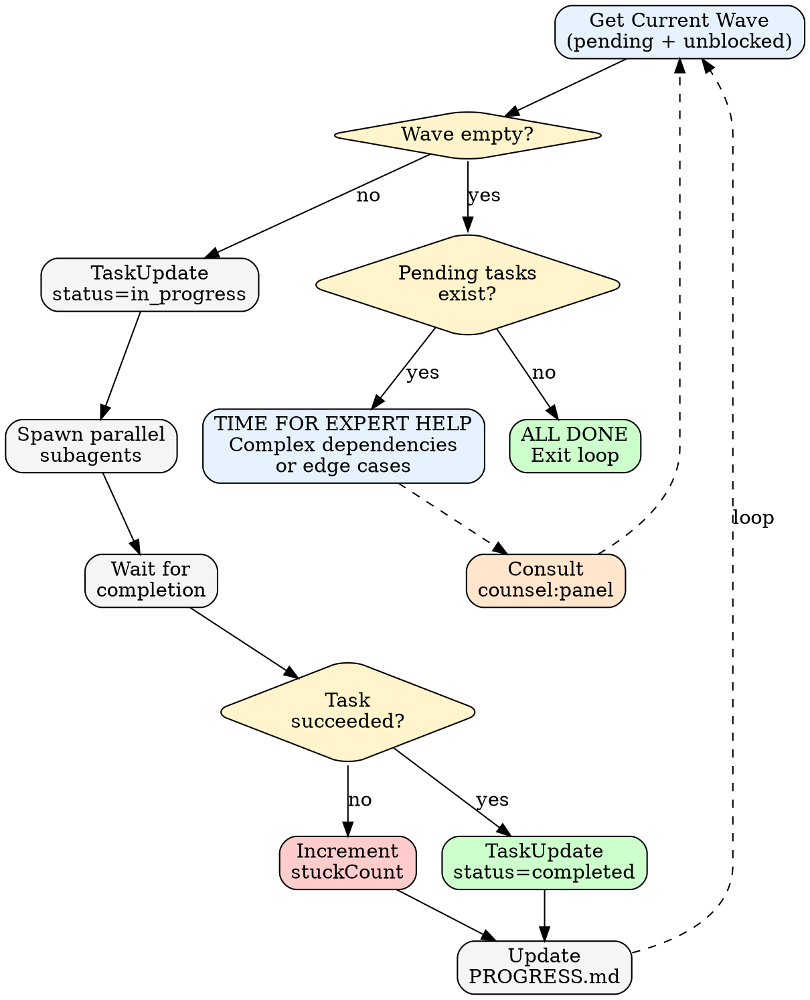

# Wave Execution

Parallel task execution using Claude Code's TaskList API.

## What is a Wave?

A **wave** is a group of tasks that can execute in parallel because they have no mutual dependencies.

```
Wave 1: [T-001, T-002, T-003]  ← No blockedBy, all run in parallel
         ↓        ↓        ↓
Wave 2: [T-004, T-005]         ← Blocked by Wave 1 tasks
              ↓
Wave 3: [T-006]                ← Blocked by Wave 2 tasks
```

## Wave Detection Protocol

1. **TaskList()** → Get all tasks
2. **Filter pending** → status = "pending"
3. **Filter unblocked** → blockedBy is empty OR all blockedBy tasks are completed
4. **Current wave** → All tasks matching both filters

```
# Pseudo-algorithm
def get_current_wave():
    all_tasks = TaskList()
    pending = [t for t in all_tasks if t.status == "pending"]
    unblocked = [t for t in pending if all(b.status == "completed" for b in t.blockedBy)]
    return unblocked
```

## Parallel Subagent Execution

Claude Code executes multiple Task tool calls in a single message in parallel.

**Wave execution:**
```
# Single message with multiple Task calls = parallel execution
Task(prompt="Execute task 1: ...", subagent_type="general-purpose")
Task(prompt="Execute task 2: ...", subagent_type="general-purpose")
Task(prompt="Execute task 3: ...", subagent_type="general-purpose")
```

Each subagent:
1. Reads task details
2. Executes the work
3. Verifies completion
4. Returns result

## Wave Execution Protocol



## Subagent Prompt Template

```
Execute this task with excellence — you're part of a parallel wave where each task contributes to the overall goal.

**Your task:** {subject}

**Details:** {description}

**Verification:** After completing, run the verification command and confirm it passes.

**Context:** Other agents are handling complementary tasks in this wave. Do your part well — the wave succeeds when each task succeeds.

**Guidelines:**
- Do exactly what the task describes
- Report actual output from verification
- If you need another approach, explain what you learned

You've got this.
```

## Progress Tracking

Update `.loop/PROGRESS.md` after each wave:

```markdown
# Loop Progress: {goal}

**Status:** Wave {N} of {total} | Iteration {i} | Cost: ${spent}/${budget}

## ✅ Completed (Wave 1-N)
- [x] T-001: {subject}
- [x] T-002: {subject}

## 🔄 In Progress (Wave N+1)
- [ ] T-003: {subject} (assigned to subagent)

## ⏳ Pending
- [ ] T-004: {subject} (blocked by T-003)

## 📊 Metrics
- Tasks: {completed}/{total}
- Stuck count: {n}
- Counsel consulted: {yes/no}
```

## Handling Tasks That Need Another Attempt

When a task needs iteration (verification doesn't pass yet):

**Iteration is normal.** Complex tasks often need refinement. Here's how to handle it:

1. **First attempt incomplete** → Note what was learned, increment attempt count
2. **Attempt count >= 1** → Time for expert perspective — invoke counsel:panel
3. **Apply insight** → Update task description or approach based on recommendation
4. **Try again** → Re-execute with refined approach. You've got this.
5. **Continued iteration** → Only pause at max iterations

**Remember:** Each attempt teaches something. Iteration is thoroughness, not failure.

No human escalation during loop — only pause when:
- Max iterations reached
- User manually cancels

## TaskList Persistence

Tasks persist to: `~/.claude/tasks/{CLAUDE_CODE_TASK_LIST_ID}/`

Set task list ID before starting:
```bash
export CLAUDE_CODE_TASK_LIST_ID=my-feature-loop
```

Resume across sessions by using same ID.

## Execution Mode Selection

### Subagent Wave (Default)

**When:** team_score < 10, simple parallel execution

1. Get current wave (pending + unblocked)
2. Spawn parallel subagents in single message
3. Wait for all to complete
4. Light review (counsel:panel)
5. Update PROGRESS.md
6. Loop to next wave

### Teammate Wave (Complex)

**When:** team_score ≥ 12, coordination required

1. Spawn team: `Teammate(operation="spawnTeam", team_name="{project}-loop")`
2. Spawn specialized teammates based on aspects (see [team-roles.md](team-roles.md))
3. TaskCreate for all decomposed tasks
4. TaskUpdate to assign tasks to teammates (owner field)
5. Teammates claim and execute tasks
6. Teammates message lead on completion
7. Light review after each teammate batch
8. Thorough review when all tasks complete
9. Shutdown teammates: `SendMessage(type="shutdown_request")`
10. Cleanup team: `Teammate(operation="cleanup")`

### Hybrid Wave (Mixed)

**When:** team_score 10-11 with cross-layer tasks

1. Split tasks into simple_wave and complex_wave
2. Execute simple_wave with subagents (same message, parallel)
3. Spawn team for complex_wave (cross-layer ownership)
4. Aggregate results from both
5. Cleanup team after complex tasks complete

See [agent-teams.md](agent-teams.md) for team score calculation and full protocol.

---

## Wave Size Guidelines

| Wave Size | Recommended | Notes |
|-----------|-------------|-------|
| 1-3 tasks | Ideal | Low coordination overhead |
| 4-6 tasks | Good | Reasonable parallelism |
| 7+ tasks | Split | Consider smaller waves |

Larger waves increase:
- Context per subagent
- Coordination complexity
- Risk of conflicts
